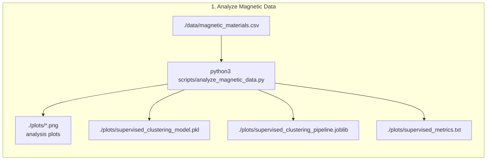
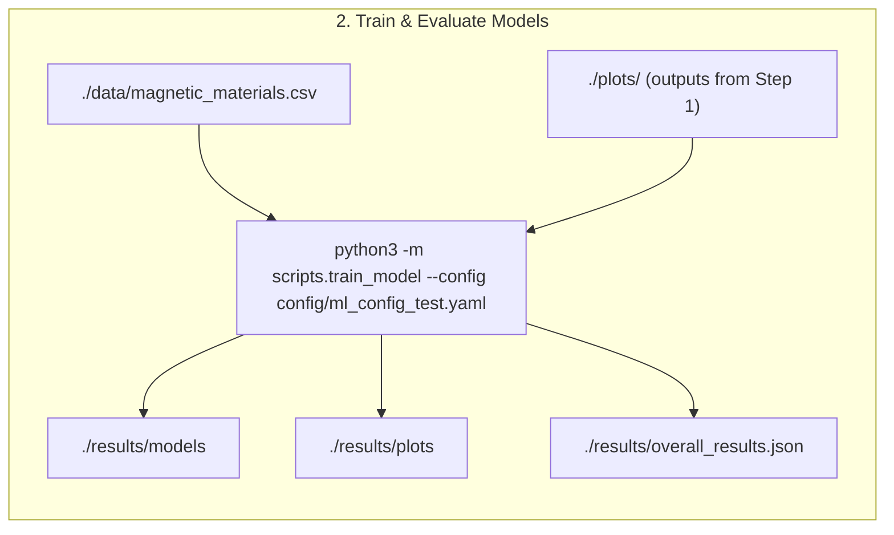
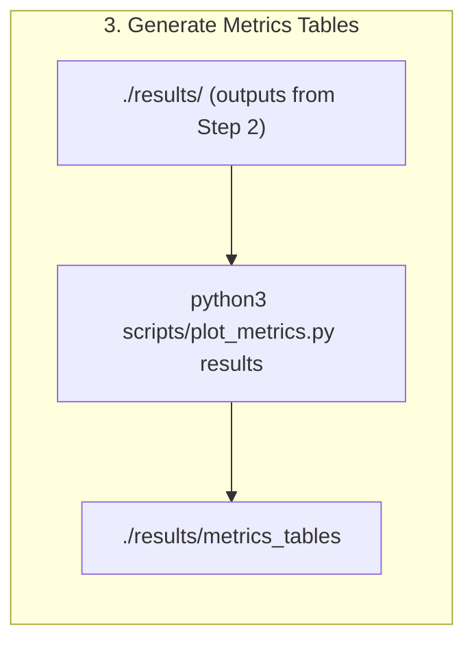
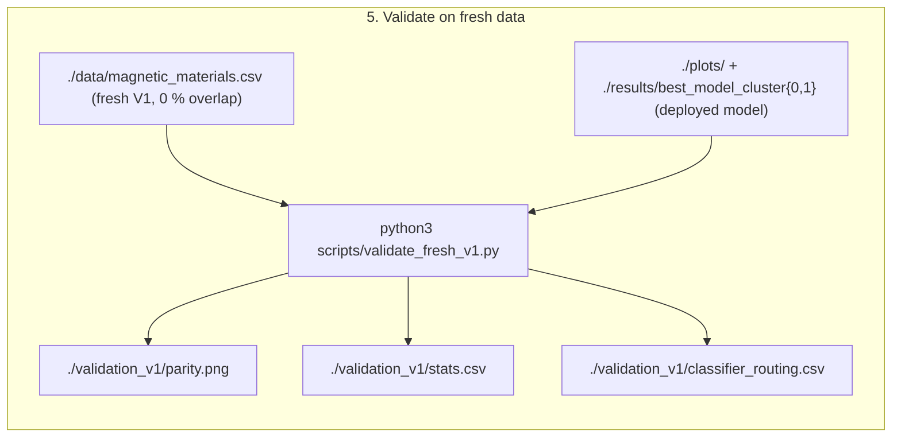

# ML surrogate model for micromagnetic simulations, H and K1 aligned in z-direction
Inverse model.

## Current version of model
v1.0


## 0. Installation
Use requirements.txt. In addition pytorch, compatible with your system, must be installed.

## Training data generation

- The training data has been created using micromagnetic simulations.
- One hysteresis loop for a cube of 50nm edge length was computed for each combination of material parameters A, Ms, K
- from the hysteresis loops, Hc, Mr and BHmax are computed (that's the input data for the ML model, available at [data/single_grain_cube_50nm_aligned.csv](data/single_grain_cube_50nm_aligned.csv)).
- in total 10388 data points were computed

The generation of the V2 training data and details on the simulation software and method are [described in data-generation](https://github.com/MaMMoS-project/BSW_data_generation).


## 1. Analyze Magnetic Data

Run:

```
python3 -m scripts.analyze_magnetic_data
```



NEEDS:
- ./data/magnetic_materials.csv

OUTPUT:
- stdout
- ./plots/*.png  # analysis plots
- ./plots/supervised_clustering_model.pkl
- ./plots/supervised_clustering_pipeline.joblib
- ./plots/supervised_metrics.txt


## 2. Model Training

Linear regression (LR) models, a random forest (RF), the LASSO regression, a Gaussian process and a fully connected neural network (FCNN) have been developed. Note that separate regressors have been trained for the hard and soft magnetic materials. 

Run:

```
python3 -m scripts.train_model --config config/ml_config_test.yaml
```



NEEDS:
- ./data/magnetic_materials.csv
- output files ./plots/ of 1

OUTPUT:
- stdout
- ./results/models
- ./results/plots
- ./results/overall_results.json

## 3. Metric Plots
Run:

```
python3 scripts/plot_metrics.py results
```



NEEDS:
- ./results of 2.

OUTPUT:
- stdout
- ./results/metrics_tables

## Results Soft Magnets

### Model metrics for target A (J/m)

|  # | Model             | Split |   MAE |   Gini |        R² |   MSE |   Adj. R² |             MAPE |
| -: | ----------------- | ----- | ----: | -----: | --------: | ----: | --------: | ---------------: |
|  1 | random_forest     | train | 0.000 | -0.445 |     0.848 | 0.000 |     0.848 |           17.775 |
|  2 | random_forest     | test  | 0.000 | -0.433 |     0.725 | 0.000 |     0.721 |           25.800 |
|  3 | neural_network    | train | 0.008 | -0.312 | -1.430e19 | 0.000 | -1.435e19 | 207774588332.621 |
|  4 | neural_network    | test  | 0.008 | -0.326 | -1.407e19 | 0.000 | -1.426e19 | 191260670612.834 |
|  5 | linear_regression | train | 0.000 | -0.428 |     0.581 | 0.000 |     0.579 |           33.191 |
|  6 | linear_regression | test  | 0.000 | -0.418 |     0.501 | 0.000 |     0.495 |           36.833 |
|  7 | lasso_lars        | train | 0.000 | -0.331 |     0.000 | 0.000 |    -0.003 |           73.230 |
|  8 | lasso_lars        | test  | 0.000 | -0.325 |    -0.000 | 0.000 |    -0.013 |           67.563 |
|  9 | lasso_lars_cv     | train | 0.000 | -0.331 |     0.000 | 0.000 |    -0.003 |           73.230 |
| 10 | lasso_lars_cv     | test  | 0.000 | -0.325 |    -0.000 | 0.000 |    -0.013 |           67.563 |
| 11 | gaussian_process  | train | 0.000 | -0.331 |     0.000 | 0.000 |    -0.003 |           73.230 |
| 12 | gaussian_process  | test  | 0.000 | -0.325 |    -0.000 | 0.000 |    -0.013 |           67.563 |


### Model metrics for target K (J/m^3)

|  # | Model             | Split |   MAE |   Gini |     R² |   MSE | Adj. R² |   MAPE |
| -: | ----------------- | ----- | ----: | -----: | -----: | ----: | ------: | -----: |
|  1 | random_forest     | train | 0.238 | -0.368 |  0.942 | 0.135 |   0.942 |  2.153 |
|  2 | random_forest     | test  | 0.406 | -0.369 |  0.845 | 0.418 |   0.843 |  3.725 |
|  3 | neural_network    | train | 0.372 | -0.367 |  0.873 | 0.296 |   0.873 |  3.347 |
|  4 | neural_network    | test  | 0.435 | -0.369 |  0.846 | 0.416 |   0.844 |  3.951 |
|  5 | linear_regression | train | 0.453 | -0.367 |  0.830 | 0.396 |   0.830 |  4.027 |
|  6 | linear_regression | test  | 0.534 | -0.368 |  0.795 | 0.553 |   0.793 |  4.811 |
|  7 | lasso_lars        | train | 0.454 | -0.367 |  0.830 | 0.398 |   0.829 |  4.037 |
|  8 | lasso_lars        | test  | 0.537 | -0.369 |  0.794 | 0.556 |   0.791 |  4.844 |
|  9 | lasso_lars_cv     | train | 0.453 | -0.367 |  0.830 | 0.396 |   0.830 |  4.027 |
| 10 | lasso_lars_cv     | test  | 0.534 | -0.368 |  0.795 | 0.553 |   0.793 |  4.811 |
| 11 | gaussian_process  | train | 1.306 | -0.332 |  0.000 | 2.334 |  -0.003 | 11.258 |
| 12 | gaussian_process  | test  | 1.436 | -0.332 | -0.001 | 2.701 |  -0.014 | 12.377 |


### Model metrics for target Ms (A/m)

|  # | Model             | Split |   MAE |   Gini |     R² |   MSE | Adj. R² |  MAPE |
| -: | ----------------- | ----- | ----: | -----: | -----: | ----: | ------: | ----: |
|  1 | random_forest     | train | 0.067 | -0.341 |  0.956 | 0.008 |   0.956 | 0.466 |
|  2 | random_forest     | test  | 0.099 | -0.341 |  0.901 | 0.019 |   0.899 | 0.685 |
|  3 | neural_network    | train | 0.141 | -0.340 |  0.837 | 0.030 |   0.836 | 0.976 |
|  4 | neural_network    | test  | 0.141 | -0.340 |  0.833 | 0.032 |   0.831 | 0.972 |
|  5 | linear_regression | train | 0.124 | -0.341 |  0.875 | 0.023 |   0.874 | 0.854 |
|  6 | linear_regression | test  | 0.132 | -0.340 |  0.858 | 0.027 |   0.856 | 0.910 |
|  7 | lasso_lars        | train | 0.127 | -0.341 |  0.866 | 0.025 |   0.866 | 0.878 |
|  8 | lasso_lars        | test  | 0.133 | -0.340 |  0.854 | 0.028 |   0.852 | 0.920 |
|  9 | lasso_lars_cv     | train | 0.124 | -0.341 |  0.875 | 0.023 |   0.874 | 0.854 |
| 10 | lasso_lars_cv     | test  | 0.132 | -0.340 |  0.858 | 0.027 |   0.856 | 0.910 |
| 11 | gaussian_process  | train | 0.357 | -0.333 |  0.000 | 0.186 |  -0.003 | 2.476 |
| 12 | gaussian_process  | test  | 0.362 | -0.333 | -0.004 | 0.189 |  -0.017 | 2.509 |


## Results Hard Magnets

###  Model metrics for target A (J/m)

|  # | Model             | Split |   MAE |   Gini |        R² |   MSE |   Adj. R² |            MAPE |
| -: | ----------------- | ----- | ----: | -----: | --------: | ----: | --------: | --------------: |
|  1 | random_forest     | train | 0.000 | -0.448 |     0.618 | 0.000 |     0.618 |          48.646 |
|  2 | random_forest     | test  | 0.000 | -0.436 |     0.516 | 0.000 |     0.515 |          53.791 |
|  3 | neural_network    | train | 0.003 | -0.364 | -8.602e17 | 0.000 | -8.605e17 | 70591090101.220 |
|  4 | neural_network    | test  | 0.003 | -0.362 | -8.890e17 | 0.000 | -8.905e17 | 69450443815.498 |
|  5 | linear_regression | train | 0.000 | -0.438 |     0.483 | 0.000 |     0.483 |          57.301 |
|  6 | linear_regression | test  | 0.000 | -0.436 |     0.426 | 0.000 |     0.425 |          56.343 |
|  7 | lasso_lars        | train | 0.000 | -0.334 |     0.000 | 0.000 |    -0.000 |         107.324 |
|  8 | lasso_lars        | test  | 0.000 | -0.331 |    -0.004 | 0.000 |    -0.006 |         103.597 |
|  9 | lasso_lars_cv     | train | 0.000 | -0.334 |     0.000 | 0.000 |    -0.000 |         107.324 |
| 10 | lasso_lars_cv     | test  | 0.000 | -0.331 |    -0.004 | 0.000 |    -0.006 |         103.597 |
| 11 | gaussian_process  | train | 0.000 | -0.421 |     0.000 | 0.000 |    -0.000 |         107.324 |
| 12 | gaussian_process  | test  | 0.000 | -0.418 |    -0.004 | 0.000 |    -0.006 |         103.597 |


### Model metrics for target K (J/m^3)

|  # | Model             | Split |   MAE |   Gini |     R² |   MSE | Adj. R² |   MAPE |
| -: | ----------------- | ----- | ----: | -----: | -----: | ----: | ------: | -----: |
|  1 | random_forest     | train | 0.038 | -0.365 |  0.998 | 0.005 |   0.998 |  0.314 |
|  2 | random_forest     | test  | 0.055 | -0.364 |  0.997 | 0.010 |   0.997 |  0.451 |
|  3 | neural_network    | train | 0.100 | -0.365 |  0.994 | 0.019 |   0.994 |  0.786 |
|  4 | neural_network    | test  | 0.102 | -0.364 |  0.994 | 0.019 |   0.994 |  0.788 |
|  5 | linear_regression | train | 0.120 | -0.365 |  0.985 | 0.046 |   0.985 |  0.944 |
|  6 | linear_regression | test  | 0.141 | -0.364 |  0.749 | 0.758 |   0.748 |  1.070 |
|  7 | lasso_lars        | train | 0.186 | -0.365 |  0.975 | 0.078 |   0.975 |  1.463 |
|  8 | lasso_lars        | test  | 0.190 | -0.364 |  0.971 | 0.088 |   0.971 |  1.469 |
|  9 | lasso_lars_cv     | train | 0.120 | -0.365 |  0.985 | 0.046 |   0.985 |  0.944 |
| 10 | lasso_lars_cv     | test  | 0.141 | -0.364 |  0.749 | 0.758 |   0.748 |  1.070 |
| 11 | gaussian_process  | train | 1.462 | -0.353 |  0.000 | 3.144 |  -0.000 | 11.488 |
| 12 | gaussian_process  | test  | 1.451 | -0.352 | -0.002 | 3.023 |  -0.004 | 11.241 |

### Model metrics for target Ms (A/m)

|  # | Model             | Split |   MAE |   Gini |     R² |   MSE | Adj. R² |  MAPE |
| -: | ----------------- | ----- | ----: | -----: | -----: | ----: | ------: | ----: |
|  1 | random_forest     | train | 0.007 | -0.354 |  1.000 | 0.000 |   1.000 | 0.050 |
|  2 | random_forest     | test  | 0.008 | -0.353 |  1.000 | 0.000 |   1.000 | 0.063 |
|  3 | neural_network    | train | 0.071 | -0.354 |  0.995 | 0.006 |   0.995 | 0.522 |
|  4 | neural_network    | test  | 0.072 | -0.353 |  0.994 | 0.006 |   0.994 | 0.524 |
|  5 | linear_regression | train | 0.006 | -0.354 |  1.000 | 0.000 |   1.000 | 0.043 |
|  6 | linear_regression | test  | 0.008 | -0.353 |  0.995 | 0.005 |   0.995 | 0.055 |
|  7 | lasso_lars        | train | 0.012 | -0.354 |  1.000 | 0.000 |   1.000 | 0.087 |
|  8 | lasso_lars        | test  | 0.013 | -0.353 |  0.998 | 0.003 |   0.998 | 0.095 |
|  9 | lasso_lars_cv     | train | 0.006 | -0.354 |  1.000 | 0.000 |   1.000 | 0.043 |
| 10 | lasso_lars_cv     | test  | 0.008 | -0.353 |  0.995 | 0.005 |   0.995 | 0.055 |
| 11 | gaussian_process  | train | 0.898 | -0.333 |  0.000 | 1.129 |  -0.000 | 6.768 |
| 12 | gaussian_process  | test  | 0.888 | -0.333 | -0.004 | 1.099 |  -0.005 | 6.639 |


## 4. Inference

To run an inference please run:
python3 ./scripts/predict.py 

## 5. Validation on fresh (held-out) data

The deployed inverse model is validated on a genuinely fresh dataset. The models are trained on
the V2 dataset (`data/single_grain_cube_50nm_aligned.csv`); an older, independently generated V1
dataset of 1,497 single-grain simulations (`data/magnetic_materials.csv`, same 50 nm aligned
geometry) is used as an external hold-out. The two datasets share **0 %** of their `(Ms, A, K1)`
parameter triples, so every validation point is genuinely unseen. The full deployed pipeline is
applied to each point (hard/soft classification from `Hc, Mr, (BH)max` → the class-specific
random-forest regressor) and the predicted intrinsic properties `Ms, A, K1` are compared with the
simulated ground truth.

Run:

```
python3 scripts/validate_fresh_v1.py
```



Of the 1,497 fresh points, 11 fall outside the training volume (excluded as extrapolation),
leaving **1,486** points (1,305 hard, 181 soft) for the comparison.

### Per-target results (fresh V1 data)

| Target (intrinsic) | R² | R²(log) | Median rel. error | MAE |
| --- | --- | --- | --- | --- |
| Spontaneous magnetisation `Ms` | **0.965** | 0.985 | **0.6 %** | 6.9×10⁴ A/m |
| Exchange stiffness `A` | **−1.04** | −1.04 | 52.0 % | 3.4×10⁻¹² J/m |
| Anisotropy constant `K1` | **0.980** | 0.964 | 4.8 % | 2.6×10⁵ J/m³ |

`Ms` and `K1` are recovered excellently on unseen data, confirming that the surrogate generalises
rather than memorising the training set. **`A`, however, is not recoverable** (negative R²; the
predictions collapse to a near-constant band regardless of the true value — see the middle panel
of `validation_v1/parity.png`). This is expected physically, not a model defect: the exchange
stiffness has only a weak effect on the extrinsic single-grain properties, so the inverse mapping
`(Hc, Mr, (BH)max) → A` is ill-posed / non-identifiable. `A` predictions from this inverse model
should therefore not be trusted.

### Hard/soft classifier routing

| Metric | Value |
| --- | --- |
| Points validated | 1,486 |
| Classifier accuracy | 97.4 % |
| Misrouted (wrong regressor used) | 39 (2.6 %) |
| &nbsp;&nbsp;soft (`Mr/Ms ≤ 0.4`) predicted as hard | 39 |
| &nbsp;&nbsp;hard (`Mr/Ms > 0.4`) predicted as soft | 0 |

The classifier is 97.4 % accurate on the fresh data, and its errors are entirely one-sided (soft
magnets routed to the hard regressor — the same asymmetry seen in the forward model). Here the
misrouting has a negligible effect on the targets: isolating the correctly-routed points barely
changes the metrics (`Ms` 0.965 → 0.971, `K1` unchanged at 0.980, `A` unchanged), so the residual
error is dominated by the intrinsic non-identifiability of `A`, not by classifier routing. The
misrouted points are ringed in red in the parity plot.

OUTPUT (in `./validation_v1/`):
- `parity.png` — predicted vs. true `Ms, A, K1` (log–log), coloured by predicted class, misrouted points ringed
- `stats.csv` — per-target R², R²(log), MAE, RMSE, median relative error
- `classifier_routing.csv` — hard/soft routing accuracy on the fresh data
