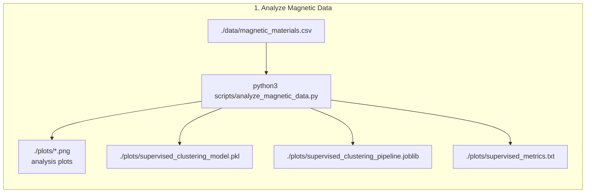
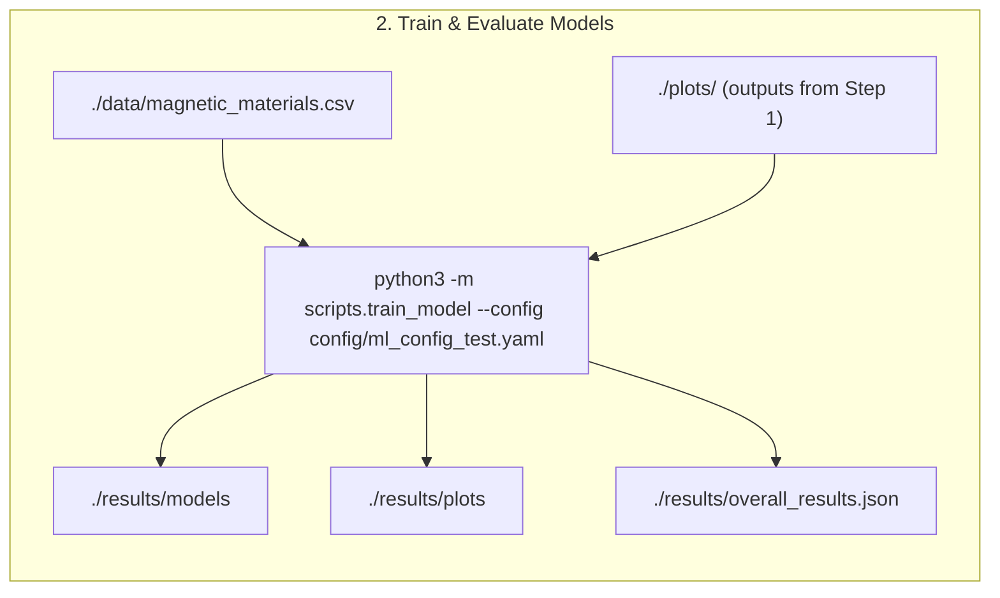
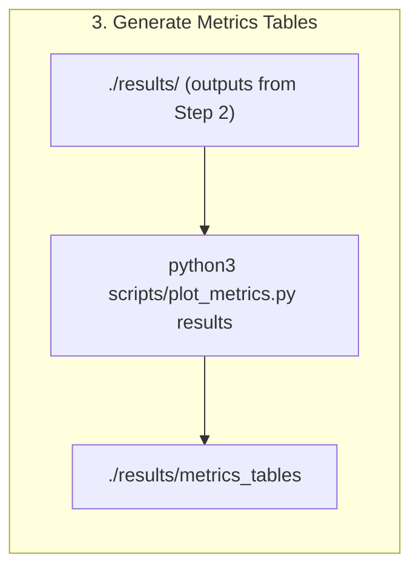
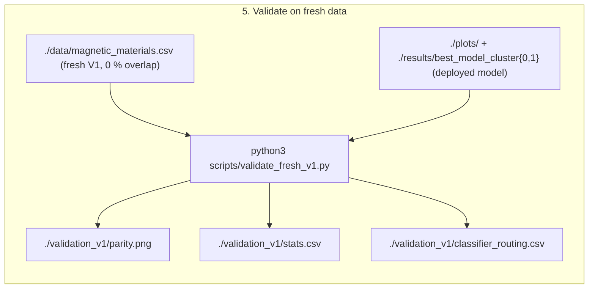

# ML surrogate model for micromagnetic simulations, H and K1 aligned in z-direction
Inverse model.

## Current version of model
v1.0


## 0. Installation
Use requirements.txt. In addition pytorch, compatible with your system, must be installed.

## Training data generation

- The training data has been created using micromagnetic simulations.
- One hysteresis loop for a cube of 50nm edge length was computed for each combination of material parameters A, Ms, K
- from the hysteresis loops, Hc, Mr and BHmax are computed (that's the input data for the ML model, available at [data/single_grain_cube_50nm_aligned.csv](data/single_grain_cube_50nm_aligned.csv)).
- in total 10388 data points were computed

The generation of the V2 training data and details on the simulation software and method are [described in data-generation](https://github.com/MaMMoS-project/BSW_data_generation).


## 1. Analyze Magnetic Data

Run:

```
python3 -m scripts.analyze_magnetic_data
```



NEEDS:
- ./data/magnetic_materials.csv

OUTPUT:
- stdout
- ./plots/*.png  # analysis plots
- ./plots/supervised_clustering_model.pkl
- ./plots/supervised_clustering_pipeline.joblib
- ./plots/supervised_metrics.txt


## 2. Model Training

Linear regression (LR) models, a random forest (RF), the LASSO regression, a Gaussian process and a fully connected neural network (FCNN) have been developed. Note that separate regressors have been trained for the hard and soft magnetic materials. 

Run:

```
python3 -m scripts.train_model --config config/ml_config_test.yaml
```



NEEDS:
- ./data/magnetic_materials.csv
- output files ./plots/ of 1

OUTPUT:
- stdout
- ./results/models
- ./results/plots
- ./results/overall_results.json

## 3. Metric Plots
Run:

```
python3 scripts/plot_metrics.py results
```



NEEDS:
- ./results of 2.

OUTPUT:
- stdout
- ./results/metrics_tables

## Results
Below results for the best model (Gaussian Process) and second best model (Random Forest) are displayed. Note that the Gaussian Process is likely prone to overfitting.


### 🏆 Best model metrics for target A (J/m)
| Model | Soft Magnet                         |Hard Magnets            | 
| ----- | -----------------------             |------------------------| 
| RF (Train) | MSE: 0.0000  <br> R²:0.8481    | MSE: 0.0000 <br> R²: 0.6179  |
| RF (Test)    | MSE: 0.0000 <br> R²: 0.7248  | MSE: 0.0000 <br> R²: 0.5160  |
| GP (Train)  | MSE: 0.0000 <br> R²: 1.0      | MSE: 0.0000 <br> R²: 1.0  | 
| GP (Test)  | MSE: 0.0000 <br> R²: 0.8210    | MSE: 0.0000 <br> R²: 0.5196  | 

### 🏆 Best model metrics for target K (J/m^3)
| Model | Soft Magnet             | Hard Magnets               | 
| ----- | ----------------------- | ------------------------ | 
| RF (Train) | MSE: 0.1350  <br> R²: 0.9422 | MSE: 0.0052 <br> R²: 0.9983|
| RF (Test)  | MSE: 0.4184  <br> R²: 0.8449 | MSE: 0.0102 <br> R²: 0.9966|
| GP (Train) | MSE: 0.0000  <br> R²: 1.0    | MSE: 0.0000 <br> R²: 1.0| 
| GP (Test)  | MSE: 0.3968  <br> R²: 0.8529 | MSE: 0.0118 <br> R²:  0.9961| 

### 🏆 Best model metrics for target Ms (A/m)
| Model | Soft Magnet                           | Hard Magnets               | 
| ----- | -----------------------               | ------------------------   | 
| RF (Train) | MSE: 0.0081 <br> R²: 0.9563      | MSE: 0.0001 <br> R²:   0.9999           |
| RF (Test)    | MSE: 0.0188 <br> R²: 0.9006    | MSE: 0.0002 <br> R²:   0.9998          |
| GP (Train)  | MSE: 0.0000 <br> R²: 1.0        | MSE: 0.0000 <br> R²:   1.0         | 
| GP (Test)  | MSE: 0.0154 <br> R²: 0.9187      | MSE: 0.0011 <br> R²:   0.9990         | 


## 4. Inference

To run an inference please run:
python3 ./scripts/load_onnx_models.py 

## 5. Validation on fresh (held-out) data

The deployed inverse model is validated on a genuinely fresh dataset. The models are trained on
the V2 dataset (`data/single_grain_cube_50nm_aligned.csv`); an older, independently generated V1
dataset of 1,497 single-grain simulations (`data/magnetic_materials.csv`, same 50 nm aligned
geometry) is used as an external hold-out. The two datasets share **0 %** of their `(Ms, A, K1)`
parameter triples, so every validation point is genuinely unseen. The full deployed pipeline is
applied to each point (hard/soft classification from `Hc, Mr, (BH)max` → the class-specific
random-forest regressor) and the predicted intrinsic properties `Ms, A, K1` are compared with the
simulated ground truth.

Run:

```
python3 scripts/validate_fresh_v1.py
```



Of the 1,497 fresh points, 11 fall outside the training volume (excluded as extrapolation),
leaving **1,486** points (1,305 hard, 181 soft) for the comparison.

### Per-target results (fresh V1 data)

| Target (intrinsic) | R² | R²(log) | Median rel. error | MAE |
| --- | --- | --- | --- | --- |
| Spontaneous magnetisation `Ms` | **0.965** | 0.985 | **0.6 %** | 6.9×10⁴ A/m |
| Exchange stiffness `A` | **−1.04** | −1.04 | 52.0 % | 3.4×10⁻¹² J/m |
| Anisotropy constant `K1` | **0.980** | 0.964 | 4.8 % | 2.6×10⁵ J/m³ |

`Ms` and `K1` are recovered excellently on unseen data, confirming that the surrogate generalises
rather than memorising the training set. **`A`, however, is not recoverable** (negative R²; the
predictions collapse to a near-constant band regardless of the true value — see the middle panel
of `validation_v1/parity.png`). This is expected physically, not a model defect: the exchange
stiffness has only a weak effect on the extrinsic single-grain properties, so the inverse mapping
`(Hc, Mr, (BH)max) → A` is ill-posed / non-identifiable. `A` predictions from this inverse model
should therefore not be trusted.

### Hard/soft classifier routing

| Metric | Value |
| --- | --- |
| Points validated | 1,486 |
| Classifier accuracy | 97.4 % |
| Misrouted (wrong regressor used) | 39 (2.6 %) |
| &nbsp;&nbsp;soft (`Mr/Ms ≤ 0.4`) predicted as hard | 39 |
| &nbsp;&nbsp;hard (`Mr/Ms > 0.4`) predicted as soft | 0 |

The classifier is 97.4 % accurate on the fresh data, and its errors are entirely one-sided (soft
magnets routed to the hard regressor — the same asymmetry seen in the forward model). Here the
misrouting has a negligible effect on the targets: isolating the correctly-routed points barely
changes the metrics (`Ms` 0.965 → 0.971, `K1` unchanged at 0.980, `A` unchanged), so the residual
error is dominated by the intrinsic non-identifiability of `A`, not by classifier routing. The
misrouted points are ringed in red in the parity plot.

OUTPUT (in `./validation_v1/`):
- `parity.png` — predicted vs. true `Ms, A, K1` (log–log), coloured by predicted class, misrouted points ringed
- `stats.csv` — per-target R², R²(log), MAE, RMSE, median relative error
- `classifier_routing.csv` — hard/soft routing accuracy on the fresh data
