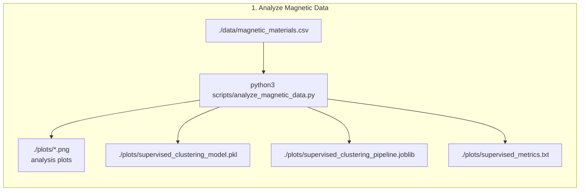
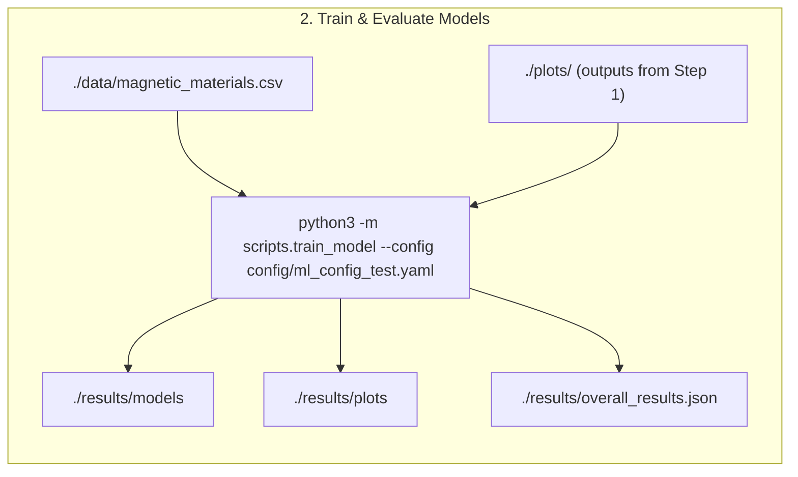
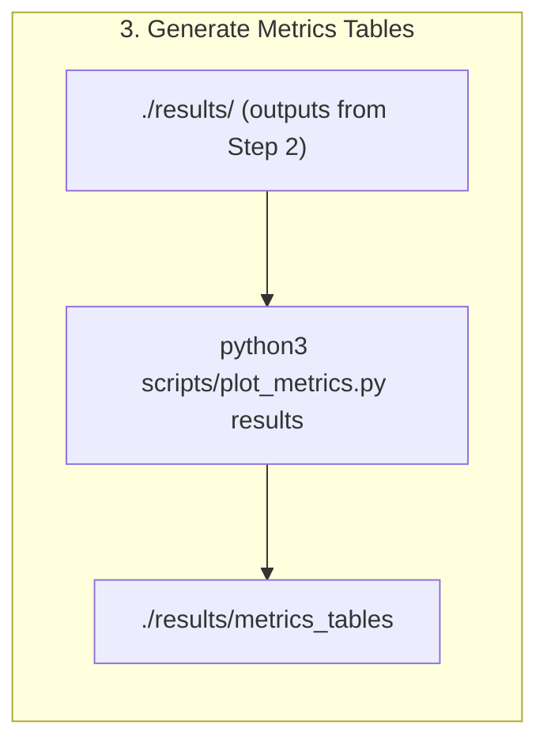
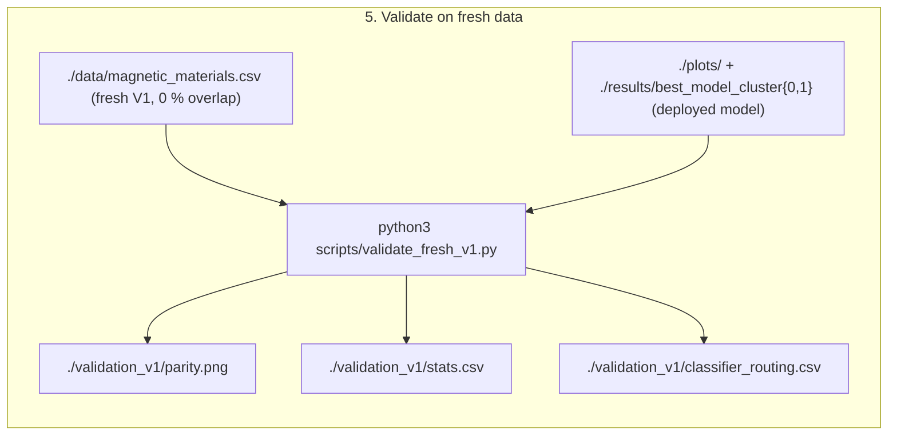

# ML surrogate model for micromagnetic simulations, H and K1 aligned in z-direction
Inverse model.

## Current version of model
v1.0


## 0. Installation
Use requirements.txt. In addition pytorch, compatible with your system, must be installed.

## Training data generation

- The training data has been created using micromagnetic simulations.
- One hysteresis loop for a cube of 50nm edge length was computed for each combination of material parameters A, Ms, K
- from the hysteresis loops, Hc, Mr and BHmax are computed (that's the input data for the ML model, available at [data/single_grain_cube_50nm_aligned.csv](data/single_grain_cube_50nm_aligned.csv)).
- in total 10388 data points were computed

The generation of the V2 training data and details on the simulation software and method are [described in data-generation](https://github.com/MaMMoS-project/BSW_data_generation).


## 1. Analyze Magnetic Data

Run:

```
python3 -m scripts.analyze_magnetic_data
```



NEEDS:
- ./data/magnetic_materials.csv

OUTPUT:
- stdout
- ./plots/*.png  # analysis plots
- ./plots/supervised_clustering_model.pkl
- ./plots/supervised_clustering_pipeline.joblib
- ./plots/supervised_metrics.txt


## 2. Model Training

Linear regression (LR) models, a random forest (RF), the LASSO regression, a Gaussian process and a fully connected neural network (FCNN) have been developed. Note that separate regressors have been trained for the hard and soft magnetic materials. 

Run:

```
python3 -m scripts.train_model --config config/ml_config_test.yaml
```



NEEDS:
- ./data/magnetic_materials.csv
- output files ./plots/ of 1

OUTPUT:
- stdout
- ./results/models
- ./results/plots
- ./results/overall_results.json

## 3. Metric Plots
Run:

```
python3 scripts/plot_metrics.py results
```



NEEDS:
- ./results of 2.

OUTPUT:
- stdout
- ./results/metrics_tables

## Results Soft Magnets

### Model metrics for target A (J/m)

| Model                 |  Train R² |       Test R² | ΔR² (Train-Test) | Train MAE |     Test MAE | Train MSE |     Test MSE | Train MAPE |    Test MAPE |
| --------------------- | --------: | ------------: | ---------------: | --------: | -----------: | --------: | -----------: | ---------: | -----------: |
| **gaussian_process**  |    1.0000 |    **0.8210** |           0.1790 |  6.73E-18 | **6.83E-13** |  1.10E-34 | **1.29E-24** |     0.0001 |  **19.2367** |
| **random_forest**     |    0.8481 |    **0.7248** |           0.1233 |  7.54E-13 | **9.65E-13** |  1.12E-24 | **1.98E-24** |    17.7753 |  **25.8003** |
| **linear_regression** |    0.5806 |    **0.5015** |           0.0791 |  1.43E-12 | **1.54E-12** |  3.10E-24 | **3.59E-24** |    33.1907 |  **36.8335** |
| **lasso_lars**        |    0.0000 |   **-0.0003** |           0.0003 |  2.37E-12 | **2.33E-12** |  7.40E-24 | **7.21E-24** |    73.2297 |  **67.5631** |
| **lasso_lars_cv**     |    0.0000 |   **-0.0003** |           0.0003 |  2.37E-12 | **2.33E-12** |  7.40E-24 | **7.21E-24** |    73.2297 |  **67.5631** |
| **neural_network**    | -6.28E+18 | **-5.79E+18** |        -4.92E+17 |    0.0055 |   **0.0050** |  4.64E-05 | **4.17E-05** |   1.26E+11 | **1.27E+11** |


### Model metrics for target K (J/m^3)

| Model                 | Train R² |    Test R² | ΔR² (Train-Test) |  Train MAE |   Test MAE |  Train MSE |   Test MSE | Train MAPE |  Test MAPE |
| --------------------- | -------: | ---------: | ---------------: | ---------: | ---------: | ---------: | ---------: | ---------: | ---------: |
| **gaussian_process**  |   1.0000 | **0.8529** |           0.1471 |     0.0000 | **0.3342** |     0.0000 | **0.3968** |     0.0000 | **3.1152** |
| **neural_network**    |   0.8689 | **0.8480** |       **0.0209** |     0.3838 |     0.4326 |     0.3060 |     0.4101 |     3.4325 |     3.9258 |
| **random_forest**     |   0.9422 | **0.8449** |           0.0972 | **0.2376** | **0.4064** | **0.1350** |     0.4184 | **2.1534** |     3.7252 |
| **linear_regression** |   0.8303 |     0.7952 |           0.0351 |     0.4534 |     0.5339 |     0.3960 |     0.5525 |     4.0272 |     4.8109 |
| **lasso_lars_cv**     |   0.8303 |     0.7952 |           0.0351 |     0.4534 |     0.5339 |     0.3960 |     0.5525 |     4.0272 |     4.8109 |
| **lasso_lars**        |   0.8297 |     0.7940 |           0.0357 |     0.4542 |     0.5370 |     0.3975 |     0.5559 |     4.0370 |     4.8441 |


### Model metrics for target Ms (A/m)

| Model                 | Train R² |    Test R² | ΔR² (Train-Test) | Train MAE |   Test MAE | Train MSE |   Test MSE | Train MAPE |  Test MAPE |
| --------------------- | -------: | ---------: | ---------------: | --------: | ---------: | --------: | ---------: | ---------: | ---------: |
| **gaussian_process**  |   1.0000 | **0.9187** |           0.0813 |  6.77E-07 | **0.0738** |  1.37E-12 | **0.0154** |     0.0000 | **0.5145** |
| **random_forest**     |   0.9563 | **0.9006** |           0.0556 |    0.0670 | **0.0987** |    0.0081 | **0.0188** |     0.4656 | **0.6847** |
| **linear_regression** |   0.8745 | **0.8582** |           0.0164 |    0.1236 | **0.1319** |    0.0234 | **0.0268** |     0.8539 | **0.9103** |
| **lasso_lars_cv**     |   0.8745 | **0.8582** |           0.0164 |    0.1236 | **0.1319** |    0.0234 | **0.0268** |     0.8539 | **0.9103** |
| **lasso_lars**        |   0.8661 | **0.8535** |           0.0126 |    0.1272 | **0.1335** |    0.0249 | **0.0276** |     0.8780 | **0.9197** |
| **neural_network**    |   0.8261 | **0.8104** |           0.0157 |    0.1474 | **0.1480** |    0.0324 | **0.0358** |     1.0166 | **1.0227** |


## Results Hard Magnets

###  Model metrics for target A (J/m)

| Model                 |  Train R² |       Test R² | ΔR² (Train-Test) | Train MAE |     Test MAE | Train MSE |     Test MSE | Train MAPE |    Test MAPE |
| --------------------- | --------: | ------------: | ---------------: | --------: | -----------: | --------: | -----------: | ---------: | -----------: |
| **gaussian_process**  |    1.0000 |    **0.5196** |           0.4804 |  1.04E-17 | **1.66E-12** |  1.69E-34 | **4.47E-24** |     0.0003 |  **53.6912** |
| **random_forest**     |    0.6179 |    **0.5160** |           0.1020 |  1.48E-12 | **1.67E-12** |  3.51E-24 | **4.50E-24** |    48.6463 |  **53.7910** |
| **linear_regression** |    0.4834 |    **0.4257** |           0.0577 |  1.76E-12 | **1.76E-12** |  4.75E-24 | **5.34E-24** |    57.3010 |  **56.3426** |
| **lasso_lars**        |    0.0000 |   **-0.0038** |           0.0038 |  2.62E-12 | **2.67E-12** |  9.19E-24 | **9.33E-24** |   107.3239 | **103.5975** |
| **lasso_lars_cv**     |    0.0000 |   **-0.0038** |           0.0038 |  2.62E-12 | **2.67E-12** |  9.19E-24 | **9.33E-24** |   107.3239 | **103.5975** |
| **neural_network**    | -2.62E+18 | **-2.58E+18** |        -4.23E+16 |    0.0042 |   **0.0042** |  2.41E-05 | **2.40E-05** |   1.23E+11 | **1.17E+11** |


### Model metrics for target K (J/m^3)

| Model                 | Train R² |    Test R² | ΔR² (Train-Test) | Train MAE |   Test MAE | Train MSE |   Test MSE | Train MAPE |  Test MAPE |
| --------------------- | -------: | ---------: | ---------------: | --------: | ---------: | --------: | ---------: | ---------: | ---------: |
| **random_forest**     |   0.9983 | **0.9966** |           0.0017 |    0.0381 | **0.0554** |    0.0052 | **0.0102** |     0.3142 | **0.4510** |
| **gaussian_process**  |   1.0000 | **0.9961** |           0.0039 |    0.0000 | **0.0546** |    0.0000 | **0.0118** |     0.0000 | **0.4447** |
| **neural_network**    |   0.9963 | **0.9941** |           0.0022 |    0.0745 | **0.0779** |    0.0117 | **0.0177** |     0.5859 | **0.6051** |
| **lasso_lars**        |   0.9751 | **0.9707** |           0.0044 |    0.1864 | **0.1896** |    0.0783 | **0.0884** |     1.4631 | **1.4687** |
| **linear_regression** |   0.9852 | **0.7488** |           0.2364 |    0.1203 | **0.1406** |    0.0464 | **0.7576** |     0.9439 | **1.0697** |
| **lasso_lars_cv**     |   0.9852 | **0.7488** |           0.2364 |    0.1203 | **0.1406** |    0.0464 | **0.7576** |     0.9439 | **1.0697** |


### Model metrics for target Ms (A/m)
| Model                 | Train R² |    Test R² | ΔR² (Train-Test) | Train MAE |   Test MAE | Train MSE |   Test MSE | Train MAPE |  Test MAPE |
| --------------------- | -------: | ---------: | ---------------: | --------: | ---------: | --------: | ---------: | ---------: | ---------: |
| **random_forest**     |   0.9999 | **0.9998** |           0.0001 |    0.0066 | **0.0084** |    0.0001 | **0.0002** |     0.0497 | **0.0633** |
| **lasso_lars**        |   0.9996 | **0.9977** |           0.0019 |    0.0117 | **0.0131** |    0.0004 | **0.0025** |     0.0869 | **0.0954** |
| **gaussian_process**  |   1.0000 | **0.9990** |           0.0010 |    0.0000 | **0.0058** |    0.0000 | **0.0011** |     0.0000 | **0.0428** |
| **neural_network**    |   0.9992 | **0.9940** |           0.0051 |    0.0243 | **0.0262** |    0.0010 | **0.0065** |     0.1813 | **0.1934** |
| **linear_regression** |   0.9998 | **0.9952** |           0.0047 |    0.0058 | **0.0076** |    0.0002 | **0.0053** |     0.0427 | **0.0545** |
| **lasso_lars_cv**     |   0.9998 | **0.9952** |           0.0047 |    0.0058 | **0.0076** |    0.0002 | **0.0053** |     0.0427 | **0.0545** |


## 4. Inference

To run an inference please run:
python3 ./scripts/predict.py 

## 5. Validation on fresh (held-out) data

The deployed inverse model is validated on a genuinely fresh dataset. The models are trained on
the V2 dataset (`data/single_grain_cube_50nm_aligned.csv`); an older, independently generated V1
dataset of 1,497 single-grain simulations (`data/magnetic_materials.csv`, same 50 nm aligned
geometry) is used as an external hold-out. The two datasets share **0 %** of their `(Ms, A, K1)`
parameter triples, so every validation point is genuinely unseen. The full deployed pipeline is
applied to each point (hard/soft classification from `Hc, Mr, (BH)max` → the class-specific
random-forest regressor) and the predicted intrinsic properties `Ms, A, K1` are compared with the
simulated ground truth.

Run:

```
python3 scripts/validate_fresh_v1.py
```



Of the 1,497 fresh points, 11 fall outside the training volume (excluded as extrapolation),
leaving **1,486** points (1,305 hard, 181 soft) for the comparison.

### Per-target results (fresh V1 data)

| Target (intrinsic) | R² | R²(log) | Median rel. error | MAE |
| --- | --- | --- | --- | --- |
| Spontaneous magnetisation `Ms` | **0.965** | 0.985 | **0.6 %** | 6.9×10⁴ A/m |
| Exchange stiffness `A` | **−1.04** | −1.04 | 52.0 % | 3.4×10⁻¹² J/m |
| Anisotropy constant `K1` | **0.980** | 0.964 | 4.8 % | 2.6×10⁵ J/m³ |

`Ms` and `K1` are recovered excellently on unseen data, confirming that the surrogate generalises
rather than memorising the training set. **`A`, however, is not recoverable** (negative R²; the
predictions collapse to a near-constant band regardless of the true value — see the middle panel
of `validation_v1/parity.png`). This is expected physically, not a model defect: the exchange
stiffness has only a weak effect on the extrinsic single-grain properties, so the inverse mapping
`(Hc, Mr, (BH)max) → A` is ill-posed / non-identifiable. `A` predictions from this inverse model
should therefore not be trusted.

### Hard/soft classifier routing

| Metric | Value |
| --- | --- |
| Points validated | 1,486 |
| Classifier accuracy | 97.4 % |
| Misrouted (wrong regressor used) | 39 (2.6 %) |
| &nbsp;&nbsp;soft (`Mr/Ms ≤ 0.4`) predicted as hard | 39 |
| &nbsp;&nbsp;hard (`Mr/Ms > 0.4`) predicted as soft | 0 |

The classifier is 97.4 % accurate on the fresh data, and its errors are entirely one-sided (soft
magnets routed to the hard regressor — the same asymmetry seen in the forward model). Here the
misrouting has a negligible effect on the targets: isolating the correctly-routed points barely
changes the metrics (`Ms` 0.965 → 0.971, `K1` unchanged at 0.980, `A` unchanged), so the residual
error is dominated by the intrinsic non-identifiability of `A`, not by classifier routing. The
misrouted points are ringed in red in the parity plot.

OUTPUT (in `./validation_v1/`):
- `parity.png` — predicted vs. true `Ms, A, K1` (log–log), coloured by predicted class, misrouted points ringed
- `stats.csv` — per-target R², R²(log), MAE, RMSE, median relative error
- `classifier_routing.csv` — hard/soft routing accuracy on the fresh data
