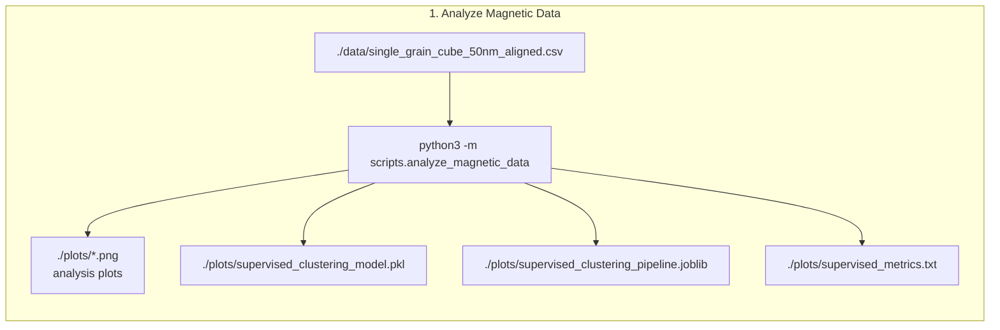
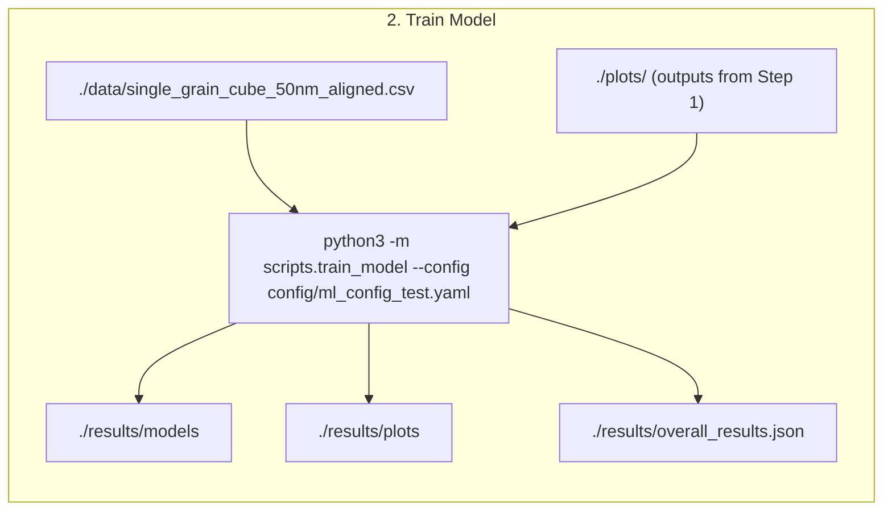
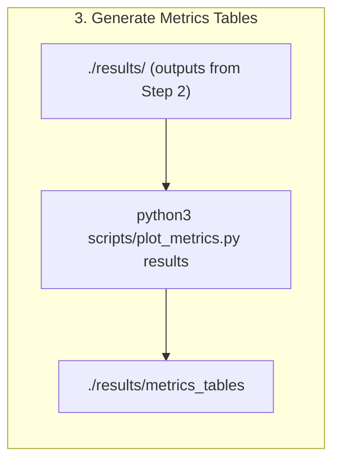

# ML surrogate model for micromagnetic simulations, H and K1 aligned in z-direction


## Current version of model
v1.0


## 0. Installation
Use requirements.txt. In addition pytorch, compatible with your system, must be installed.

## Training data generation

- The training data has been created using micromagnetic simulations.
- One hysteresis loop for a cube of 50nm edge length was computed for each combination of material parameters A, Ms, K
- from the hysteresis loops, Hc, Mr and BHmax are computed (that's the input data for the ML model, available at [data/single_grain_cube_50nm_aligned.csv](data/single_grain_cube_50nm_aligned.csv)).
- in total 10388 data points were computed

The generation of the V2 training data and details on the simulation software and method are [described in data-generation](https://github.com/MaMMoS-project/BSW_data_generation).


## 1. Analyze Magnetic Data

Run:

```
python3 -m scripts.analyze_magnetic_data

```


NEEDS:
- ./data/single_grain_cube_50nm_aligned.csv

OUTPUT:
- stdout
- ./plots/*.png  # analysis plots
- ./plots/supervised_clustering_model.pkl
- ./plots/supervised_clustering_pipeline.joblib
- ./plots/supervised_metrics.txt

In this specific case where the anisotropy axis is aligned with the external magnetic field, the dataset can be split into two distinct groups when considering the dimensionless ratio Mr/Ms. Namely, hard and soft magnetic materials. The points for hard magnets corresponds to Mr/Ms≈1 (red points ) while other points lie around Mr/Ms≈0 (blue points). A k-means clustering algorithm is applied to find the cluster centers of Mr/Ms ration. Then a random forest classifier is trained to predict the material class label (hard, soft) from intrinsic properties. 

- Cluster 0 = soft magnetic materials
- Cluster 1 = hard magnetic materials


## 2. Model Training

Linear regression (LR) models, a random forest (RF), the LASSO regression, a Gaussian process and a fully connected neural network (FCNN) have been developed. Note that separate regressors have been trained for the hard and soft magnetic materials. 

Run:

```
python3 -m scripts.train_model --config config/ml_config_test.yaml
```



NEEDS:
- ./data/single_grain_cube_50nm_aligned.csv
- output files ./plots/ of 1

OUTPUT:
- stdout
- ./results/models
- ./results/plots
- ./results/overall_results.json

## 3. Metric Plots
Run:

```
python3 scripts/plot_metrics.py results
```



NEEDS:
- ./results of 2.

OUTPUT:
- stdout
- ./results/metrics_tables

## Results Soft Magnets

### Results for target Hc (A/m)

| Model             | Split |  MAPE |    R² | Adj. R² |   MSE |   Gini |   MAE |
| ----------------- | ----- | ----: | ----: | ------: | ----: | -----: | ----: |
| random_forest     | train | 0.618 | 0.950 |   0.950 | 0.011 | -0.346 | 0.063 |
| random_forest     | test  | 1.111 | 0.851 |   0.849 | 0.035 | -0.346 | 0.114 |
| neural_network    | train | 1.709 | 0.756 |   0.755 | 0.055 | -0.345 | 0.174 |
| neural_network    | test  | 1.620 | 0.773 |   0.770 | 0.053 | -0.345 | 0.167 |
| linear_regression | train | 2.342 | 0.536 |   0.534 | 0.104 | -0.343 | 0.240 |
| linear_regression | test  | 2.189 | 0.567 |   0.562 | 0.101 | -0.344 | 0.227 |
| lasso_lars        | train | 2.326 | 0.535 |   0.534 | 0.104 | -0.343 | 0.239 |
| lasso_lars        | test  | 2.174 | 0.565 |   0.559 | 0.102 | -0.344 | 0.226 |
| lasso_lars_cv     | train | 2.342 | 0.536 |   0.534 | 0.104 | -0.343 | 0.240 |
| lasso_lars_cv     | test  | 2.189 | 0.567 |   0.562 | 0.101 | -0.344 | 0.227 |
| gaussian_process  | train | 0.003 | 1.000 |   1.000 | 0.000 | -0.346 | 0.000 |
| gaussian_process  | test  | 1.026 | 0.860 |   0.859 | 0.033 | -0.346 | 0.106 |

 
### Results for target Mr (A/m)

| Model             | Split |  MAPE |    R² | Adj. R² |   MSE |   Gini |   MAE |
| ----------------- | ----- | ----: | ----: | ------: | ----: | -----: | ----: |
| random_forest     | train | 0.564 | 0.932 |   0.932 | 0.018 | -0.345 | 0.067 |
| random_forest     | test  | 0.974 | 0.862 |   0.861 | 0.037 | -0.345 | 0.116 |
| neural_network    | train | 1.617 | 0.710 |   0.709 | 0.079 | -0.344 | 0.191 |
| neural_network    | test  | 1.668 | 0.743 |   0.739 | 0.069 | -0.344 | 0.197 |
| linear_regression | train | 2.413 | 0.431 |   0.429 | 0.154 | -0.341 | 0.287 |
| linear_regression | test  | 2.424 | 0.448 |   0.441 | 0.148 | -0.342 | 0.289 |
| lasso_lars        | train | 2.377 | 0.426 |   0.424 | 0.156 | -0.341 | 0.283 |
| lasso_lars        | test  | 2.409 | 0.444 |   0.436 | 0.150 | -0.342 | 0.287 |
| lasso_lars_cv     | train | 2.413 | 0.431 |   0.429 | 0.154 | -0.341 | 0.287 |
| lasso_lars_cv     | test  | 2.424 | 0.448 |   0.441 | 0.148 | -0.342 | 0.289 |
| gaussian_process  | train | 0.002 | 1.000 |   1.000 | 0.000 | -0.346 | 0.000 |
| gaussian_process  | test  | 0.947 | 0.851 |   0.849 | 0.040 | -0.345 | 0.113 |


### Results for target (BH)max (J/m^3)

| Model             | Split |  MAPE |    R² | Adj. R² |   MSE |   Gini |   MAE |
| ----------------- | ----- | ----: | ----: | ------: | ----: | -----: | ----: |
| random_forest     | train | 0.190 | 0.999 |   0.999 | 0.001 | -0.354 | 0.024 |
| random_forest     | test  | 0.365 | 0.995 |   0.995 | 0.005 | -0.354 | 0.047 |
| neural_network    | train | 0.906 | 0.975 |   0.975 | 0.023 | -0.353 | 0.120 |
| neural_network    | test  | 0.927 | 0.972 |   0.972 | 0.027 | -0.354 | 0.124 |
| linear_regression | train | 0.699 | 0.986 |   0.986 | 0.013 | -0.353 | 0.091 |
| linear_regression | test  | 0.692 | 0.987 |   0.987 | 0.012 | -0.354 | 0.092 |
| lasso_lars        | train | 0.713 | 0.985 |   0.985 | 0.013 | -0.353 | 0.093 |
| lasso_lars        | test  | 0.715 | 0.987 |   0.986 | 0.013 | -0.354 | 0.095 |
| lasso_lars_cv     | train | 0.699 | 0.986 |   0.986 | 0.013 | -0.353 | 0.091 |
| lasso_lars_cv     | test  | 0.692 | 0.987 |   0.987 | 0.012 | -0.354 | 0.092 |
| gaussian_process  | train | 0.000 | 1.000 |   1.000 | 0.000 | -0.354 | 0.000 |
| gaussian_process  | test  | 0.194 | 0.998 |   0.998 | 0.002 | -0.354 | 0.025 |


## Results Hard Magnets

### Results for target Hc (A/m)

| Model             | Split |  MAPE |    R² | Adj. R² |   MSE |   Gini |   MAE |
| ----------------- | ----- | ----: | ----: | ------: | ----: | -----: | ----: |
| random_forest     | train | 0.166 | 0.999 |   0.999 | 0.002 | -0.359 | 0.021 |
| random_forest     | test  | 0.425 | 0.994 |   0.994 | 0.011 | -0.359 | 0.053 |
| neural_network    | train | 0.401 | 0.996 |   0.996 | 0.007 | -0.359 | 0.052 |
| neural_network    | test  | 0.410 | 0.996 |   0.996 | 0.007 | -0.359 | 0.053 |
| linear_regression | train | 1.860 | 0.930 |   0.930 | 0.124 | -0.359 | 0.241 |
| linear_regression | test  | 1.745 | 0.939 |   0.939 | 0.106 | -0.358 | 0.226 |
| lasso_lars        | train | 1.866 | 0.930 |   0.929 | 0.125 | -0.359 | 0.241 |
| lasso_lars        | test  | 1.757 | 0.938 |   0.938 | 0.108 | -0.358 | 0.227 |
| lasso_lars_cv     | train | 1.860 | 0.930 |   0.930 | 0.124 | -0.359 | 0.241 |
| lasso_lars_cv     | test  | 1.745 | 0.939 |   0.939 | 0.106 | -0.358 | 0.226 |
| gaussian_process  | train | 0.005 | 1.000 |   1.000 | 0.000 | -0.359 | 0.001 |
| gaussian_process  | test  | 0.111 | 0.999 |   0.999 | 0.002 | -0.359 | 0.013 |


### Results for target Mr (A/m)

| Model             | Split |  MAPE |    R² | Adj. R² |   MSE |   Gini |   MAE |
| ----------------- | ----- | ----: | ----: | ------: | ----: | -----: | ----: |
| random_forest     | train | 0.026 | 0.999 |   0.999 | 0.001 | -0.353 | 0.003 |
| random_forest     | test  | 0.085 | 0.991 |   0.991 | 0.009 | -0.353 | 0.011 |
| neural_network    | train | 0.266 | 0.995 |   0.995 | 0.006 | -0.353 | 0.036 |
| neural_network    | test  | 0.283 | 0.990 |   0.990 | 0.011 | -0.353 | 0.038 |
| linear_regression | train | 0.107 | 0.995 |   0.995 | 0.005 | -0.353 | 0.014 |
| linear_regression | test  | 0.119 | 0.990 |   0.990 | 0.011 | -0.353 | 0.016 |
| lasso_lars        | train | 0.134 | 0.995 |   0.995 | 0.005 | -0.353 | 0.018 |
| lasso_lars        | test  | 0.145 | 0.990 |   0.990 | 0.011 | -0.353 | 0.019 |
| lasso_lars_cv     | train | 0.108 | 0.995 |   0.995 | 0.005 | -0.353 | 0.014 |
| lasso_lars_cv     | test  | 0.119 | 0.990 |   0.990 | 0.011 | -0.353 | 0.016 |
| gaussian_process  | train | 0.003 | 1.000 |   1.000 | 0.000 | -0.353 | 0.000 |
| gaussian_process  | test  | 0.062 | 0.992 |   0.992 | 0.009 | -0.353 | 0.008 |


### Results for target (BH)max (J/m^3)

| Model             | Split |  MAPE |    R² | Adj. R² |   MSE |   Gini |   MAE |
| ----------------- | ----- | ----: | ----: | ------: | ----: | -----: | ----: |
| random_forest     | train | 0.039 | 1.000 |   1.000 | 0.000 | -0.377 | 0.004 |
| random_forest     | test  | 0.099 | 1.000 |   1.000 | 0.000 | -0.377 | 0.011 |
| neural_network    | train | 0.264 | 1.000 |   1.000 | 0.002 | -0.377 | 0.033 |
| neural_network    | test  | 0.267 | 1.000 |   1.000 | 0.002 | -0.377 | 0.034 |
| linear_regression | train | 0.289 | 0.999 |   0.999 | 0.003 | -0.377 | 0.035 |
| linear_regression | test  | 0.274 | 0.999 |   0.999 | 0.002 | -0.377 | 0.033 |
| lasso_lars        | train | 0.305 | 0.999 |   0.999 | 0.003 | -0.377 | 0.037 |
| lasso_lars        | test  | 0.290 | 0.999 |   0.999 | 0.003 | -0.377 | 0.036 |
| lasso_lars_cv     | train | 0.289 | 0.999 |   0.999 | 0.003 | -0.377 | 0.035 |
| lasso_lars_cv     | test  | 0.274 | 0.999 |   0.999 | 0.002 | -0.377 | 0.033 |
| gaussian_process  | train | 0.000 | 1.000 |   1.000 | 0.000 | -0.377 | 0.000 |
| gaussian_process  | test  | 0.016 | 1.000 |   1.000 | 0.000 | -0.377 | 0.002 |


## 4. Inference

To run an inference please run:
python3 ./scripts/predict.py 