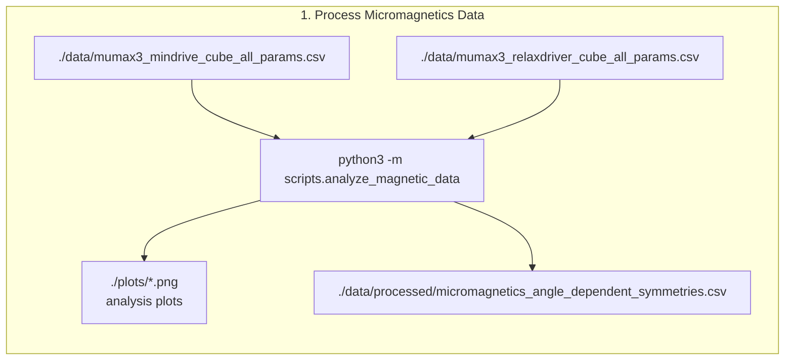
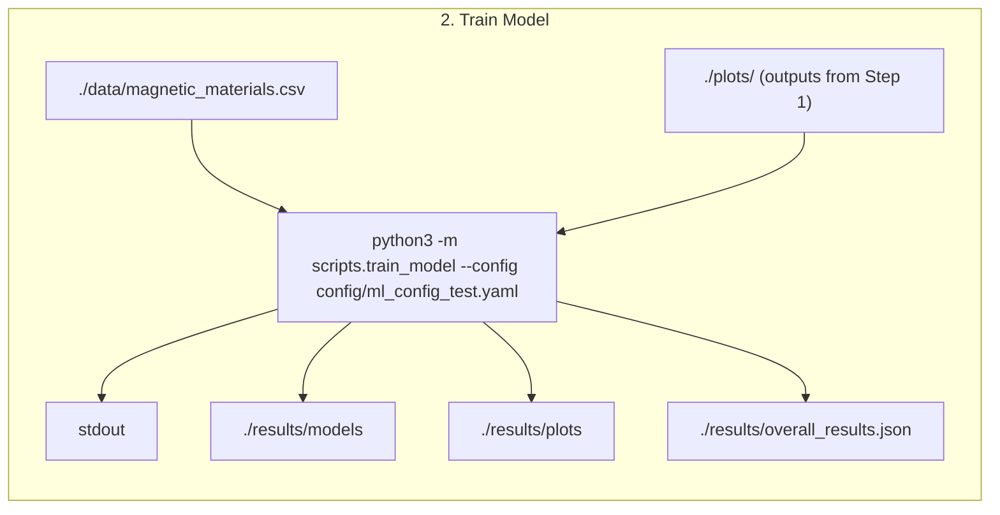

# ML model for micromagnetic simulations, h and K orientation can change independently on sphere.

## Current version of model
v0.1


# 0. Installation
Use requirements.txt. In addition pytorch, compatible with your system, must be installed

# 1. Data pre-processing

Run:

```
python3 -m scripts.analyze_magnetic_data
```



NEEDS:
- ./data/mumax3_mindrive_cube_all_params.csv
- ./data/mumax3_relaxdriver_cube_all_params.csv

OUTPUT:
- stdout
- ./plots/*.png  # analysis plots
- ./data/processed/micromagnetics_angle_dependent_symmetries.csv

# 2. Model Training
Run:

```
python3 -m scripts.train_model --config config/ml_config_test.yaml
```



NEEDS:
- ./data/magnetic_materials.csv
- output files ./plots/ of 1

OUTPUT:
- stdout
- ./results/models
- ./results/plots
- ./results/overall_results.json

# 3. Metric
Run:

```
python3 scripts/plot_metrics.py results
```

NEEDS:
- ./results of 2.

OUTPUT:
- stdout
- ./results/metrics_tables


# 4. Best Model
For all three targets, the RF models does not show strong overfitting and the performance is the best.


# 4.1 Feature Importance
