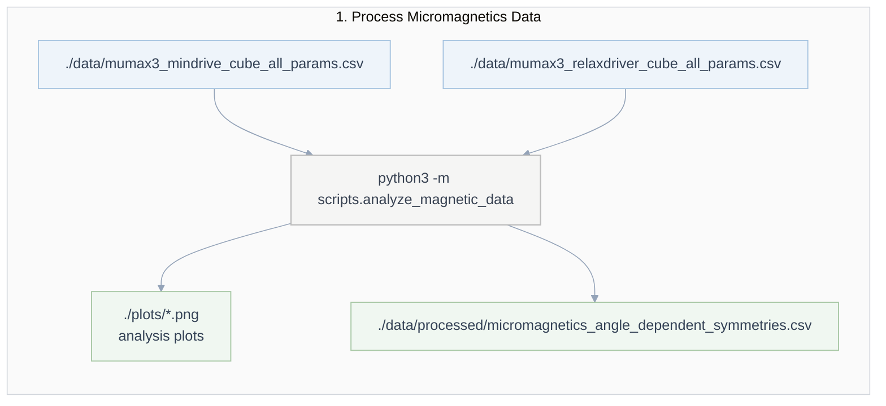
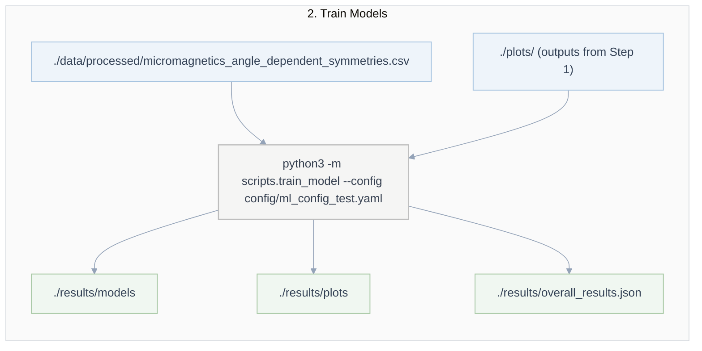
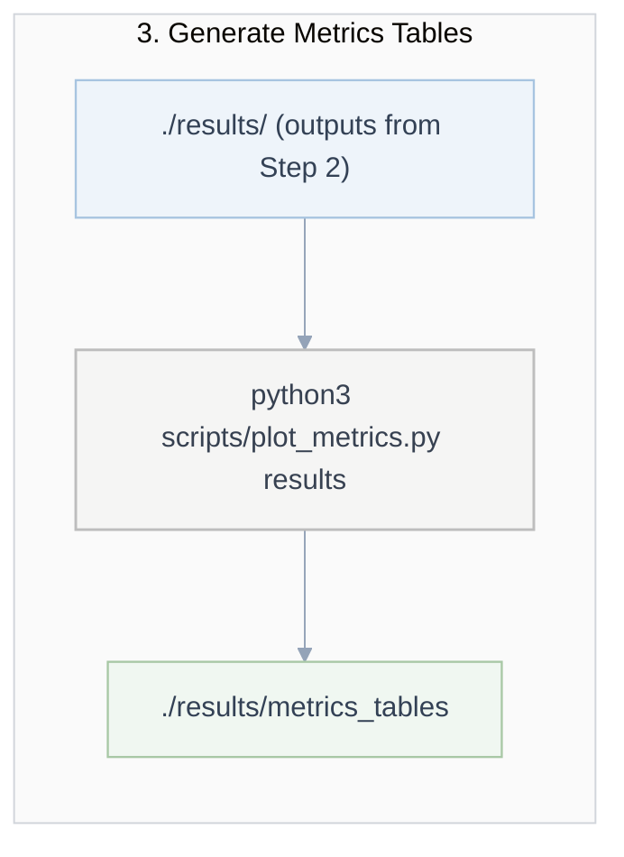
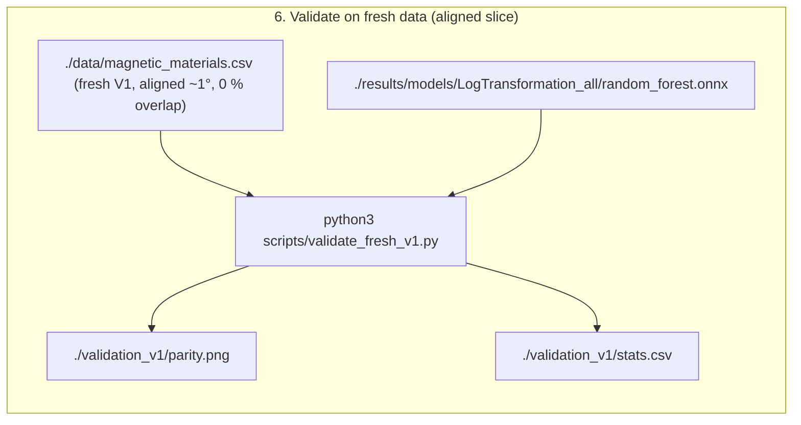

# ML model for micromagnetic simulations, h and K orientation can change independently on sphere.

## Current version of model
v0.1


# 0. Installation
Use requirements.txt. In addition pytorch, compatible with your system, must be installed

# 1. Data pre-processing

Run:

```
python3 -m scripts.analyze_magnetic_data
```


```mermaid
%%{init: {
  "theme": "base",
  "themeVariables": {
    "lineColor": "#94A3B8",
    "clusterBkg": "#FAFAFA",
    "clusterBorder": "#D1D5DB",
    "fontFamily": "Arial, sans-serif"
  }
}}%%

flowchart LR

    subgraph cluster_0["1. Process Micromagnetics Data"]
        direction TB

        A1["./data/mumax3_mindrive_cube_all_params.csv"]
        A2["./data/mumax3_relaxdriver_cube_all_params.csv"]

        A1 --> B0["python3 -m scripts.analyze_magnetic_data"]
        A2 --> B0

        B0 --> O1["./plots/*.png<br/>analysis plots"]
        B0 --> O2["./data/processed/micromagnetics_angle_dependent_symmetries.csv"]
    end

    classDef input fill:#EEF4FA,stroke:#A7C4E0,color:#334155,stroke-width:1.2px;
    classDef process fill:#F5F5F4,stroke:#BDBDBD,color:#374151,stroke-width:1.5px;
    classDef output fill:#F0F7F1,stroke:#A8C8A5,color:#334155,stroke-width:1.2px;

    class A1,A2 input;
    class B0 process;
    class O1,O2 output;
```

NEEDS:
- ./data/mumax3_mindrive_cube_all_params.csv
- ./data/mumax3_relaxdriver_cube_all_params.csv

OUTPUT:
- stdout
- ./plots/*.png  # analysis plots
- ./data/processed/micromagnetics_angle_dependent_symmetries.csv

# 2. Model Training
Run:

```
python3 -m scripts.train_model --config config/ml_config_test.yaml
```


```mermaid
%%{init: {
  "theme": "base",
  "themeVariables": {
    "lineColor": "#94A3B8",
    "clusterBkg": "#FAFAFA",
    "clusterBorder": "#D1D5DB",
    "fontFamily": "Arial, sans-serif"
  }
}}%%

flowchart LR

    subgraph cluster_1["2. Train Models"]
        direction TB

        A1["./data/processed/micromagnetics_angle_dependent_symmetries.csv"]
        A2["./plots/ (outputs from Step 1)"]

        A1 --> B1["python3 -m scripts.train_model --config config/ml_config_test.yaml"]
        A2 --> B1

        B1 --> O1["./results/models"]
        B1 --> O2["./results/plots"]
        B1 --> O3["./results/overall_results.json"]
    end

    classDef input fill:#EEF4FA,stroke:#A7C4E0,color:#334155,stroke-width:1.2px;
    classDef process fill:#F5F5F4,stroke:#BDBDBD,color:#374151,stroke-width:1.5px;
    classDef output fill:#F0F7F1,stroke:#A8C8A5,color:#334155,stroke-width:1.2px;

    class A1,A2 input;
    class B1 process;
    class O1,O2,O3 output;
```

NEEDS:
- ./data/processed/micromagnetics_angle_dependent_symmetries.csv  (output of Step 1)
- output files ./plots/ of 1

OUTPUT:
- stdout
- ./results/models
- ./results/plots
- ./results/overall_results.json

# 3. Metric
Run:

```
python3 scripts/plot_metrics.py results
```


```mermaid
%%{init: {
  "theme": "base",
  "themeVariables": {
    "lineColor": "#94A3B8",
    "clusterBkg": "#FAFAFA",
    "clusterBorder": "#D1D5DB",
    "fontFamily": "Arial, sans-serif"
  }
}}%%

flowchart LR

    subgraph cluster_2["3. Generate Metrics Tables"]
        direction TB

        A1["./results/ (outputs from Step 2)"]

        A1 --> B1["python3 scripts/plot_metrics.py results"]

        B1 --> O1["./results/metrics_tables"]
    end

    classDef input fill:#EEF4FA,stroke:#A7C4E0,color:#334155,stroke-width:1.2px;
    classDef process fill:#F5F5F4,stroke:#BDBDBD,color:#374151,stroke-width:1.5px;
    classDef output fill:#F0F7F1,stroke:#A8C8A5,color:#334155,stroke-width:1.2px;

    class A1 input;
    class B1 process;
    class O1 output;
```

NEEDS:
- ./results of 2.

OUTPUT:
- stdout
- ./results/metrics_tables


# 4. Results


### Results target \(H_c\) (A/m)

| Model             | Split |   MAE |   MSE | Adj. R² |    R² |   Gini |  MAPE |
| ----------------- | ----- | ----: | ----: | ------: | ----: | -----: | ----: |
| random_forest     | train | 0.091 | 0.033 |   0.983 | 0.983 | -0.363 | 0.892 |
| random_forest     | test  | 0.250 | 0.226 |   0.886 | 0.886 | -0.363 | 2.187 |
| neural_network    | train | 0.259 | 0.206 |   0.896 | 0.896 | -0.363 | 2.433 |
| neural_network    | test  | 0.281 | 0.214 |   0.892 | 0.893 | -0.363 | 2.409 |
| linear_regression | train | 0.615 | 0.799 |   0.598 | 0.598 | -0.359 | 5.444 |
| linear_regression | test  | 0.609 | 0.769 |   0.613 | 0.614 | -0.360 | 5.158 |
| lasso             | train | 0.618 | 0.799 |   0.598 | 0.598 | -0.359 | 5.466 |
| lasso             | test  | 0.612 | 0.770 |   0.613 | 0.614 | -0.360 | 5.181 |
| gaussian_process  | train | 0.000 | 0.000 |   1.000 | 1.000 | -0.363 | 0.001 |
| gaussian_process  | test  | 0.250 | 0.239 |   0.880 | 0.880 | -0.363 | 2.214 |


### Results target \(M_r\) (A/m)

| Model             | Split |   MAE |   MSE | Adj. R² |    R² |   Gini |    MAPE |
| ----------------- | ----- | ----: | ----: | ------: | ----: | -----: | ------: |
| random_forest     | train | 0.079 | 0.037 |   0.973 | 0.973 | -0.355 | 106.242 |
| random_forest     | test  | 0.216 | 0.247 |   0.823 | 0.824 | -0.354 |   1.699 |
| neural_network    | train | 0.247 | 0.231 |   0.831 | 0.831 | -0.354 | 228.257 |
| neural_network    | test  | 0.266 | 0.243 |   0.826 | 0.827 | -0.354 |   2.032 |
| linear_regression | train | 0.638 | 0.846 |   0.383 | 0.383 | -0.347 | 286.069 |
| linear_regression | test  | 0.644 | 0.824 |   0.410 | 0.412 | -0.348 |   4.954 |
| lasso             | train | 0.640 | 0.846 |   0.383 | 0.383 | -0.347 | 287.221 |
| lasso             | test  | 0.646 | 0.825 |   0.410 | 0.411 | -0.348 |   4.973 |
| gaussian_process  | train | 0.000 | 0.000 |   1.000 | 1.000 | -0.355 |   0.050 |
| gaussian_process  | test  | 0.238 | 0.264 |   0.811 | 0.812 | -0.354 |   1.881 |


### Results target \(BH_{\max}\) (J/m³)

| Model             | Split |   MAE |   MSE | Adj. R² |    R² |   Gini |   MAPE |
| ----------------- | ----- | ----: | ----: | ------: | ----: | -----: | -----: |
| random_forest     | train | 0.155 | 0.119 |   0.978 | 0.978 | -0.389 |  2.402 |
| random_forest     | test  | 0.421 | 0.826 |   0.852 | 0.852 | -0.388 |  5.789 |
| neural_network    | train | 0.444 | 0.693 |   0.872 | 0.872 | -0.388 |  6.551 |
| neural_network    | test  | 0.482 | 0.783 |   0.859 | 0.860 | -0.388 |  6.378 |
| linear_regression | train | 1.298 | 3.320 |   0.387 | 0.388 | -0.371 | 18.086 |
| linear_regression | test  | 1.298 | 3.356 |   0.398 | 0.399 | -0.372 | 16.737 |
| lasso             | train | 1.300 | 3.320 |   0.387 | 0.388 | -0.371 | 18.118 |
| lasso             | test  | 1.301 | 3.357 |   0.397 | 0.398 | -0.372 | 16.770 |
| gaussian_process  | train | 0.000 | 0.000 |   1.000 | 1.000 | -0.390 |  0.002 |
| gaussian_process  | test  | 0.461 | 0.914 |   0.836 | 0.836 | -0.388 |  6.744 |


# 5. Inference

Unlike the easy-axis model, this model is **not** split into hard/soft clusters
(`clustering.method: none` in the config): a single random-forest regressor is trained on the
whole dataset. The extra input is the **relative angle between the external field H and the
uniaxial anisotropy axis K1**, given in **radians**. Because K1 defines an *axis* (not a
direction), this is the **unsigned** angle `arccos(|û_K · û_H|)`, so its range — and the range the
model was trained on — is **`[0, π/2]`** (0 = field along the easy axis, π/2 = perpendicular). A
field 135° off-axis is physically equivalent to 45° and must be supplied as `π/4`; angles above
`π/2` are outside the training range and are treated as extrapolation.

To run an inference:

```
python3 ./scripts/predict.py
```

Or from Python:

```python
from scripts.load_onnx_models import calculate_extrinsic_properties
res = calculate_extrinsic_properties(Ms=1.0e6, A=1.0e-11, K=4.5e6, angle=0.0)
# -> {"Hc": ..., "Mr": ..., "BHmax": ...}
```

The pipeline applies `log1p` to `Ms`, `A`, `K1` (the angle is left untransformed, matching
`log_exclude_cols`), runs the ONNX random forest (the `StandardScaler` is baked into the ONNX
graph), and inverts the target `log1p` with `expm1`. Inputs outside the training volume are
predicted anyway but trigger an extrapolation warning.

NEEDS:
- ./results/models/LogTransformation_all/random_forest.onnx  (output of Step 2)
- ./data/processed/micromagnetics_angle_dependent_symmetries.csv  (for the training-volume check)

OUTPUT:
- dict with predicted Hc (A/m), Mr (A/m) and (BH)max (J/m³)

# 6. Validation on fresh (held-out) data

The model is validated on a genuinely fresh dataset, using the same strategy as the easy-axis
and inverse models. The model is trained on the V2 angle-dependent dataset; the older V1 file
`data/magnetic_materials.csv` (1,497 single-grain simulations) is used as an external hold-out,
sharing **0 %** of its `(Ms, A, K1)` triples with the training data.

**This validates only the (nearly) aligned slice.** V1 was generated with the field a *constant*
~1° off the easy axis, so it does not exercise the model's full angular range. The relative angle
is **derived exactly from the data** (`arccos(|û_K · û_H|)`, the same definition used in training),
which gives **1.025° (0.0179 rad)** for every V1 point — so the prediction is made at the exact
measured angle, **not** hard-coded to 0°.

Run:

```
python3 scripts/validate_fresh_v1.py
```


```mermaid
flowchart LR

    subgraph cluster_3["6. Validate on fresh data (aligned slice)"]
        direction TB

        A5["./data/magnetic_materials.csv (fresh V1, aligned ~1°, 0 % overlap)"] --> B5["python3 scripts/validate_fresh_v1.py"]
        A6["./results/models/LogTransformation_all/random_forest.onnx"] --> B5

        B5 --> O1["./validation_v1/parity.png"]
        B5 --> O2["./validation_v1/stats.csv"]
    end
```

Of the 1,497 fresh points, 42 fall outside the training volume (excluded as extrapolation),
leaving **1,455** points (1,244 hard, 211 soft by the physical `Mr/Ms > 0.4` criterion).

### Per-target results (fresh V1 data, aligned slice)

| Target | R² | R²(log) | Median rel. error | MAE |
| --- | --- | --- | --- | --- |
| Coercive field `Hc` | 0.886 | 0.866 | 27 % | 4.7×10⁵ A/m |
| Remanence `Mr` | 0.563 | 0.610 | 11 % | 4.1×10⁵ A/m |
| Energy product `(BH)max` | **−0.85** | −7.6 | 68 % | 1.3×10⁶ J/m³ |

**Interpretation.** On the aligned slice the multi-angle model is clearly *weaker than the
dedicated easy-axis model* (which reaches R² ≈ 0.995 for `Hc`/`(BH)max` on the same V1 data).
Two structural reasons, both visible in `validation_v1/parity.png`:

1. **No hard/soft split.** Unlike the easy-axis pipeline, this model is a single unified
   regressor with no classifier. The **hard** magnets (which dominate) track the diagonal
   reasonably, but the **soft** magnets — whose aligned loops have low `Mr`/`(BH)max` — are
   badly scattered, dragging `Mr` down and making `(BH)max` R² negative.
2. **Generalist across all angles.** The model spreads its capacity over the full angular range,
   so at any single angle it is less accurate than a model trained only for that geometry.

**Practical guidance:** for aligned / easy-axis use cases prefer the specialised
`single-grain-easy-axis-model`; the multi-angle model is intended for genuinely off-axis angles
that the specialised model does not cover. A full validation of the off-axis regime still
requires a fresh dataset with a range of relative angles (none is currently available).

OUTPUT (in `./validation_v1/`):
- `parity.png` — predicted vs. true `Hc, Mr, (BH)max` (log–log), coloured by the true hard/soft class
- `stats.csv` — per-target R², R²(log), MAE, RMSE, median relative error

