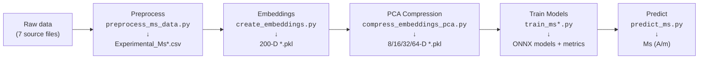

# compound-to-experimental-ms

Predict the **experimental saturation magnetisation Ms** (in A/m) of a magnetic compound
directly from its chemical formula, via a matscholar200 compound embedding.

This is a sibling of `compound-to-experimental-tc` (same pipeline and code structure) but
targets Ms instead of Tc, and is fed by the raw Ms sources used by `my_ms`. The companion
project `compound-to-simulated-ms` is identical but targets the *simulated* (DFT) Ms.

> **Trained in log-space.** Ms spans ~6 orders of magnitude, so models are trained on
> `log1p(Ms)`; `predict_ms.py` applies `expm1` so predictions come back in physical A/m.

> **What the target actually is (important).** The source databases report the *collinear /
> fully-aligned* magnetic moment per cell. For **ferromagnets** this equals the physical
> saturation magnetisation, so metals/intermetallics predict well (~±10–20%). For
> **ferrimagnets** (spinel ferrites, garnets like YIG, magnetite Fe₃O₄) it is the
> *uncompensated* moment — the antiparallel sublattices are **not** cancelled — so the
> training Ms, and hence the model, is several-fold **larger** than the true net Ms
> (e.g. Fe₃O₄ training ≈ 1.6×10⁶ vs physical ≈ 4.8×10⁵ A/m). Read predictions for
> ferrimagnetic oxides as the collinear moment, not the net saturation magnetisation.
> (Deduplication uses the pymatgen *reduced formula*, so spellings like CoFe₂O₄ / Fe₂CoO₄
> are pooled.) See `first_model_analysis.txt` and `further_improvements.txt`.
>
> **You can verify this yourself.** `data/validation_ferrimagnetic_compounds_reference.csv` lists 13 known
> ferrimagnets with their *measured net* Ms. Run
> `python src/validate_reference_data.py --ref data/validation_ferrimagnetic_compounds_reference.csv`
> and you will see the model over-predict every one — median ≈ +360 %, e.g. Fe₃O₄ +259 %,
> YIG +503 %, up to +9700 % for Gd₃Fe₅O₁₂ (near its compensation point) — confirming that
> the learned quantity is the collinear moment, not the net Ms.

## Pipeline overview

```
data/<raw sources>                         (per-project copies of the 7 raw files)
  └─ src/preprocess_ms_data.py   ──► preprocessed_data/Experimental_Ms{,_all,_RE,_RE-Free}.csv
       └─ src/create_embeddings.py        ──► outputs/*_w_embeddings.pkl        (200-D)
            └─ src/compress_embeddings_pca.py ──► outputs/*_w_embeddings_PCA.pkl (+PCA 8/16/32/64)
                 └─ src/train_ms.py (+ _all/_re/_re_free) ──► results/onnx_models/*.onnx,
                                                              results/exp_ms_best_by_dataset.csv
                      └─ src/predict_ms.py   ──► Ms (A/m) for any formula
```



## 0. Installation

Python ≥ 3.12. Create a venv and install `requirements.txt`:
```bash
python3 -m venv .venv && source .venv/bin/activate
pip install -r requirements.txt
```
(The SLURM scripts `source .venv/bin/activate`; adjust if your environment differs.)

## 1. Pre-process the raw data

`src/preprocess_ms_data.py` reads the raw **experimental** Ms sources from `data/`, converts
each to A/m, pools all values per composition into a **single median** (no mean, no
median-of-medians), flags rare-earth membership (pymatgen), drops unparsable formulae,
**drops low-Ms compounds** (`--ms-threshold`, default 50000 A/m, as in `my_ms`), and by
default **drops known ferrimagnets** (see below).

```bash
python src/preprocess_ms_data.py                    # default: drop known ferrimagnets, --ms-threshold 50000
python src/preprocess_ms_data.py --include-ferrimagnets   # keep known ferrimagnets
python src/preprocess_ms_data.py --ms-threshold 0   # keep all Ms magnitudes
```

**`--include-ferrimagnets`** (default: off → ferrimagnets dropped). For ferrimagnets the
training Ms is the *collinear / uncompensated* moment, not the net saturation magnetisation
(see the "What the target actually is" note above), so by default the script removes the
compounds it can confidently identify as ferrimagnetic — magnetite (Fe₃O₄), classic spinel
ferrites (MFe₂O₄), iron garnets (R₃Fe₅O₁₂) and hexaferrites (MFe₁₂O₁₉) — a **curated,
high-confidence subset** (~18, to be extended). The script prints a warning either way:
- default → `CAREFUL: the dataset MAY STILL CONTAIN UNKNOWN ferrimagnets` (composition cannot
  identify ferrimagnetism in general);
- with the flag → `CAREFUL: N KNOWN ferrimagnets ARE INCLUDED`.

Raw sources (in `data/`) and their conversion to A/m:

| source | sep | composition col | value col | → A/m |
|---|---|---|---|---|
| `literature_values.csv` | `;` | `Compound` | `mu0Ms (T)` | `/ µ0` |
| `Bhandari_I_exp.csv` | `\|` | `Material` | `Ms_exp (MA/m)` | `× 1e6` |
| `Bhandari_XIII_exp.csv` | `\|` | `Material` | `Ms (MA/m)` | `× 1e6` |
| `mp_fm_dedup_exp_data.csv` | `,` | `formula_pretty` | `total_magnetization_normalized_vol` | `× µ_B/ų` |

Outputs (`preprocessed_data/`): `Experimental_Ms.csv` (composition, Ms, contains_re),
`Experimental_Ms_all.csv`, `Experimental_Ms_RE.csv`, `Experimental_Ms_RE-Free.csv`.

## 2–3. Embeddings + PCA

```bash
python src/create_embeddings.py        # → outputs/*_w_embeddings.pkl (200-D matscholar200)
python src/compress_embeddings_pca.py  # → adds comp_emb_pca_8/16/32/64
```

## 4. Train

**NEEDS** (from steps 1–3): the preprocessed CSVs (`preprocessed_data/*.csv`) and the PCA
embeddings (`outputs/*_w_embeddings_PCA.pkl`). Run steps 1–3 first.

```bash
python src/train_ms.py            # all three datasets (RE-Free, RE, All)
# or one at a time (SLURM-friendly):
python src/train_ms_all.py
python src/train_ms_re.py
python src/train_ms_re_free.py
```

Which model families run is set in **`training_config.yaml`** (currently **LightGBM + RF**,
`re_features: true`). Training is in `log1p(Ms)` space; metrics/plots are reported in log1p
units. Outputs: `results/onnx_models/<Dataset>_<emb>_<model>[_refeats]_e<N>.onnx`,
per-dataset `*_results[_agg].csv`, and `results/exp_ms_best_by_dataset.csv`.

### Configuration (`training_config.yaml`)
- `re_features: true` — append 7 rare-earth physics features → 207-D input; ONNX gets a
  `_refeats` suffix (raw_200D only). `predict_ms` computes & appends them automatically.
- `models:` — per-family `enabled` / `ensemble`. Only the best + 2nd-best families
  (LightGBM, Random Forest) are enabled; Linear and MLP are disabled (far behind on Ms).

## 5. Predict

`src/predict_ms.py` predicts Ms (A/m) for any formula using the exported ONNX models — it
does all preprocessing internally (embedding, PCA/scaler baked into the graph, RE features,
and `expm1` back to A/m).

**NEEDS**: the ONNX models from step 4 (`results/onnx_models/*.onnx`) — run training first;
`python src/predict_ms.py --list` shows what's available.

```bash
python src/predict_ms.py --compound Nd2Fe14B --best      # best model for the compound type
python src/predict_ms.py --compound Fe --all             # all applicable models, mean ± std
python src/predict_ms.py --compounds-file new_materials.txt --best
python src/predict_ms.py --list
python src/predict_ms.py --compound Fe --best --no-disclaimer   # suppress the disclaimer
```

> **Are these compounds actually new?** `python -m src.check_new_materials` cross-checks every
> formula in `new_materials.txt` against the raw sources, the training set, and the validation
> references (matched by reduced formula) and writes `new_materials_known.txt`. For the shipped
> list all 8 are already present in the data — so predicting them is in-sample, not a
> generalisation test.

**Reliability disclaimer.** By default `predict_ms.py` prints a disclaimer to **stderr**
before predicting (except for `--list`), warning that the learned target is the DFT
collinear moment — correct for ferromagnets but an over-estimate for ferri-/antiferromagnets
(ferrites, garnets, oxides), so predictions must be checked and used with care. It goes to
stderr, so it never pollutes the machine-readable table on stdout. Pass **`--no-disclaimer`**
to suppress it (e.g. for scripted/batch use).

`--best`/`--all` auto-detect rare-earth content and pick the right dataset's model(s). The
RE and RE-Free models do not extrapolate across the RE boundary, so `predict_ms` **refuses**
a mismatched `--model` (use an `All_*` model, which is valid for both).

## 6. Results

### Best model per dataset

| Dataset | Embedding | Model |  N |    R² | R² Std |   MAE | MAE Std |  RMSE | RMSE Std |    MAE_Am | MedRelErr |
| ------- | --------- | ----- | -: | ----: | -----: | ----: | ------: | ----: | -------: | --------: | --------: |
| RE      | raw_200D  | LGBM  | 10 | 0.891 |  0.008 | 0.215 |   0.006 | 0.323 |    0.010 | 66465.866 |     0.132 |
| All     | raw_200D  | LGBM  | 10 | 0.805 |  0.010 | 0.279 |   0.004 | 0.389 |    0.009 | 71940.701 |     0.192 |
| RE-Free | raw_200D  | LGBM  | 10 | 0.744 |  0.012 | 0.303 |   0.007 | 0.408 |    0.010 | 72449.077 |     0.219 |

### Results All-Materials

| Dataset | Embedding | Model | Ensemble Members | R2 (mean ± std) | MAE (mean ± std) | RMSE (mean ± std) | MAE_Am (mean ± std) | MedRelErr (mean ± std) |
|---|---|---|---:|---|---|---|---|---|
| All | raw_200D | LGBM | 10 | 0.804 ± 0.012 | 0.279 ± 0.004 | 0.390 ± 0.009 | 72240 ± 1500 | 0.192 ± 0.005 |
| All | pca_64 | LGBM | 10 | 0.779 ± 0.010 | 0.304 ± 0.005 | 0.416 ± 0.007 | 79148 ± 3300 | 0.218 ± 0.004 |
| All | pca_32 | LGBM | 10 | 0.782 ± 0.010 | 0.298 ± 0.004 | 0.411 ± 0.010 | 77500 ± 4000 | 0.210 ± 0.003 |
| All | pca_16 | LGBM | 10 | 0.758 ± 0.009 | 0.317 ± 0.005 | 0.428 ± 0.007 | 82200 ± 2700 | 0.226 ± 0.006 |
| All | pca_8 | LGBM | 10 | 0.668 ± 0.011 | 0.381 ± 0.006 | 0.505 ± 0.007 | 101000 ± 2300 | 0.278 ± 0.004 |
| All | raw_200D | MLP | 10 | 0.752 ± 0.014 | 0.330 ± 0.017 | 0.438 ± 0.017 | 104000 ± 18000 | 0.246 ± 0.022 |
| All | pca_64 | MLP | 10 | 0.767 ± 0.015 | 0.314 ± 0.011 | 0.425 ± 0.012 | 90500 ± 6000 | 0.226 ± 0.009 |
| All | pca_32 | MLP | 10 | 0.767 ± 0.012 | 0.316 ± 0.010 | 0.425 ± 0.012 | 88000 ± 5000 | 0.227 ± 0.007 |
| All | pca_16 | MLP | 10 | 0.664 ± 0.090 | 0.366 ± 0.015 | 0.474 ± 0.013 | 102000 ± 6000 | 0.280 ± 0.014 |
| All | pca_8 | MLP | 10 | 0.597 ± 0.012 | 0.440 ± 0.010 | 0.558 ± 0.011 | 123000 ± 5000 | 0.342 ± 0.008 |
| All | raw_200D | RF | 10 | 0.766 ± 0.009 | 0.320 ± 0.005 | 0.430 ± 0.006 | 84300 ± 2500 | 0.233 ± 0.008 |
| All | pca_64 | RF | 10 | 0.733 ± 0.007 | 0.348 ± 0.004 | 0.457 ± 0.007 | 92000 ± 2500 | 0.260 ± 0.006 |
| All | pca_32 | RF | 10 | 0.747 ± 0.009 | 0.338 ± 0.004 | 0.443 ± 0.006 | 91300 ± 3500 | 0.253 ± 0.004 |
| All | pca_16 | RF | 10 | 0.739 ± 0.009 | 0.340 ± 0.005 | 0.450 ± 0.009 | 91500 ± 2500 | 0.252 ± 0.007 |
| All | pca_8 | RF | 10 | 0.673 ± 0.010 | 0.382 ± 0.006 | 0.505 ± 0.007 | 103000 ± 2500 | 0.281 ± 0.005 |
| All | raw_200D | Linear | 10 | 0.580 ± 0.018 | 0.458 ± 0.007 | 0.570 ± 0.010 | 180000 ± 22000 | 0.360 ± 0.008 |
| All | pca_64 | Linear | 10 | 0.582 ± 0.019 | 0.457 ± 0.007 | 0.570 ± 0.010 | 180000 ± 23000 | 0.360 ± 0.006 |
| All | pca_32 | Linear | 10 | 0.568 ± 0.018 | 0.466 ± 0.007 | 0.579 ± 0.009 | 180000 ± 18000 | 0.371 ± 0.007 |
| All | pca_16 | Linear | 10 | 0.497 ± 0.017 | 0.505 ± 0.010 | 0.630 ± 0.012 | 175000 ± 11000 | 0.402 ± 0.012 |
| All | pca_8 | Linear | 10 | 0.365 ± 0.019 | 0.570 ± 0.010 | 0.704 ± 0.010 | 179000 ± 6000 | 0.461 ± 0.009 |

### Results RE-Materials
| Dataset | Embedding | Model  | Ensembles | R² (mean ± std) | MAE (mean ± std) | RMSE (mean ± std) | MAE_Am (mean ± std) | MedRelErr (mean ± std) |
| ------- | --------- | ------ | --------- | --------------- | ---------------- | ----------------- | ------------------- | ---------------------- |
| RE      | raw_200D  | LGBM   | 10        | 0.887 ± 0.014   | 0.216 ± 0.006    | 0.324 ± 0.011     | 67268 ± 3702        | 0.134 ± 0.012          |
| RE      | pca_8     | LGBM   | 10        | 0.873 ± 0.010   | 0.235 ± 0.006    | 0.352 ± 0.004     | 75710 ± 5295        | 0.148 ± 0.010          |
| RE      | pca_16    | LGBM   | 10        | 0.879 ± 0.008   | 0.228 ± 0.007    | 0.344 ± 0.010     | 72332 ± 4029        | 0.142 ± 0.008          |
| RE      | pca_32    | LGBM   | 10        | 0.882 ± 0.007   | 0.225 ± 0.005    | 0.339 ± 0.009     | 71051 ± 3406        | 0.141 ± 0.009          |
| RE      | pca_64    | LGBM   | 10        | 0.877 ± 0.007   | 0.227 ± 0.006    | 0.340 ± 0.008     | 70557 ± 3681        | 0.139 ± 0.009          |
| RE      | raw_200D  | RF     | 10        | 0.875 ± 0.011   | 0.239 ± 0.005    | 0.350 ± 0.012     | 75096 ± 3404        | 0.148 ± 0.009          |
| RE      | pca_8     | RF     | 10        | 0.866 ± 0.011   | 0.247 ± 0.008    | 0.361 ± 0.014     | 79367 ± 4757        | 0.156 ± 0.010          |
| RE      | pca_16    | RF     | 10        | 0.866 ± 0.012   | 0.244 ± 0.008    | 0.360 ± 0.014     | 78163 ± 4775        | 0.153 ± 0.012          |
| RE      | pca_32    | RF     | 10        | 0.865 ± 0.009   | 0.247 ± 0.006    | 0.362 ± 0.010     | 77828 ± 2641        | 0.154 ± 0.010          |
| RE      | pca_64    | RF     | 10        | 0.862 ± 0.009   | 0.254 ± 0.006    | 0.369 ± 0.007     | 79405 ± 3180        | 0.158 ± 0.009          |
| RE      | pca_8     | MLP    | 10        | 0.709 ± 0.045   | 0.407 ± 0.049    | 0.545 ± 0.047     | 163078 ± 20209      | 0.297 ± 0.040          |
| RE      | pca_16    | MLP    | 10        | 0.717 ± 0.054   | 0.410 ± 0.049    | 0.539 ± 0.052     | 162142 ± 31318      | 0.306 ± 0.026          |
| RE      | pca_32    | MLP    | 10        | 0.679 ± 0.075   | 0.431 ± 0.055    | 0.575 ± 0.048     | 179526 ± 28900      | 0.348 ± 0.038          |
| RE      | pca_64    | MLP    | 10        | 0.637 ± 0.056   | 0.475 ± 0.038    | 0.607 ± 0.046     | 226084 ± 32164      | 0.353 ± 0.027          |
| RE      | raw_200D  | MLP    | 10        | 0.582 ± 0.071   | 0.488 ± 0.029    | 0.643 ± 0.052     | 231937 ± 81780      | 0.353 ± 0.022          |
| RE      | raw_200D  | Linear | 10        | 0.694 ± 0.016   | 0.425 ± 0.011    | 0.540 ± 0.013     | 219462 ± 56967      | 0.337 ± 0.016          |
| RE      | pca_8     | Linear | 10        | 0.635 ± 0.019   | 0.479 ± 0.013    | 0.599 ± 0.018     | 213785 ± 22918      | 0.376 ± 0.017          |
| RE      | pca_16    | Linear | 10        | 0.677 ± 0.011   | 0.447 ± 0.009    | 0.561 ± 0.012     | 216574 ± 26191      | 0.354 ± 0.017          |
| RE      | pca_32    | Linear | 10        | 0.687 ± 0.015   | 0.435 ± 0.012    | 0.548 ± 0.012     | 211906 ± 61996      | 0.344 ± 0.015          |
| RE      | pca_64    | Linear | 10        | 0.696 ± 0.010   | 0.429 ± 0.010    | 0.545 ± 0.013     | 224570 ± 70548      | 0.340 ± 0.016          |

### Results RE-Free Materials
| Dataset | Embedding | Model | Ensembles | R² (mean ± std) | MAE (mean ± std) | RMSE (mean ± std) | MAE_Am (mean ± std) | MedRelErr (mean ± std) |
|---------|-----------|-------|-----------|-----------------|------------------|-------------------|---------------------|------------------------|
| RE-Free | raw_200D  | LGBM  | 10        | 0.748 ± 0.024   | 0.303 ± 0.011    | 0.405 ± 0.012     | 72,938 ± 3,549      | 0.216 ± 0.011          |
| RE-Free | pca_32    | LGBM  | 10        | 0.727 ± 0.024   | 0.320 ± 0.018    | 0.422 ± 0.018     | 77,538 ± 4,041      | 0.239 ± 0.015          |
| RE-Free | pca_64    | LGBM  | 10        | 0.722 ± 0.025   | 0.324 ± 0.018    | 0.426 ± 0.019     | 78,758 ± 4,017      | 0.242 ± 0.014          |
| RE-Free | raw_200D  | RF    | 10        | 0.704 ± 0.028   | 0.340 ± 0.020    | 0.438 ± 0.023     | 85,085 ± 5,724      | 0.260 ± 0.017          |
| RE-Free | pca_32    | RF    | 10        | 0.682 ± 0.028   | 0.356 ± 0.026    | 0.454 ± 0.027     | 90,523 ± 5,897      | 0.274 ± 0.020          |
| RE-Free | pca_64    | RF    | 10        | 0.657 ± 0.029   | 0.368 ± 0.029    | 0.472 ± 0.029     | 92,424 ± 6,548      | 0.281 ± 0.024          |
| RE-Free | pca_8     | LGBM  | 10        | 0.555 ± 0.055   | 0.421 ± 0.028    | 0.534 ± 0.029     | 107,454 ± 6,588     | 0.324 ± 0.018          |
| RE-Free | pca_16    | LGBM  | 10        | 0.667 ± 0.038   | 0.355 ± 0.026    | 0.467 ± 0.028     | 89,005 ± 5,584      | 0.267 ± 0.017          |
| RE-Free | pca_32    | MLP   | 10        | 0.643 ± 0.047   | 0.374 ± 0.033    | 0.478 ± 0.034     | 97,771 ± 10,572     | 0.278 ± 0.023          |
| RE-Free | pca_64    | MLP   | 10        | 0.641 ± 0.048   | 0.373 ± 0.035    | 0.477 ± 0.036     | 98,418 ± 12,137     | 0.276 ± 0.024          |
| RE-Free | raw_200D  | MLP   | 10        | 0.630 ± 0.048   | 0.383 ± 0.036    | 0.485 ± 0.037     | 104,750 ± 12,354    | 0.296 ± 0.027          |
| RE-Free | raw_200D  | Linear| 10        | 0.534 ± 0.028   | 0.441 ± 0.017    | 0.552 ± 0.019     | 127,747 ± 10,838    | 0.355 ± 0.015          |
| RE-Free | pca_8     | Linear| 10        | 0.225 ± 0.027   | 0.577 ± 0.025    | 0.710 ± 0.019     | 153,320 ± 10,374    | 0.469 ± 0.013          |
| RE-Free | pca_16    | Linear| 10        | 0.350 ± 0.058   | 0.523 ± 0.037    | 0.651 ± 0.028     | 139,384 ± 10,286    | 0.424 ± 0.018          |
| RE-Free | pca_32    | Linear| 10        | 0.522 ± 0.035   | 0.450 ± 0.027    | 0.562 ± 0.028     | 128,812 ± 11,876    | 0.360 ± 0.019          |
| RE-Free | pca_64    | Linear| 10        | 0.532 ± 0.035   | 0.443 ± 0.027    | 0.555 ± 0.028     | 129,901 ± 11,898    | 0.355 ± 0.019          |
| RE-Free | pca_8     | MLP   | 10        | 0.435 ± 0.075   | 0.493 ± 0.049    | 0.607 ± 0.048     | 130,041 ± 14,578    | 0.395 ± 0.027          |
| RE-Free | pca_16    | MLP   | 10        | 0.533 ± 0.057   | 0.447 ± 0.045    | 0.557 ± 0.047     | 120,158 ± 14,582    | 0.354 ± 0.029          |