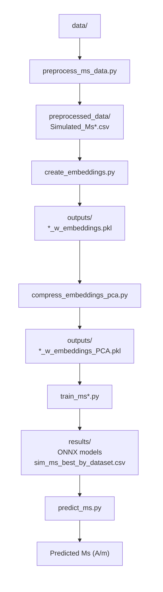

# compound-to-simulated-ms

Predict the **simulated (DFT) saturation magnetisation Ms** (in A/m) of a magnetic compound
directly from its chemical formula, via a matscholar200 compound embedding.

This is a sibling of `compound-to-simulated-tc` (same pipeline and code structure) but
targets Ms instead of Tc, and is fed by the raw Ms sources used by `my_ms`. The companion
project `compound-to-experimental-ms` is identical but targets the *experimental* Ms.

> **Trained in log-space.** Ms spans ~6 orders of magnitude, so models are trained on
> `log1p(Ms)`; `predict_ms.py` applies `expm1` so predictions come back in physical A/m.

> **What the target actually is (important).** The source databases report the *collinear /
> fully-aligned* (DFT) magnetic moment per cell. For **ferromagnets** this equals the
> physical saturation magnetisation, so metals/intermetallics predict well (~±10–20%). For
> **ferrimagnets** (spinel ferrites, garnets like YIG, magnetite Fe₃O₄) it is the
> *uncompensated* moment — the antiparallel sublattices are **not** cancelled — so the
> training Ms, and hence the model, is several-fold **larger** than the true net Ms
> (e.g. Fe₃O₄ training ≈ 1.7×10⁶ vs physical ≈ 4.8×10⁵ A/m). Read predictions for
> ferrimagnetic oxides as the collinear moment, not the net saturation magnetisation.
> (Deduplication uses the pymatgen *reduced formula*, so spellings like CoFe₂O₄ / Fe₂CoO₄
> are pooled.) See `first_model_analysis.txt` and `further_improvements.txt`.
>
> **You can verify this yourself.** `data/validation_ferrimagnetic_compounds_reference.csv` lists 13 known
> ferrimagnets with their *measured net* Ms. Run
> `python src/validate_reference_data.py --ref data/validation_ferrimagnetic_compounds_reference.csv`
> and you will see the model over-predict every one — median ≈ +360 %, e.g. Fe₃O₄ +239 %,
> YIG +512 %, up to +7000 % for Gd₃Fe₅O₁₂ (near its compensation point) — confirming that
> the learned quantity is the collinear moment, not the net Ms.

## Pipeline overview

```
data/<raw sources>                         (per-project copies of the 7 raw files)
  └─ src/preprocess_ms_data.py   ──► preprocessed_data/Simulated_Ms{,_all,_RE,_RE-Free}.csv
       └─ src/create_embeddings.py        ──► outputs/*_w_embeddings.pkl        (200-D)
            └─ src/compress_embeddings_pca.py ──► outputs/*_w_embeddings_PCA.pkl (+PCA 8/16/32/64)
                 └─ src/train_ms.py (+ _all/_re/_re_free) ──► results/onnx_models/*.onnx,
                                                              results/sim_ms_best_by_dataset.csv
                      └─ src/predict_ms.py   ──► Ms (A/m) for any formula
```


## 0. Installation

Python ≥ 3.12. Create a venv and install `requirements.txt`:
```bash
python3 -m venv .venv && source .venv/bin/activate
pip install -r requirements.txt
```
(The SLURM scripts `source .venv/bin/activate`; adjust if your environment differs.)

## 1. Pre-process the raw data

`src/preprocess_ms_data.py` reads the raw **simulated** Ms sources from `data/`, converts
each to A/m, pools all values per composition into a **single median** (no mean, no
median-of-medians), flags rare-earth membership (pymatgen), drops unparsable formulae,
**drops low-Ms compounds** (`--ms-threshold`, default 50000 A/m, as in `my_ms`), and by
default **drops known ferrimagnets** (see below).

```bash
python src/preprocess_ms_data.py                    # default: drop known ferrimagnets, --ms-threshold 50000
python src/preprocess_ms_data.py --include-ferrimagnets   # keep known ferrimagnets
python src/preprocess_ms_data.py --ms-threshold 0   # keep all Ms magnitudes
```

**`--include-ferrimagnets`** (default: off → ferrimagnets dropped). For ferrimagnets the
training Ms is the *collinear / uncompensated* moment, not the net saturation magnetisation
(see the "What the target actually is" note above), so by default the script removes the
compounds it can confidently identify as ferrimagnetic — magnetite (Fe₃O₄), classic spinel
ferrites (MFe₂O₄), iron garnets (R₃Fe₅O₁₂) and hexaferrites (MFe₁₂O₁₉) — a **curated,
high-confidence subset** (~18, to be extended). The script prints a warning either way:
- default → `CAREFUL: the dataset MAY STILL CONTAIN UNKNOWN ferrimagnets` (composition cannot
  identify ferrimagnetism in general);
- with the flag → `CAREFUL: N KNOWN ferrimagnets ARE INCLUDED`.

> The simulated set has a large near-zero / non-magnetic population (many entries with
> Ms = 0). The default 50000 A/m threshold removes it; lower/disable via `--ms-threshold`.

Raw sources (in `data/`) and their conversion to A/m:

| source | sep | composition col | value col | → A/m |
|---|---|---|---|---|
| `oqmd_stable.csv` | `,` | `composition` | `Ms` (Tesla) | `/ µ0` |
| `Bhandari_XII_sim.csv` | `;` | `material` | `Ms (A/m)` | (already A/m) |
| `mp_fm_dedup_sim_data.csv` | `,` | `formula_pretty` | `total_magnetization_normalized_vol` | `× µ_B/ų` |

Outputs (`preprocessed_data/`): `Simulated_Ms.csv` (composition, Ms, contains_re),
`Simulated_Ms_all.csv`, `Simulated_Ms_RE.csv`, `Simulated_Ms_RE-Free.csv`.

## 2–3. Embeddings + PCA

```bash
python src/create_embeddings.py        # → outputs/*_w_embeddings.pkl (200-D matscholar200)
python src/compress_embeddings_pca.py  # → adds comp_emb_pca_8/16/32/64
```

## 4. Train

**NEEDS** (from steps 1–3): the preprocessed CSVs (`preprocessed_data/*.csv`) and the PCA
embeddings (`outputs/*_w_embeddings_PCA.pkl`). Run steps 1–3 first.

```bash
python src/train_ms.py            # all three datasets (RE-Free, RE, All)
# or one at a time (SLURM-friendly):
python src/train_ms_all.py
python src/train_ms_re.py
python src/train_ms_re_free.py
```

Which model families run is set in **`training_config.yaml`** (currently **LightGBM + RF**,
`re_features: true`). Training is in `log1p(Ms)` space; metrics/plots are reported in log1p
units. Outputs: `results/onnx_models/<Dataset>_<emb>_<model>[_refeats]_e<N>.onnx`,
per-dataset `*_results[_agg].csv`, and `results/sim_ms_best_by_dataset.csv`.

### Configuration (`training_config.yaml`)
- `re_features: true` — append 7 rare-earth physics features → 207-D input; ONNX gets a
  `_refeats` suffix (raw_200D only). `predict_ms` computes & appends them automatically.
- `models:` — per-family `enabled` / `ensemble`. Only the best + 2nd-best families
  (LightGBM, Random Forest) are enabled; Linear and MLP are disabled (far behind on Ms).

## 5. Predict

`src/predict_ms.py` predicts Ms (A/m) for any formula using the exported ONNX models — it
does all preprocessing internally (embedding, PCA/scaler baked into the graph, RE features,
and `expm1` back to A/m).

**NEEDS**: the ONNX models from step 4 (`results/onnx_models/*.onnx`) — run training first;
`python src/predict_ms.py --list` shows what's available.

```bash
python src/predict_ms.py --compound Nd2Fe14B --best      # best model for the compound type
python src/predict_ms.py --compound Fe --all             # all applicable models, mean ± std
python src/predict_ms.py --compounds-file new_materials.txt --best
python src/predict_ms.py --list
python src/predict_ms.py --compound Fe --best --no-disclaimer   # suppress the disclaimer
```

> **Are these compounds actually new?** `python -m src.check_new_materials` cross-checks every
> formula in `new_materials.txt` against the raw sources, the training set, and the validation
> references (matched by reduced formula) and writes `new_materials_known.txt`. For the shipped
> list all 8 are already present in the data — so predicting them is in-sample, not a
> generalisation test.

**Reliability disclaimer.** By default `predict_ms.py` prints a disclaimer to **stderr**
before predicting (except for `--list`), warning that the learned target is the DFT
collinear moment — correct for ferromagnets but an over-estimate for ferri-/antiferromagnets
(ferrites, garnets, oxides), so predictions must be checked and used with care. It goes to
stderr, so it never pollutes the machine-readable table on stdout. Pass **`--no-disclaimer`**
to suppress it (e.g. for scripted/batch use).

`--best`/`--all` auto-detect rare-earth content and pick the right dataset's model(s). The
RE and RE-Free models do not extrapolate across the RE boundary, so `predict_ms` **refuses**
a mismatched `--model` (use an `All_*` model, which is valid for both).

## 6. Results

### Best model per dataset

### Results All-Materials

Trained with the default option where known ferrimagnets are dropped and ms-threshold is 50000 (A/m).

| Embedding | Model      | R² (mean ± std)     | MAE (mean ± std)    | RMSE (mean ± std)   | MAE (A/m) (mean ± std) | Median Rel. Err. (mean ± std) |
| :-------- | :--------- | :------------------ | :------------------ | :------------------ | :--------------------- | :---------------------------- |
| raw_200D  | **MLP**    | **0.8108 ± 0.0040** | **0.2388 ± 0.0032** | **0.3462 ± 0.0032** | **62505 ± 1842**       | **0.1554 ± 0.0034**           |
| pca_64    | **MLP**    | **0.8124 ± 0.0031** | **0.2353 ± 0.0022** | **0.3456 ± 0.0034** | **62761 ± 1714**       | **0.1501 ± 0.0027**           |
| pca_32    | **MLP**    | **0.7992 ± 0.0032** | **0.2495 ± 0.0040** | **0.3568 ± 0.0030** | **66172 ± 1376**       | **0.1661 ± 0.0050**           |
| pca_16    | **MLP**    | **0.7652 ± 0.0031** | **0.2787 ± 0.0031** | **0.3871 ± 0.0026** | **73857 ± 1613**       | **0.1924 ± 0.0042**           |
| pca_8     | **MLP**    | **0.6257 ± 0.0038** | **0.3693 ± 0.0022** | **0.4886 ± 0.0025** | **100605 ± 1356**      | **0.2710 ± 0.0024**           |
| raw_200D  | **LGBM**   | **0.7468 ± 0.0033** | **0.2950 ± 0.0017** | **0.4012 ± 0.0022** | **77334 ± 617**        | **0.2113 ± 0.0025**           |
| pca_64    | **LGBM**   | **0.7186 ± 0.0037** | **0.3190 ± 0.0023** | **0.4229 ± 0.0026** | **85234 ± 1063**       | **0.2359 ± 0.0024**           |
| pca_32    | **LGBM**   | **0.7166 ± 0.0027** | **0.3202 ± 0.0015** | **0.4249 ± 0.0023** | **85439 ± 1008**       | **0.2363 ± 0.0020**           |
| pca_16    | **LGBM**   | **0.6952 ± 0.0037** | **0.3346 ± 0.0027** | **0.4402 ± 0.0029** | **89591 ± 914**        | **0.2485 ± 0.0034**           |
| pca_8     | **LGBM**   | **0.5617 ± 0.0016** | **0.4129 ± 0.0024** | **0.5280 ± 0.0024** | **114492 ± 983**       | **0.3182 ± 0.0042**           |
| raw_200D  | **RF**     | **0.7149 ± 0.0024** | **0.3169 ± 0.0018** | **0.4249 ± 0.0020** | **82916 ± 1034**       | **0.2278 ± 0.0028**           |
| pca_64    | **RF**     | **0.6667 ± 0.0032** | **0.3507 ± 0.0022** | **0.4602 ± 0.0021** | **94121 ± 961**        | **0.2594 ± 0.0023**           |
| pca_32    | **RF**     | **0.6853 ± 0.0032** | **0.3427 ± 0.0019** | **0.4471 ± 0.0025** | **93141 ± 774**        | **0.2547 ± 0.0024**           |
| pca_16    | **RF**     | **0.6816 ± 0.0028** | **0.3445 ± 0.0022** | **0.4495 ± 0.0021** | **93469 ± 960**        | **0.2569 ± 0.0031**           |
| pca_8     | **RF**     | **0.6009 ± 0.0033** | **0.3838 ± 0.0023** | **0.5031 ± 0.0027** | **105642 ± 788**       | **0.2857 ± 0.0035**           |
| raw_200D  | **Linear** | **0.4874 ± 0.0050** | **0.4545 ± 0.0030** | **0.5711 ± 0.0042** | **136316 ± 1590**      | **0.3475 ± 0.0028**           |
| pca_64    | **Linear** | **0.4872 ± 0.0051** | **0.4574 ± 0.0028** | **0.5718 ± 0.0038** | **136443 ± 1399**      | **0.3498 ± 0.0029**           |
| pca_32    | **Linear** | **0.4536 ± 0.0041** | **0.4733 ± 0.0025** | **0.5896 ± 0.0032** | **138818 ± 1304**      | **0.3687 ± 0.0026**           |
| pca_16    | **Linear** | **0.4036 ± 0.0067** | **0.4991 ± 0.0034** | **0.6147 ± 0.0042** | **145494 ± 1267**      | **0.3939 ± 0.0036**           |
| pca_8     | **Linear** | **0.1047 ± 0.0040** | **0.6256 ± 0.0043** | **0.7543 ± 0.0045** | **181725 ± 1418**      | **0.5011 ± 0.0048**           |


### Results RE-Materials

| Dataset | Embedding | Model | EnsembleIdx | R² | MAE | RMSE | MAE_Am | MedRelErr |
|---------|-----------|-------|------------:|---:|----:|-----:|--------:|----------:|
| RE | raw_200D | MLP | 0 | 0.743 | 0.285 | 0.400 | 71343.722 | 0.196 |
| RE | pca_64 | MLP | 0 | 0.740 | 0.286 | 0.403 | 69595.101 | 0.193 |
| RE | pca_32 | MLP | 0 | 0.711 | 0.309 | 0.424 | 74767.294 | 0.214 |
| RE | raw_200D | LGBM | 0 | 0.704 | 0.308 | 0.430 | 75223.867 | 0.212 |
| RE | pca_64 | LGBM | 0 | 0.679 | 0.330 | 0.447 | 80510.764 | 0.234 |
| RE | pca_32 | LGBM | 0 | 0.647 | 0.348 | 0.469 | 85127.430 | 0.247 |
| RE | raw_200D | RF | 0 | 0.638 | 0.354 | 0.475 | 86923.588 | 0.254 |
| RE | pca_32 | RF | 0 | 0.603 | 0.384 | 0.497 | 95597.164 | 0.290 |
| RE | pca_64 | RF | 0 | 0.601 | 0.390 | 0.499 | 98285.424 | 0.295 |
| RE | pca_16 | LGBM | 0 | 0.579 | 0.392 | 0.513 | 96727.121 | 0.291 |
| RE | pca_16 | RF | 0 | 0.572 | 0.397 | 0.517 | 97734.758 | 0.293 |
| RE | pca_16 | MLP | 0 | 0.570 | 0.397 | 0.518 | 98563.383 | 0.293 |
| RE | raw_200D | Linear | 0 | 0.469 | 0.452 | 0.575 | 123416.729 | 0.335 |
| RE | pca_64 | Linear | 0 | 0.461 | 0.457 | 0.580 | 123661.757 | 0.346 |
| RE | pca_8 | RF | 0 | 0.456 | 0.445 | 0.582 | 112012.137 | 0.325 |
| RE | pca_8 | LGBM | 0 | 0.418 | 0.468 | 0.602 | 118981.667 | 0.355 |
| RE | pca_32 | Linear | 0 | 0.343 | 0.515 | 0.640 | 132693.132 | 0.405 |
| RE | pca_8 | MLP | 0 | 0.328 | 0.523 | 0.647 | 134131.152 | 0.407 |
| RE | pca_16 | Linear | 0 | 0.237 | 0.568 | 0.690 | 144499.458 | 0.447 |
| RE | pca_8 | Linear | 0 | 0.029 | 0.653 | 0.778 | 169583.108 | 0.520 |


### Results RE-Free Materials

| Dataset | Embedding | Model | EnsembleIdx | R² | MAE | RMSE | MAE_Am | MedRelErr |
|---------|-----------|-------|------------:|---:|----:|-----:|--------:|----------:|
| RE-Free | pca_64 | MLP | 0 | 0.803 | 0.249 | 0.350 | 69354.044 | 0.170 |
| RE-Free | raw_200D | MLP | 0 | 0.800 | 0.253 | 0.352 | 68534.798 | 0.171 |
| RE-Free | pca_32 | MLP | 0 | 0.795 | 0.259 | 0.357 | 71167.755 | 0.178 |
| RE-Free | pca_16 | MLP | 0 | 0.755 | 0.287 | 0.390 | 77359.532 | 0.200 |
| RE-Free | raw_200D | LGBM | 0 | 0.751 | 0.290 | 0.393 | 77382.902 | 0.206 |
| RE-Free | pca_32 | LGBM | 0 | 0.722 | 0.312 | 0.415 | 85000.092 | 0.229 |
| RE-Free | raw_200D | RF | 0 | 0.720 | 0.313 | 0.417 | 86187.676 | 0.228 |
| RE-Free | pca_64 | LGBM | 0 | 0.717 | 0.314 | 0.418 | 85484.617 | 0.229 |
| RE-Free | pca_16 | LGBM | 0 | 0.689 | 0.332 | 0.439 | 90494.184 | 0.244 |
| RE-Free | pca_32 | RF | 0 | 0.683 | 0.339 | 0.443 | 95399.212 | 0.251 |
| RE-Free | pca_16 | RF | 0 | 0.676 | 0.342 | 0.448 | 94870.287 | 0.253 |
| RE-Free | pca_64 | RF | 0 | 0.671 | 0.345 | 0.452 | 95716.203 | 0.257 |
| RE-Free | pca_8 | MLP | 0 | 0.611 | 0.376 | 0.491 | 106072.902 | 0.283 |
| RE-Free | pca_8 | RF | 0 | 0.584 | 0.392 | 0.508 | 112287.713 | 0.292 |
| RE-Free | pca_8 | LGBM | 0 | 0.564 | 0.403 | 0.520 | 115147.882 | 0.306 |
| RE-Free | pca_64 | Linear | 0 | 0.497 | 0.446 | 0.559 | 141402.952 | 0.345 |
| RE-Free | raw_200D | Linear | 0 | 0.497 | 0.446 | 0.559 | 141592.179 | 0.345 |
| RE-Free | pca_32 | Linear | 0 | 0.479 | 0.455 | 0.569 | 141497.931 | 0.357 |
| RE-Free | pca_16 | Linear | 0 | 0.415 | 0.486 | 0.602 | 149747.031 | 0.380 |
| RE-Free | pca_8 | Linear | 0 | 0.142 | 0.599 | 0.729 | 182234.834 | 0.474 |