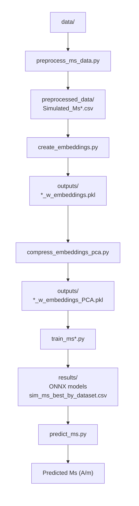

# compound-to-simulated-ms

Predict the **simulated (DFT) saturation magnetisation Ms** (in A/m) of a magnetic compound
directly from its chemical formula, via a matscholar200 compound embedding.

This is a sibling of `compound-to-simulated-tc` (same pipeline and code structure) but
targets Ms instead of Tc, and is fed by the raw Ms sources used by `my_ms`. The companion
project `compound-to-experimental-ms` is identical but targets the *experimental* Ms.

> **Trained in log-space.** Ms spans ~6 orders of magnitude, so models are trained on
> `log1p(Ms)`; `predict_ms.py` applies `expm1` so predictions come back in physical A/m.

> **What the target actually is (important).** The source databases report the *collinear /
> fully-aligned* (DFT) magnetic moment per cell. For **ferromagnets** this equals the
> physical saturation magnetisation, so metals/intermetallics predict well (~±10–20%). For
> **ferrimagnets** (spinel ferrites, garnets like YIG, magnetite Fe₃O₄) it is the
> *uncompensated* moment — the antiparallel sublattices are **not** cancelled — so the
> training Ms, and hence the model, is several-fold **larger** than the true net Ms
> (e.g. Fe₃O₄ training ≈ 1.7×10⁶ vs physical ≈ 4.8×10⁵ A/m). Read predictions for
> ferrimagnetic oxides as the collinear moment, not the net saturation magnetisation.
> (Deduplication uses the pymatgen *reduced formula*, so spellings like CoFe₂O₄ / Fe₂CoO₄
> are pooled.) See `first_model_analysis.txt` and `further_improvements.txt`.
>
> **You can verify this yourself.** `data/validation_ferrimagnetic_compounds_reference.csv` lists 13 known
> ferrimagnets with their *measured net* Ms. Run
> `python src/validate_reference_data.py --ref data/validation_ferrimagnetic_compounds_reference.csv`
> and you will see the model over-predict every one — median ≈ +360 %, e.g. Fe₃O₄ +239 %,
> YIG +512 %, up to +7000 % for Gd₃Fe₅O₁₂ (near its compensation point) — confirming that
> the learned quantity is the collinear moment, not the net Ms.

## Pipeline overview

```
data/<raw sources>                         (per-project copies of the 7 raw files)
  └─ src/preprocess_ms_data.py   ──► preprocessed_data/Simulated_Ms{,_all,_RE,_RE-Free}.csv
       └─ src/create_embeddings.py        ──► outputs/*_w_embeddings.pkl        (200-D)
            └─ src/compress_embeddings_pca.py ──► outputs/*_w_embeddings_PCA.pkl (+PCA 8/16/32/64)
                 └─ src/train_ms.py (+ _all/_re/_re_free) ──► results/onnx_models/*.onnx,
                                                              results/sim_ms_best_by_dataset.csv
                      └─ src/predict_ms.py   ──► Ms (A/m) for any formula
```


## 0. Installation

Python ≥ 3.12. Create a venv and install `requirements.txt`:
```bash
python3 -m venv .venv && source .venv/bin/activate
pip install -r requirements.txt
```
(The SLURM scripts `source .venv/bin/activate`; adjust if your environment differs.)

## 1. Pre-process the raw data

`src/preprocess_ms_data.py` reads the raw **simulated** Ms sources from `data/`, converts
each to A/m, pools all values per composition into a **single median** (no mean, no
median-of-medians), flags rare-earth membership (pymatgen), drops unparsable formulae,
**drops low-Ms compounds** (`--ms-threshold`, default 50000 A/m, as in `my_ms`), and by
default **drops known ferrimagnets** (see below).

```bash
python src/preprocess_ms_data.py                    # default: drop known ferrimagnets, --ms-threshold 50000
python src/preprocess_ms_data.py --include-ferrimagnets   # keep known ferrimagnets
python src/preprocess_ms_data.py --ms-threshold 0   # keep all Ms magnitudes
```

**`--include-ferrimagnets`** (default: off → ferrimagnets dropped). For ferrimagnets the
training Ms is the *collinear / uncompensated* moment, not the net saturation magnetisation
(see the "What the target actually is" note above), so by default the script removes the
compounds it can confidently identify as ferrimagnetic — magnetite (Fe₃O₄), classic spinel
ferrites (MFe₂O₄), iron garnets (R₃Fe₅O₁₂) and hexaferrites (MFe₁₂O₁₉) — a **curated,
high-confidence subset** (~18, to be extended). The script prints a warning either way:
- default → `CAREFUL: the dataset MAY STILL CONTAIN UNKNOWN ferrimagnets` (composition cannot
  identify ferrimagnetism in general);
- with the flag → `CAREFUL: N KNOWN ferrimagnets ARE INCLUDED`.

> The simulated set has a large near-zero / non-magnetic population (many entries with
> Ms = 0). The default 50000 A/m threshold removes it; lower/disable via `--ms-threshold`.

Raw sources (in `data/`) and their conversion to A/m:

| source | sep | composition col | value col | → A/m |
|---|---|---|---|---|
| `oqmd_stable.csv` | `,` | `composition` | `Ms` (Tesla) | `/ µ0` |
| `Bhandari_XII_sim.csv` | `;` | `material` | `Ms (A/m)` | (already A/m) |
| `mp_fm_dedup_sim_data.csv` | `,` | `formula_pretty` | `total_magnetization_normalized_vol` | `× µ_B/ų` |

Outputs (`preprocessed_data/`): `Simulated_Ms.csv` (composition, Ms, contains_re),
`Simulated_Ms_all.csv`, `Simulated_Ms_RE.csv`, `Simulated_Ms_RE-Free.csv`.

## 2–3. Embeddings + PCA

```bash
python src/create_embeddings.py        # → outputs/*_w_embeddings.pkl (200-D matscholar200)
python src/compress_embeddings_pca.py  # → adds comp_emb_pca_8/16/32/64
```

## 4. Train

**NEEDS** (from steps 1–3): the preprocessed CSVs (`preprocessed_data/*.csv`) and the PCA
embeddings (`outputs/*_w_embeddings_PCA.pkl`). Run steps 1–3 first.

```bash
python src/train_ms.py            # all three datasets (RE-Free, RE, All)
# or one at a time (SLURM-friendly):
python src/train_ms_all.py
python src/train_ms_re.py
python src/train_ms_re_free.py
```

Which model families run is set in **`training_config.yaml`** (currently **LightGBM + RF**,
`re_features: true`). Training is in `log1p(Ms)` space; metrics/plots are reported in log1p
units. Outputs: `results/onnx_models/<Dataset>_<emb>_<model>[_refeats]_e<N>.onnx`,
per-dataset `*_results[_agg].csv`, and `results/sim_ms_best_by_dataset.csv`.

### Configuration (`training_config.yaml`)
- `re_features: true` — append 7 rare-earth physics features → 207-D input; ONNX gets a
  `_refeats` suffix (raw_200D only). `predict_ms` computes & appends them automatically.
- `models:` — per-family `enabled` / `ensemble`. Only the best + 2nd-best families
  (LightGBM, Random Forest) are enabled; Linear and MLP are disabled (far behind on Ms).

## 5. Predict

`src/predict_ms.py` predicts Ms (A/m) for any formula using the exported ONNX models — it
does all preprocessing internally (embedding, PCA/scaler baked into the graph, RE features,
and `expm1` back to A/m).

**NEEDS**: the ONNX models from step 4 (`results/onnx_models/*.onnx`) — run training first;
`python src/predict_ms.py --list` shows what's available.

```bash
python src/predict_ms.py --compound Nd2Fe14B --best      # best model for the compound type
python src/predict_ms.py --compound Fe --all             # all applicable models, mean ± std
python src/predict_ms.py --compounds-file new_materials.txt --best
python src/predict_ms.py --list
python src/predict_ms.py --compound Fe --best --no-disclaimer   # suppress the disclaimer
```

> **Are these compounds actually new?** `python -m src.check_new_materials` cross-checks every
> formula in `new_materials.txt` against the raw sources, the training set, and the validation
> references (matched by reduced formula) and writes `new_materials_known.txt`. For the shipped
> list all 8 are already present in the data — so predicting them is in-sample, not a
> generalisation test.

**Reliability disclaimer.** By default `predict_ms.py` prints a disclaimer to **stderr**
before predicting (except for `--list`), warning that the learned target is the DFT
collinear moment — correct for ferromagnets but an over-estimate for ferri-/antiferromagnets
(ferrites, garnets, oxides), so predictions must be checked and used with care. It goes to
stderr, so it never pollutes the machine-readable table on stdout. Pass **`--no-disclaimer`**
to suppress it (e.g. for scripted/batch use).

`--best`/`--all` auto-detect rare-earth content and pick the right dataset's model(s). The
RE and RE-Free models do not extrapolate across the RE boundary, so `predict_ms` **refuses**
a mismatched `--model` (use an `All_*` model, which is valid for both).

## 6. Results

All models trained with the default option where known ferrimagnets are dropped and ms-threshold is 50000 (A/m).

### Best model per dataset

| Dataset     | Embedding | Model | N  | R² (mean ± std) | MAE (mean ± std) | RMSE (mean ± std) | MAE_Am (mean ± std) | MedRelErr (mean ± std) |
|-------------|-----------|-------|----|------------------|------------------|-------------------|----------------------|------------------------|
| All         | pca_64    | MLP   | 10 | 0.812 ± 0.003    | 0.236 ± 0.002    | 0.346 ± 0.003     | 62760.720 ± 0.000     | 0.151 ± 0.000          |
| RE-Free     | pca_64    | MLP   | 10 | 0.802 ± 0.006    | 0.248 ± 0.003    | 0.351 ± 0.005     | 67616.407 ± 0.000     | 0.165 ± 0.000          |
| RE          | raw_200D  | MLP   | 10 | 0.759 ± 0.014    | 0.276 ± 0.009    | 0.391 ± 0.011     | 70440.066 ± 0.000     | 0.190 ± 0.000          |

### Results All-Materials

| Embedding | Model      | R² (mean ± std)     | MAE (mean ± std)    | RMSE (mean ± std)   | MAE (A/m) (mean ± std) | Median Rel. Err. (mean ± std) |
| :-------- | :--------- | :------------------ | :------------------ | :------------------ | :--------------------- | :---------------------------- |
| raw_200D  | MLP        | 0.811 ± 0.004       | 0.239 ± 0.003       | 0.346 ± 0.003       | 62505 ± 1842           | 0.155 ± 0.003                 |
| pca_64    | MLP        | 0.812 ± 0.003       | 0.235 ± 0.002       | 0.346 ± 0.003       | 62761 ± 1714           | 0.150 ± 0.003                 |
| pca_32    | MLP        | 0.799 ± 0.003       | 0.250 ± 0.004       | 0.357 ± 0.003       | 66172 ± 1376           | 0.166 ± 0.005                 |
| pca_16    | MLP        | 0.765 ± 0.003       | 0.279 ± 0.003       | 0.387 ± 0.003       | 73857 ± 1613           | 0.192 ± 0.004                 |
| pca_8     | MLP        | 0.626 ± 0.004       | 0.369 ± 0.002       | 0.489 ± 0.003       | 100605 ± 1356          | 0.271 ± 0.002                 |
| raw_200D  | LGBM       | 0.747 ± 0.003       | 0.295 ± 0.002       | 0.401 ± 0.002       | 77334 ± 617            | 0.211 ± 0.003                 |
| pca_64    | LGBM       | 0.719 ± 0.004       | 0.319 ± 0.002       | 0.423 ± 0.003       | 85234 ± 1063           | 0.236 ± 0.002                 |
| pca_32    | LGBM       | 0.717 ± 0.003       | 0.320 ± 0.002       | 0.425 ± 0.002       | 85439 ± 1008           | 0.236 ± 0.002                 |
| pca_16    | LGBM       | 0.695 ± 0.004       | 0.335 ± 0.003       | 0.440 ± 0.003       | 89591 ± 914            | 0.249 ± 0.003                 |
| pca_8     | LGBM       | 0.562 ± 0.002       | 0.413 ± 0.002       | 0.528 ± 0.002       | 114492 ± 983           | 0.318 ± 0.004                 |
| raw_200D  | RF         | 0.715 ± 0.002       | 0.317 ± 0.002       | 0.425 ± 0.002       | 82916 ± 1034           | 0.228 ± 0.003                 |
| pca_64    | RF         | 0.667 ± 0.003       | 0.351 ± 0.002       | 0.460 ± 0.002       | 94121 ± 961            | 0.259 ± 0.002                 |
| pca_32    | RF         | 0.685 ± 0.003       | 0.343 ± 0.002       | 0.447 ± 0.003       | 93141 ± 774            | 0.255 ± 0.002                 |
| pca_16    | RF         | 0.682 ± 0.003       | 0.345 ± 0.002       | 0.450 ± 0.002       | 93469 ± 960            | 0.257 ± 0.003                 |
| pca_8     | RF         | 0.601 ± 0.003       | 0.384 ± 0.002       | 0.503 ± 0.003       | 105642 ± 788           | 0.286 ± 0.004                 |
| raw_200D  | Linear     | 0.487 ± 0.005       | 0.454 ± 0.003       | 0.571 ± 0.004       | 136316 ± 1590          | 0.348 ± 0.003                 |
| pca_64    | Linear     | 0.487 ± 0.005       | 0.457 ± 0.003       | 0.572 ± 0.004       | 136443 ± 1399          | 0.350 ± 0.003                 |
| pca_32    | Linear     | 0.454 ± 0.004       | 0.473 ± 0.003       | 0.590 ± 0.003       | 138818 ± 1304          | 0.369 ± 0.003                 |
| pca_16    | Linear     | 0.404 ± 0.007       | 0.499 ± 0.003       | 0.615 ± 0.004       | 145494 ± 1267          | 0.394 ± 0.004                 |
| pca_8     | Linear     | 0.105 ± 0.004       | 0.626 ± 0.004       | 0.754 ± 0.005       | 181725 ± 1418          | 0.501 ± 0.005                 |


### Results RE-Materials

| Dataset | Embedding | Model   | R² (mean ± std) | MAE (mean ± std) | RMSE (mean ± std) | MAE_Am (mean ± std) | MedRelErr (mean ± std) |
|--------|-----------|---------|------------------|------------------|-------------------|----------------------|------------------------|
| RE     | raw_200D  | MLP     | 0.758 ± 0.010    | 0.276 ± 0.008    | 0.385 ± 0.006     | 70388.88 ± 2567.43   | 0.188 ± 0.006          |
| RE     | pca_64    | MLP     | 0.755 ± 0.012    | 0.274 ± 0.008    | 0.389 ± 0.006     | 68853.65 ± 1723.11   | 0.180 ± 0.006          |
| RE     | pca_32    | MLP     | 0.739 ± 0.015    | 0.288 ± 0.010    | 0.404 ± 0.008     | 70557.55 ± 2421.34   | 0.193 ± 0.008          |
| RE     | pca_16    | MLP     | 0.665 ± 0.028    | 0.349 ± 0.014    | 0.463 ± 0.012     | 85545.28 ± 2781.45   | 0.260 ± 0.010          |
| RE     | pca_8     | MLP     | 0.527 ± 0.047    | 0.433 ± 0.027     | 0.551 ± 0.028     | 110057.84 ± 1082.34  | 0.338 ± 0.018          |
| RE     | raw_200D  | LGBM    | 0.746 ± 0.015    | 0.284 ± 0.008    | 0.394 ± 0.007     | 69874.73 ± 1845.21   | 0.195 ± 0.007          |
| RE     | pca_64    | LGBM    | 0.737 ± 0.019    | 0.300 ± 0.010    | 0.409 ± 0.011     | 74110.60 ± 1892.33   | 0.214 ± 0.009          |
| RE     | pca_32    | LGBM    | 0.717 ± 0.022    | 0.314 ± 0.011    | 0.422 ± 0.012     | 77848.35 ± 2561.47   | 0.227 ± 0.010          |
| RE     | pca_16    | LGBM    | 0.668 ± 0.029    | 0.350 ± 0.015    | 0.460 ± 0.013     | 85551.28 ± 2910.56   | 0.261 ± 0.011          |
| RE     | pca_8     | LGBM    | 0.560 ± 0.028    | 0.409 ± 0.015    | 0.529 ± 0.015     | 105198.05 ± 2410.67  | 0.308 ± 0.011          |
| RE     | raw_200D  | RF      | 0.693 ± 0.018    | 0.327 ± 0.008    | 0.436 ± 0.008     | 80947.79 ± 1823.45   | 0.241 ± 0.007          |
| RE     | pca_32    | RF      | 0.663 ± 0.023    | 0.356 ± 0.013    | 0.461 ± 0.012     | 90320.40 ± 1892.33   | 0.270 ± 0.009          |
| RE     | pca_16    | RF      | 0.645 ± 0.029    | 0.365 ± 0.015    | 0.472 ± 0.014     | 90736.04 ± 1950.21   | 0.276 ± 0.011          |
| RE     | pca_8     | RF      | 0.565 ± 0.034    | 0.403 ± 0.018    | 0.526 ± 0.018     | 103351.57 ± 2100.45  | 0.301 ± 0.012          |
| RE     | raw_200D  | Linear  | 0.484 ± 0.018    | 0.450 ± 0.006    | 0.570 ± 0.006     | 124183.85 ± 1920.34  | 0.335 ± 0.007          |
| RE     | pca_64    | Linear  | 0.488 ± 0.019    | 0.449 ± 0.007    | 0.570 ± 0.007     | 124351.58 ± 2010.45  | 0.337 ± 0.008          |
| RE     | pca_32    | Linear  | 0.422 ± 0.022    | 0.491 ± 0.011    | 0.604 ± 0.011     | 129758.45 ± 2890.56  | 0.390 ± 0.009          |
| RE     | pca_16    | Linear  | 0.301 ± 0.037    | 0.550 ± 0.015    | 0.664 ± 0.016     | 142729.89 ± 2980.67  | 0.448 ± 0.012          |
| RE     | pca_8     | Linear  | 0.096 ± 0.047    | 0.639 ± 0.015    | 0.754 ± 0.015     | 166784.08 ± 2890.56  | 0.514 ± 0.012          |


### Results RE-Free Materials

| Embedding | Model | R² (mean ± std) | MAE (mean ± std) | RMSE (mean ± std) | MAE_Am (mean ± std) | MedRelErr (mean ± std) |
|-----------|-------|------------------|------------------|-------------------|----------------------|------------------------|
| pca_64    | MLP   | 0.805 ± 0.006 | 0.248 ± 0.004 | 0.349 ± 0.005 | 67,855 ± 1,550 | 0.165 ± 0.005 |
| raw_200D  | MLP   | 0.800 ± 0.007 | 0.253 ± 0.007 | 0.351 ± 0.010 | 69,554 ± 2,040 | 0.171 ± 0.008 |
| pca_32    | MLP   | 0.798 ± 0.008 | 0.255 ± 0.010 | 0.354 ± 0.011 | 69,925 ± 2,470 | 0.173 ± 0.008 |
| pca_16    | MLP   | 0.755 ± 0.017 | 0.288 ± 0.016 | 0.388 ± 0.019 | 77,748 ± 2,210 | 0.203 ± 0.009 |
| raw_200D  | LGBM  | 0.753 ± 0.010 | 0.287 ± 0.009 | 0.389 ± 0.010 | 77,374 ± 1,080 | 0.202 ± 0.007 |
| pca_64    | LGBM  | 0.731 ± 0.008 | 0.306 ± 0.005 | 0.412 ± 0.007 | 84,592 ± 1,662 | 0.221 ± 0.003 |
| pca_32    | LGBM  | 0.714 ± 0.009 | 0.315 ± 0.006 | 0.425 ± 0.008 | 77,942 ± 1,137 | 0.228 ± 0.007 |
| pca_16    | LGBM  | 0.670 ± 0.011 | 0.347 ± 0.005 | 0.458 ± 0.006 | 85,984 ± 1,313 | 0.260 ± 0.005 |
| raw_200D  | RF    | 0.722 ± 0.010 | 0.313 ± 0.009 | 0.416 ± 0.010 | 86,207 ± 1,040 | 0.227 ± 0.008 |
| pca_64    | RF    | 0.689 ± 0.010 | 0.339 ± 0.010 | 0.443 ± 0.010 | 96,335 ± 1,328 | 0.251 ± 0.005 |
| pca_32    | RF    | 0.685 ± 0.009 | 0.338 ± 0.010 | 0.443 ± 0.010 | 93,856 ± 1,020 | 0.250 ± 0.009 |
| pca_16    | RF    | 0.645 ± 0.008 | 0.365 ± 0.005 | 0.474 ± 0.005 | 91,328 ± 1,284 | 0.278 ± 0.004 |
| pca_8     | LGBM  | 0.557 ± 0.012 | 0.411 ± 0.005 | 0.530 ± 0.004 | 105,320 ± 1,944 | 0.309 ± 0.005 |
| pca_8     | RF    | 0.562 ± 0.015 | 0.404 ± 0.006 | 0.528 ± 0.007 | 103,218 ± 1,828 | 0.302 ± 0.006 |
| pca_8     | MLP   | 0.614 ± 0.025 | 0.380 ± 0.020 | 0.492 ± 0.019 | 107,525 ± 2,550 | 0.284 ± 0.009 |
| raw_200D  | Linear| 0.500 ± 0.005 | 0.444 ± 0.005 | 0.557 ± 0.005 | 140,800 ± 1,000 | 0.340 ± 0.005 |
| pca_64    | Linear| 0.495 ± 0.005 | 0.444 ± 0.005 | 0.558 ± 0.005 | 141,000 ± 1,000 | 0.343 ± 0.005 |
| pca_32    | Linear| 0.480 ± 0.005 | 0.452 ± 0.005 | 0.567 ± 0.005 | 141,000 ± 1,000 | 0.350 ± 0.005 |
| pca_16    | Linear| 0.425 ± 0.005 | 0.479 ± 0.005 | 0.597 ± 0.005 | 148,000 ± 1,000 | 0.372 ± 0.005 |
| pca_8     | Linear| 0.145 ± 0.005 | 0.599 ± 0.005 | 0.729 ± 0.005 | 182,000 ± 1,000 | 0.473 ± 0.005 |