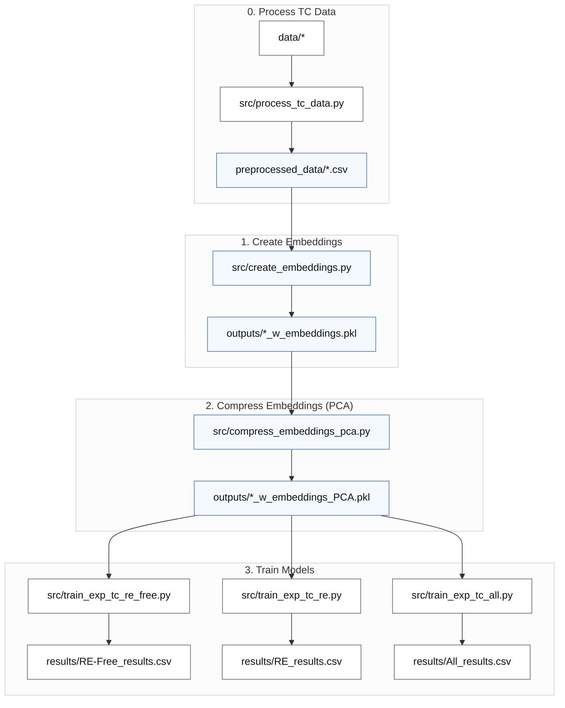

# Predicting experimental Curie temperatures from compound embeddings

This pipeline trains machine learning models that predict experimental Curie temperatures
(Tc_exp, in Kelvin) directly from stoichiometric compound embeddings — without any
simulated Tc values or data augmentation.

## Pipeline overview



Three datasets are trained independently (steps 3a–3c can run in any order or in parallel):
- **RE-Free** — rare-earth-free compounds (~6 200 rows)
- **RE** — rare-earth-containing compounds (~9 800 rows)
- **All** — combined dataset (~16 000 rows)

> **Note:** `src/train_exp_tc.py` is still available as a convenience script that runs all
> three datasets in sequence and is the shared library used by the individual scripts.

## 0. Installation

Install Python dependencies:

```bash
pip install -r requirements.txt
```

PyTorch must be installed separately to match your hardware:

```bash
# CPU-only example — see https://pytorch.org/get-started/locally/ for GPU variants
pip install torch --index-url https://download.pytorch.org/whl/cpu
```

## 1. Pre-Process Data

1. **Aggregate** data from multiple sources.  
2. **Clean** Tc values: remove units, symbols, and uncertainties; convert to float.  
3. **Drop** invalid (non-numeric) Tc entries.  
4. **Deduplicate** by taking the median Tc per composition.  
5. **Flag** compositions containing rare-earth elements.  
6. **Split** data into RE-containing and RE-free subsets.  
7. **Save** clean, structured datasets for analysis.


Run:

```bash
python src/process_tc_data.py
```
**Needs:**
```
data/m-tcsum_nur_new.csv
data/literature_values_prepared.csv
data/DS1+DS2.csv
data/combinded_tables.xlsx"
data/MagneticMaterials_All.csv
```
**Outputs:**
```
preprocessed_data/Experimental_Tc.csv          
preprocessed_data/Experimental_Tc_RE.csv   
preprocessed_data/Simulated_Tc.csv           
preprocessed_data/Simulation_Tc_RE.csv
preprocessed_data/Experimental_Tc_RE-Free.csv  
preprocessed_data/Experimental_Tc_all.csv  
preprocessed_data/Simulation_Tc_RE-Free.csv  
preprocessed_data/Simulation_Tc_all.csv
```

## 2. Create compound embeddings

Generates element-abundance-weighted compound embeddings from the Matscholar200
element vectors (200-dimensional). For example:

```
Fe2O3 embedding = (2/5) × [Fe vec] + (3/5) × [O vec]
```

Run:

```bash
python src/create_embeddings.py
```

**Needs:**
```
preprocessed_data/Experimental_Tc_RE-Free.csv
preprocessed_data/Experimental_Tc_RE.csv
preprocessed_data/Experimental_Tc_all.csv
data/embeddings/element/matscholar200.json
```

**Outputs:**
```
outputs/Experimental_Tc_RE-Free_w_embeddings.pkl
outputs/Experimental_Tc_RE_w_embeddings.pkl
outputs/Experimental_Tc_all_w_embeddings.pkl
logs/create_embeddings.txt
```

Each pickle contains the original `composition` and `Tc_exp` columns plus a
`compound_embedding` column holding a 200-D numpy array per row. Rows whose
compositions cannot be parsed or contain elements absent from the Matscholar200
vocabulary are dropped.

## 3. Compress embeddings with PCA

Fits PCA on each dataset independently and adds compressed embedding columns for
component sizes 8, 16, 32, and 64.

Run:

```bash
python src/compress_embeddings_pca.py
```

**Needs:**
```
outputs/Experimental_Tc_RE-Free_w_embeddings.pkl
outputs/Experimental_Tc_RE_w_embeddings.pkl
outputs/Experimental_Tc_all_w_embeddings.pkl
```

**Outputs:**
```
outputs/Experimental_Tc_RE-Free_w_embeddings_PCA.pkl
outputs/Experimental_Tc_RE_w_embeddings_PCA.pkl
outputs/Experimental_Tc_all_w_embeddings_PCA.pkl
logs/compress_embeddings_pca.txt
```

Each output pickle extends the input with columns `comp_emb_pca_8`, `comp_emb_pca_16`,
`comp_emb_pca_32`, and `comp_emb_pca_64`.

## 4. Train models

Trains three model families on five embedding variants for each of the three datasets
(15 training runs per dataset, 45 total):

| Model family | Variants |
|---|---|
| Linear (Lasso / Ridge best of two) | all 5 embedding variants |
| Random Forest (randomised CV) | all 5 embedding variants |
| MLP with early stopping (PyTorch) | all 5 embedding variants |

Embedding variants: `raw_200D`, `pca_8`, `pca_16`, `pca_32`, `pca_64`.

Hyperparameters are scaled to the training-set size:
- **RF `n_iter`** scales inversely with n_train (≈40 / 25 / 15 for RE-Free / RE / All).
- **MLP architecture**: `(128, 64, 32)` for n_train < 6 000; `(256, 128, 64)` otherwise.

Each dataset is trained by a dedicated script. Run them individually:

```bash
python src/train_exp_tc_re_free.py   # RE-Free dataset
python src/train_exp_tc_re.py        # RE dataset
python src/train_exp_tc_all.py       # All (combined) dataset
```

Or run all three in one go (backward-compatible):

```bash
python src/train_exp_tc.py
```

**Needs (per script):**
```
outputs/Experimental_Tc_RE-Free_w_embeddings_PCA.pkl    ← train_exp_tc_re_free.py
outputs/Experimental_Tc_RE_w_embeddings_PCA.pkl         ← train_exp_tc_re.py
outputs/Experimental_Tc_all_w_embeddings_PCA.pkl        ← train_exp_tc_all.py
```

**Outputs (per script):**
```
results/exp_tc/<Dataset>_results.csv
results/exp_tc/exp_tc_comparison.csv      (updated from all datasets run so far)
results/exp_tc/exp_tc_best_by_dataset.csv (updated from all datasets run so far)
results/exp_tc/figures/<dataset>_<embedding>_<model>.png
logs/train_exp_tc_re_free.txt  |  train_exp_tc_re.txt  |  train_exp_tc_all.txt
```

---

## Results

All metrics are on a held-out 20 % test split. Metrics are R² (higher is better),
MAE and RMSE in Kelvin (lower is better). Below we report the performance of the best-performing ensemble member on the test set.

### Best model per dataset

| Dataset | Model | Embedding | R²        | MAE (K) | RMSE (K) |
| ------- | ----- | --------- | --------- | ------- | -------- |
| All     | RF    | raw_200D  | 0.871     | 53.10    | 94.19     |
| RE      | RF    | raw_200D  | **0.946** | 36.13    | 65.63     |
| RE-Free | RF    | raw_200D  | 0.778     | 72.76    | 123.15    |

Random Forest on the full 200-D embeddings is the best model on every dataset.
RE compounds are considerably more predictable (R² = 0.946) than RE-free ones
(R² = 0.778), which may reflect greater chemical regularity within the RE sub-family.

### All — Best result per embedding and model 
Results shown for the best-performing ensemble member per configuration.

| Embedding | Model  | R²         | MAE (K) | RMSE (K) |
| --------- | ------ | ---------- | ------- | -------- |
| raw_200D  | RF     | **0.8713** | 53.10   | 94.19    |
| pca_16    | RF     | 0.8650     | 54.71   | 99.36    |
| pca_32    | RF     | **0.8667** | 57.19   | 100.22   |
| pca_64    | RF     | 0.8630     | 60.59   | 101.58   |
| pca_8     | RF     | 0.8524     | 58.88   | 103.87   |
| raw_200D  | MLP(256,128,64)    | 0.8360     | 69.13   | 111.15   |
| pca_64    | MLP(256,128,64)    | **0.8453** | 66.95   | 107.97   |
| pca_32    | MLP(256,128,64)    | 0.8435     | 66.98   | 103.87   |
| pca_16    | MLP(256,128,64)    | 0.8234     | 72.50   | 110.35   |
| pca_8     | MLP(256,128,64)    | 0.7768     | 89.12   | 129.69   |
| raw_200D  | Linear(Ridge) | **0.4969** | 144.25  | 186.26   |
| pca_64    | Linear(Lasso) | 0.4952     | 144.71  | 186.58   |
| pca_32    | Linear(Lasso) | 0.4901     | 145.46  | 187.52   |
| pca_16    | Linear(Lasso) | 0.4734     | 147.73  | 190.57   |
| pca_8     | Linear(Lasso) | 0.4460     | 152.33  | 195.45   |

### All - Random Forest — Mean ± Std (per embedding)
| Embedding    | Model | R² (mean ± std)     | MAE (K) (mean ± std) | RMSE (K) (mean ± std) |
| ------------ | ----- | ------------------- | ---------------- | ----------------- |
| **raw_200D** | RF    | **0.8657 ± 0.0044** | **54.55 ± 0.94** | **98.80 ± 2.68**  |
| pca_32       | RF    | 0.8623 ± 0.0035     | 56.35 ± 0.94     | 100.30 ± 1.78     |
| pca_16       | RF    | 0.8619 ± 0.0029     | 55.59 ± 1.15     | 100.28 ± 1.94     |
| pca_64       | RF    | 0.8570 ± 0.0047     | 59.58 ± 1.01     | 101.98 ± 2.19     |
| pca_8        | RF    | 0.8494 ± 0.0027     | 59.50 ± 0.98     | 104.15 ± 1.80     |

---

### RE — full results table

| Embedding | Model | R² | MAE (K) | RMSE (K) |
|---|---|---|---|---|
| raw_200D | RF | **0.9330** | **37.3** | **70.8** |
| pca_32 | RF | 0.9291 | 39.5 | 72.9 |
| pca_16 | RF | 0.9289 | 40.0 | 73.0 |
| pca_64 | RF | 0.9274 | 40.4 | 73.8 |
| pca_8 | RF | 0.9214 | 42.8 | 76.7 |
| pca_64 | MLP(256,128,64) | 0.9153 | 49.3 | 79.7 |
| pca_32 | MLP(256,128,64) | 0.9105 | 52.1 | 81.9 |
| raw_200D | MLP(256,128,64) | 0.9044 | 54.9 | 84.6 |
| pca_16 | MLP(256,128,64) | 0.8891 | 60.5 | 91.2 |
| pca_8 | MLP(256,128,64) | 0.8560 | 71.1 | 103.9 |
| raw_200D | Linear(Lasso) | 0.5929 | 133.5 | 174.7 |
| pca_64 | Linear(Ridge) | 0.5918 | 133.7 | 174.9 |
| pca_32 | Linear(Ridge) | 0.5828 | 134.9 | 176.8 |
| pca_16 | Linear(Lasso) | 0.5704 | 138.2 | 179.4 |
| pca_8 | Linear(Lasso) | 0.5293 | 143.8 | 187.8 |

---


### RE-Free — full results table

Below we report the performance of the best-performing ensemble member on the test set.

| Embedding | Model | R² | MAE (K) | RMSE (K) |
|---|---|---|---|---|
| raw_200D | RF | **0.7744** | **75.7** | **126.0** |
| pca_16 | RF | 0.7727 | 76.1 | 126.5 |
| pca_32 | RF | 0.7714 | 76.5 | 126.9 |
| pca_64 | RF | 0.7589 | 78.0 | 130.3 |
| pca_8 | RF | 0.7378 | 81.3 | 135.9 |
| pca_32 | MLP(128,64,32) | 0.6499 | 107.9 | 157.0 |
| pca_64 | MLP(128,64,32) | 0.6227 | 107.9 | 163.0 |
| pca_16 | MLP(128,64,32) | 0.6096 | 118.0 | 165.8 |
| raw_200D | MLP(128,64,32) | 0.5920 | 118.5 | 169.5 |
| pca_8 | MLP(128,64,32) | 0.5424 | 133.5 | 179.5 |
| raw_200D | Linear(Lasso) | 0.4032 | 157.9 | 205.0 |
| pca_64 | Linear(Lasso) | 0.4022 | 157.8 | 205.1 |
| pca_32 | Linear(Lasso) | 0.3965 | 158.7 | 206.1 |
| pca_16 | Linear(Lasso) | 0.3742 | 162.5 | 209.9 |
| pca_8 | Linear(Lasso) | 0.3453 | 167.9 | 214.7 |
---