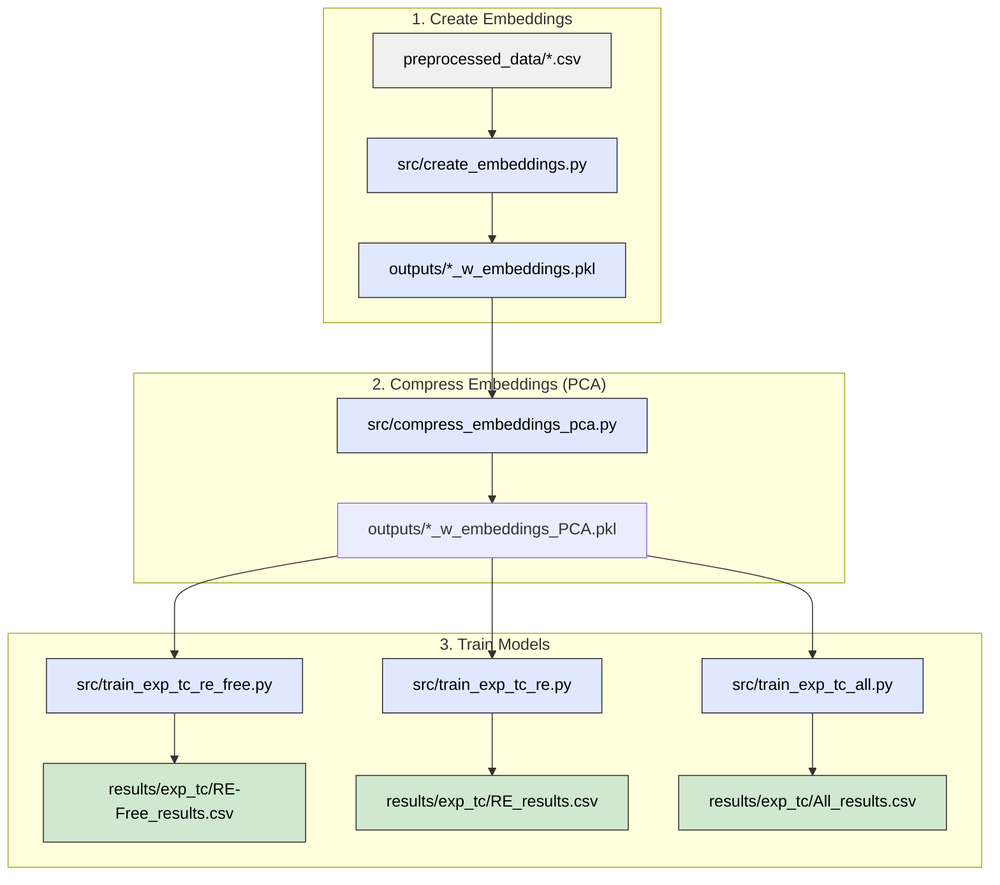

# Predicting experimental Curie temperatures from compound embeddings

This pipeline trains machine learning models that predict experimental Curie temperatures
(Tc_exp, in Kelvin) directly from stoichiometric compound embeddings — without any
simulated Tc values or data augmentation.

## Pipeline overview

```
preprocessed_data/*.csv
        │
        ▼
1. src/create_embeddings.py        → outputs/*_w_embeddings.pkl
        │
        ▼
2. src/compress_embeddings_pca.py  → outputs/*_w_embeddings_PCA.pkl
        │
        ▼
3a. src/train_exp_tc_re_free.py    → results/exp_tc/RE-Free_results.csv
3b. src/train_exp_tc_re.py         → results/exp_tc/RE_results.csv
3c. src/train_exp_tc_all.py        → results/exp_tc/All_results.csv
```



Three datasets are trained independently (steps 3a–3c can run in any order or in parallel):
- **RE-Free** — rare-earth-free compounds (~6 200 rows)
- **RE** — rare-earth-containing compounds (~9 800 rows)
- **All** — combined dataset (~16 000 rows)

> **Note:** `src/train_exp_tc.py` is still available as a convenience script that runs all
> three datasets in sequence and is the shared library used by the individual scripts.

## 0. Installation

Install Python dependencies:

```bash
pip install -r requirements.txt
```

PyTorch must be installed separately to match your hardware:

```bash
# CPU-only example — see https://pytorch.org/get-started/locally/ for GPU variants
pip install torch --index-url https://download.pytorch.org/whl/cpu
```

## 1. Create compound embeddings

Generates element-abundance-weighted compound embeddings from the Matscholar200
element vectors (200-dimensional). For example:

```
Fe2O3 embedding = (2/5) × [Fe vec] + (3/5) × [O vec]
```

Run:

```bash
python src/create_embeddings.py
```

**Needs:**
```
preprocessed_data/Experimental_Tc_RE-Free.csv
preprocessed_data/Experimental_Tc_RE.csv
preprocessed_data/Experimental_Tc_all.csv
data/embeddings/element/matscholar200.json
```

**Outputs:**
```
outputs/Experimental_Tc_RE-Free_w_embeddings.pkl
outputs/Experimental_Tc_RE_w_embeddings.pkl
outputs/Experimental_Tc_all_w_embeddings.pkl
logs/create_embeddings.txt
```

Each pickle contains the original `composition` and `Tc_exp` columns plus a
`compound_embedding` column holding a 200-D numpy array per row. Rows whose
compositions cannot be parsed or contain elements absent from the Matscholar200
vocabulary are dropped.

## 2. Compress embeddings with PCA

Fits PCA on each dataset independently and adds compressed embedding columns for
component sizes 8, 16, 32, and 64.

Run:

```bash
python src/compress_embeddings_pca.py
```

**Needs:**
```
outputs/Experimental_Tc_RE-Free_w_embeddings.pkl
outputs/Experimental_Tc_RE_w_embeddings.pkl
outputs/Experimental_Tc_all_w_embeddings.pkl
```

**Outputs:**
```
outputs/Experimental_Tc_RE-Free_w_embeddings_PCA.pkl
outputs/Experimental_Tc_RE_w_embeddings_PCA.pkl
outputs/Experimental_Tc_all_w_embeddings_PCA.pkl
logs/compress_embeddings_pca.txt
```

Each output pickle extends the input with columns `comp_emb_pca_8`, `comp_emb_pca_16`,
`comp_emb_pca_32`, and `comp_emb_pca_64`.

## 3. Train models

Trains three model families on five embedding variants for each of the three datasets
(15 training runs per dataset, 45 total):

| Model family | Variants |
|---|---|
| Linear (Lasso / Ridge best of two) | all 5 embedding variants |
| Random Forest (randomised CV) | all 5 embedding variants |
| MLP with early stopping (PyTorch) | all 5 embedding variants |

Embedding variants: `raw_200D`, `pca_8`, `pca_16`, `pca_32`, `pca_64`.

Hyperparameters are scaled to the training-set size:
- **RF `n_iter`** scales inversely with n_train (≈40 / 25 / 15 for RE-Free / RE / All).
- **MLP architecture**: `(128, 64, 32)` for n_train < 6 000; `(256, 128, 64)` otherwise.

Each dataset is trained by a dedicated script. Run them individually:

```bash
python src/train_exp_tc_re_free.py   # RE-Free dataset
python src/train_exp_tc_re.py        # RE dataset
python src/train_exp_tc_all.py       # All (combined) dataset
```

Or run all three in one go (backward-compatible):

```bash
python src/train_exp_tc.py
```

**Needs (per script):**
```
outputs/Experimental_Tc_RE-Free_w_embeddings_PCA.pkl   ← train_exp_tc_re_free.py
outputs/Experimental_Tc_RE_w_embeddings_PCA.pkl         ← train_exp_tc_re.py
outputs/Experimental_Tc_all_w_embeddings_PCA.pkl        ← train_exp_tc_all.py
```

**Outputs (per script):**
```
results/exp_tc/<Dataset>_results.csv
results/exp_tc/exp_tc_comparison.csv      (updated from all datasets run so far)
results/exp_tc/exp_tc_best_by_dataset.csv (updated from all datasets run so far)
results/exp_tc/figures/<dataset>_<embedding>_<model>.png
logs/train_exp_tc_re_free.txt  |  train_exp_tc_re.txt  |  train_exp_tc_all.txt
```

---

## Results

All metrics are on a held-out 20 % test split. Metrics are R² (higher is better),
MAE and RMSE in Kelvin (lower is better).

### Best model per dataset

| Dataset | Model | Embedding | R² | MAE (K) | RMSE (K) |
|---|---|---|---|---|---|
| RE | RF | raw_200D | **0.933** | 37.3 | 70.8 |
| All | RF | raw_200D | 0.867 | 51.8 | 98.7 |
| RE-Free | RF | raw_200D | 0.774 | 75.7 | 126.0 |

Random Forest on the full 200-D embeddings is the best model on every dataset.
RE compounds are considerably more predictable (R² = 0.93) than RE-free ones
(R² = 0.77), which may reflect greater chemical regularity within the RE sub-family.

---

### RE-Free — full results table

| Embedding | Model | R² | MAE (K) | RMSE (K) |
|---|---|---|---|---|
| raw_200D | RF | **0.7744** | **75.7** | **126.0** |
| pca_16 | RF | 0.7727 | 76.1 | 126.5 |
| pca_32 | RF | 0.7714 | 76.5 | 126.9 |
| pca_64 | RF | 0.7589 | 78.0 | 130.3 |
| pca_8 | RF | 0.7378 | 81.3 | 135.9 |
| pca_32 | MLP(128,64,32) | 0.6499 | 107.9 | 157.0 |
| pca_64 | MLP(128,64,32) | 0.6227 | 107.9 | 163.0 |
| pca_16 | MLP(128,64,32) | 0.6096 | 118.0 | 165.8 |
| raw_200D | MLP(128,64,32) | 0.5920 | 118.5 | 169.5 |
| pca_8 | MLP(128,64,32) | 0.5424 | 133.5 | 179.5 |
| raw_200D | Linear(Lasso) | 0.4032 | 157.9 | 205.0 |
| pca_64 | Linear(Lasso) | 0.4022 | 157.8 | 205.1 |
| pca_32 | Linear(Lasso) | 0.3965 | 158.7 | 206.1 |
| pca_16 | Linear(Lasso) | 0.3742 | 162.5 | 209.9 |
| pca_8 | Linear(Lasso) | 0.3453 | 167.9 | 214.7 |

---

### RE — full results table

| Embedding | Model | R² | MAE (K) | RMSE (K) |
|---|---|---|---|---|
| raw_200D | RF | **0.9330** | **37.3** | **70.8** |
| pca_32 | RF | 0.9291 | 39.5 | 72.9 |
| pca_16 | RF | 0.9289 | 40.0 | 73.0 |
| pca_64 | RF | 0.9274 | 40.4 | 73.8 |
| pca_8 | RF | 0.9214 | 42.8 | 76.7 |
| pca_64 | MLP(256,128,64) | 0.9153 | 49.3 | 79.7 |
| pca_32 | MLP(256,128,64) | 0.9105 | 52.1 | 81.9 |
| raw_200D | MLP(256,128,64) | 0.9044 | 54.9 | 84.6 |
| pca_16 | MLP(256,128,64) | 0.8891 | 60.5 | 91.2 |
| pca_8 | MLP(256,128,64) | 0.8560 | 71.1 | 103.9 |
| raw_200D | Linear(Lasso) | 0.5929 | 133.5 | 174.7 |
| pca_64 | Linear(Ridge) | 0.5918 | 133.7 | 174.9 |
| pca_32 | Linear(Ridge) | 0.5828 | 134.9 | 176.8 |
| pca_16 | Linear(Lasso) | 0.5704 | 138.2 | 179.4 |
| pca_8 | Linear(Lasso) | 0.5293 | 143.8 | 187.8 |

---

### All — full results table

| Embedding | Model | R² | MAE (K) | RMSE (K) |
|---|---|---|---|---|
| raw_200D | RF | **0.8669** | **51.8** | **98.7** |
| pca_16 | RF | 0.8621 | 53.5 | 100.4 |
| pca_32 | RF | 0.8600 | 56.6 | 101.2 |
| pca_64 | RF | 0.8571 | 55.8 | 102.2 |
| pca_8 | RF | 0.8501 | 57.7 | 104.7 |
| pca_64 | MLP(256,128,64) | 0.8332 | 70.6 | 110.4 |
| pca_32 | MLP(256,128,64) | 0.8233 | 73.1 | 113.7 |
| raw_200D | MLP(256,128,64) | 0.8169 | 74.0 | 115.7 |
| pca_16 | MLP(256,128,64) | 0.8020 | 81.0 | 120.3 |
| pca_8 | MLP(256,128,64) | 0.7442 | 96.2 | 136.7 |
| raw_200D | Linear(Ridge) | 0.4820 | 152.1 | 194.6 |
| pca_64 | Linear(Lasso) | 0.4803 | 152.4 | 194.9 |
| pca_32 | Linear(Lasso) | 0.4765 | 153.1 | 195.6 |
| pca_16 | Linear(Lasso) | 0.4651 | 154.6 | 197.8 |
| pca_8 | Linear(Lasso) | 0.4339 | 159.4 | 203.4 |
