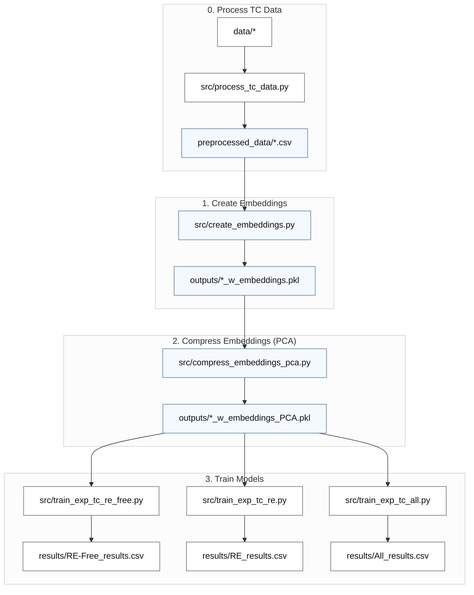

# Predicting experimental Curie temperatures from compound embeddings

This pipeline trains machine learning models that predict experimental Curie temperatures
(Tc_exp, in Kelvin) directly from stoichiometric compound embeddings — without any
simulated Tc values or data augmentation.

## Pipeline overview



Three datasets are trained independently (steps 3a–3c can run in any order or in parallel):
- **RE-Free** — rare-earth-free compounds (~6 200 rows)
- **RE** — rare-earth-containing compounds (~9 800 rows)
- **All** — combined dataset (~16 000 rows)

> **Note:** `src/train_exp_tc.py` is still available as a convenience script that runs all
> three datasets in sequence and is the shared library used by the individual scripts.

## 0. Installation

Install Python dependencies:

```bash
pip install -r requirements.txt
```

PyTorch must be installed separately to match your hardware:

```bash
# CPU-only example — see https://pytorch.org/get-started/locally/ for GPU variants
pip install torch --index-url https://download.pytorch.org/whl/cpu
```

## 1. Pre-Process Data

1. **Aggregate** data from multiple sources.  
2. **Clean** Tc values: remove units, symbols, and uncertainties; convert to float.  
3. **Drop** invalid (non-numeric) Tc entries.  
4. **Deduplicate** by taking the median Tc per composition.  
5. **Flag** compositions containing rare-earth elements.  
6. **Split** data into RE-containing and RE-free subsets.  
7. **Save** clean, structured datasets for analysis.


Run:

```bash
python src/process_tc_data.py
```
**Needs:**
```
data/m-tcsum_nur_new.csv
data/literature_values_prepared.csv
data/DS1+DS2.csv
data/combinded_tables.xlsx"
data/MagneticMaterials_All.csv
```
**Outputs:**
```
preprocessed_data/Experimental_Tc.csv          
preprocessed_data/Experimental_Tc_RE.csv   
preprocessed_data/Simulated_Tc.csv           
preprocessed_data/Simulation_Tc_RE.csv
preprocessed_data/Experimental_Tc_RE-Free.csv  
preprocessed_data/Experimental_Tc_all.csv  
preprocessed_data/Simulation_Tc_RE-Free.csv  
preprocessed_data/Simulation_Tc_all.csv
```

## 2. Create compound embeddings

Generates element-abundance-weighted compound embeddings from the Matscholar200
element vectors (200-dimensional). For example:

```
Fe2O3 embedding = (2/5) × [Fe vec] + (3/5) × [O vec]
```

Run:

```bash
python src/create_embeddings.py
```

**Needs:**
```
preprocessed_data/Experimental_Tc_RE-Free.csv
preprocessed_data/Experimental_Tc_RE.csv
preprocessed_data/Experimental_Tc_all.csv
data/embeddings/element/matscholar200.json
```

**Outputs:**
```
outputs/Experimental_Tc_RE-Free_w_embeddings.pkl
outputs/Experimental_Tc_RE_w_embeddings.pkl
outputs/Experimental_Tc_all_w_embeddings.pkl
logs/create_embeddings.txt
```

Each pickle contains the original `composition` and `Tc_exp` columns plus a
`compound_embedding` column holding a 200-D numpy array per row. Rows whose
compositions cannot be parsed or contain elements absent from the Matscholar200
vocabulary are dropped.

## 3. Compress embeddings with PCA

Fits PCA on each dataset independently and adds compressed embedding columns for
component sizes 8, 16, 32, and 64.

Run:

```bash
python src/compress_embeddings_pca.py
```

**Needs:**
```
outputs/Experimental_Tc_RE-Free_w_embeddings.pkl
outputs/Experimental_Tc_RE_w_embeddings.pkl
outputs/Experimental_Tc_all_w_embeddings.pkl
```

**Outputs:**
```
outputs/Experimental_Tc_RE-Free_w_embeddings_PCA.pkl
outputs/Experimental_Tc_RE_w_embeddings_PCA.pkl
outputs/Experimental_Tc_all_w_embeddings_PCA.pkl
logs/compress_embeddings_pca.txt
```

Each output pickle extends the input with columns `comp_emb_pca_8`, `comp_emb_pca_16`,
`comp_emb_pca_32`, and `comp_emb_pca_64`.

## 4. Train models

Trains **four model families** on five embedding variants for each of the three datasets.
Each (family × embedding) is trained as an **ensemble** of N members on different random
train/test splits (N is set per family in `training_config.yaml`, default 10), so the
default run is 4 × 5 × 10 = **200 fits per dataset**.

| Model family | Notes |
|---|---|
| Linear (Lasso / Ridge, best of two) | all 5 embedding variants |
| Random Forest (randomised CV, tuned once per embedding) | all 5 embedding variants |
| MLP with early stopping (PyTorch) | all 5 embedding variants |
| LightGBM (gradient-boosted trees, randomised CV, tuned once per embedding) | all 5 embedding variants |

Embedding variants: `raw_200D`, `pca_8`, `pca_16`, `pca_32`, `pca_64`.

Hyperparameters are scaled to the training-set size:
- **RF / LightGBM `n_iter`** scales inversely with n_train (the search is run **once**
  per (dataset, embedding) and the best params are reused across all ensemble members).
- **MLP architecture**: `(128, 64, 32)` for n_train < 6 000; `(256, 128, 64)` otherwise.

> **ONNX note:** every model — Linear, RF, MLP **and LightGBM** — is exported to ONNX
> (`results/onnx_models/`) for use by `predict_tc.py`. LightGBM export requires the
> `onnxmltools` package (in `requirements.txt`); if it is missing, only LightGBM is
> skipped and training still completes. With `re_features` enabled the ONNX input
> changes from a 200-D embedding to `[embedding | 7 RE feats]` (207-D), and `predict_tc`
> supplies the extra features automatically (see the `re_features` row below).

### Configuration (`training_config.yaml`)

Which families to train, the ensemble size, and the rare-earth feature toggle are all
controlled by `training_config.yaml`:

```yaml
  re_features: false        # see below; default false
  models:
    linear:
      enabled: true
      ensemble: 10          # train 10 members on different splits; headline = mean ± std
    rf:
      enabled: true
      ensemble: 10
    mlp:
      enabled: true
      ensemble: 10
    lgbm:                   # LightGBM (gradient-boosted trees)
      enabled: true
      ensemble: 10
```

**Options:**

| Key | Values | Meaning |
|---|---|---|
| `models.<family>.enabled` | `true` / `false` | Train this family or skip it entirely. Families: `linear`, `rf`, `mlp`, `lgbm`. |
| `models.<family>.ensemble` | integer ≥ 1 | Number of ensemble members (different random splits). Reported metrics are the **mean ± std** across members. `ensemble: 1` reproduces a single split (std = 0). |
| `re_features` | `true` / `false` | When `true`, append 7 rare-earth physics features (de Gennes factor, S-state fraction, free-ion moment, …) to the embedding. Zero for RE-free compounds, so safe on every dataset. The exported ONNX then takes a **207-D** input `[embedding \| 7 feats]` (**raw_200D only** — PCA variants are skipped, as they'd need an in-graph ColumnTransformer), written with a **`_refeats`** suffix so it doesn't collide with the embedding-only models; `predict_tc` detects the 207-D input and computes & appends the features from the formula automatically. Default `false`. |

Shorthands: a family may be given as a bare bool (`rf: true` ⇒ enabled, ensemble 1); an
omitted family defaults to enabled with ensemble 1; if the file is missing, all four
families train with ensemble 1 and `re_features` off. `lgbm` requires the optional
`lightgbm` package (otherwise it is skipped with a note).

Each dataset is trained by a dedicated script. Run them individually:

```bash
python src/train_exp_tc_re_free.py   # RE-Free dataset
python src/train_exp_tc_re.py        # RE dataset
python src/train_exp_tc_all.py       # All (combined) dataset
```

Or run all three in one go (backward-compatible):

```bash
python src/train_exp_tc.py
```

**Needs (per script):**
```
outputs/Experimental_Tc_RE-Free_w_embeddings_PCA.pkl    ← train_exp_tc_re_free.py
outputs/Experimental_Tc_RE_w_embeddings_PCA.pkl         ← train_exp_tc_re.py
outputs/Experimental_Tc_all_w_embeddings_PCA.pkl        ← train_exp_tc_all.py
```

**Outputs (per script):**
```
results/<Dataset>_results.csv             (one row per ensemble member)
results/<Dataset>_results_agg.csv         (ensemble mean ± std per model/embedding)
results/exp_tc_comparison.csv             (aggregated, updated from all datasets run so far)
results/exp_tc_best_by_dataset.csv        (best by mean R², updated from all datasets run so far)
results/figures/<dataset>_<embedding>_<model>.png
results/onnx_models/<dataset>_<embedding>_<model>.onnx   (except LightGBM / re_features runs)
logs/train_exp_tc_re_free.txt  |  train_exp_tc_re.txt  |  train_exp_tc_all.txt
```

## 5. Predict Tc for new compounds

`src/predict_tc.py` predicts Tc for any chemical formula using the exported ONNX models
— you give it a formula and it does all preprocessing (embedding, PCA, scaling, and the
RE features if needed) internally.

```bash
# best model for the compound's type (RE vs RE-free is auto-detected)
python src/predict_tc.py --compound Nd2Fe14B --best

# every applicable model, as a comparison table (ensemble mean ± std)
python src/predict_tc.py --compound Fe --all

# a specific model file
python src/predict_tc.py --compound SmCo5 --model results/onnx_models/RE_raw_200D_lgbm_e0.onnx

# many compounds from a file (one formula per line)
python src/predict_tc.py --compounds-file new_materials.txt --best

# list available models
python src/predict_tc.py --list
```

**Choosing a model:** `--best`/`--all` auto-detect rare-earth content and pick the right
dataset's model(s) — `--best` uses the best **RE** model for a rare-earth compound and the
best **RE-Free** model for a rare-earth-free one. If you pass `--model` yourself, match it
to the chemistry — **RE-Free** or **All** for rare-earth-free compounds (Fe, Co, Ni…),
**RE** or **All** for rare-earth compounds (Nd₂Fe₁₄B, SmCo₅…). The RE and RE-Free models
extrapolate poorly across the RE boundary, so `predict_tc` **refuses** a mismatched
`--model` (a RE model on a RE-free compound, or vice-versa) with an error telling you to
use an `All_*` model; the `All` model is always valid.

**RE-features models:** models trained with `re_features: true` are saved with a
`_refeats` suffix and take a 207-D input. `predict_tc` detects this from the ONNX graph
and computes & appends the 7 features automatically — no extra arguments. `--best`/`--all`
resolve to these `_refeats` files when they are the ones on disk (exact embedding-only
name first, `_refeats` as fallback).

A SLURM helper is provided: `run_1node-predict.sh` (runs `--compounds-file … --best`).

### Validate against a reference set (`src/validate_reference_data.py`)

`src/validate_reference_data.py` scores the models against an external reference list of
compounds with known Curie/Néel temperatures (`data/validation_reference.csv`). For each
compound it predicts Tc with **only the best model for that chemistry** — the best **RE**
model for rare-earth compounds, the best **RE-Free** model otherwise (from
`results/exp_tc_best_by_dataset.csv`) — as the **ensemble mean ± std** over the model's
ONNX members (never a best-of-N pick). It reuses the exact prediction path from
`predict_tc.py`, so it can't drift from the deployed predictor.

```bash
python src/validate_reference_data.py
# or point at a different reference / output file
python src/validate_reference_data.py --ref data/validation_reference.csv --out table.csv
```

It prints a table (`compound | RE? | reference | prediction | std | error | best model`),
writes the same to `results/validation_reference_predictions.csv`, and reports a summary
**MAE computed only over the true ferro/ferrimagnetic Curie temperatures** — antiferromagnets
(Néel T) and non-magnetic entries are shown for sanity but excluded from the error, since
the model only predicts a Curie temperature. See `validation_idea.txt` for the rationale
and how to read the results.

---

## Results

Metrics are on held-out 20 % test splits, reported as the **ensemble mean ± std** over
the N members (default N = 10) — not the single luckiest split. R² higher is better;
MAE and RMSE in Kelvin lower is better.

> **Current run:** all three datasets are from the latest run with **LightGBM** and
> `re_features: true` (rare-earth physics features on), N = 10 members each.

### Best model per dataset (ensemble mean ± std)

| Dataset | Model | Embedding | R² | MAE (K) | RMSE (K) |
| ------- | ----- | --------- | -- | ------- | -------- |
| RE      | **LightGBM** | raw_200D | **0.940 ± 0.006** | 36.5 | 67.3 |
| All     | **LightGBM** | raw_200D | 0.871 ± 0.009 | 53.6 | 96.7 |
| RE-Free | **LightGBM** | raw_200D | 0.760 ± 0.014 | 78.1 | 128.7 |

LightGBM (the 4th family) is now the best model on **all three** datasets — on RE-Free it
is tied with Random Forest (RF raw_200D 0.760 ± 0.012). RE compounds remain considerably
more predictable (R² ≈ 0.94) than the combined set (≈ 0.87) and RE-free ones (≈ 0.76). The
full 200-D embedding is the best variant on every dataset.

### All — All models × embeddings (ensemble mean ± std, with RE features)

Latest run: 4 families, `re_features: true`, N = 10 members. Sorted by R².

| Embedding | Model    | R² (mean ± std)   | MAE (K) | RMSE (K) |
| --------- | -------- | ----------------- | ------- | -------- |
| raw_200D  | LightGBM | **0.871 ± 0.009** | 53.6    | 96.7     |
| raw_200D  | RF       | 0.868 ± 0.009     | 53.8    | 97.5     |
| pca_64    | LightGBM | 0.868 ± 0.007     | 56.0    | 97.6     |
| pca_32    | LightGBM | 0.868 ± 0.009     | 56.6    | 97.8     |
| pca_32    | RF       | 0.866 ± 0.008     | 55.2    | 98.5     |
| pca_16    | RF       | 0.864 ± 0.008     | 55.2    | 99.0     |
| pca_16    | LightGBM | 0.862 ± 0.010     | 58.4    | 99.8     |
| pca_64    | RF       | 0.860 ± 0.009     | 58.6    | 100.6    |
| pca_8     | RF       | 0.854 ± 0.008     | 58.4    | 102.6    |
| pca_8     | LightGBM | 0.847 ± 0.009     | 62.9    | 105.2    |
| pca_64    | MLP      | 0.837 ± 0.007     | 67.4    | 108.7    |
| pca_32    | MLP      | 0.833 ± 0.008     | 69.6    | 109.8    |
| raw_200D  | MLP      | 0.832 ± 0.008     | 69.0    | 110.2    |
| pca_16    | MLP      | 0.816 ± 0.008     | 74.6    | 115.3    |
| pca_8     | MLP      | 0.785 ± 0.013     | 82.7    | 124.7    |
| raw_200D  | Linear   | 0.491 ± 0.009     | 149.2   | 191.9    |
| pca_64    | Linear   | 0.489 ± 0.009     | 149.5   | 192.1    |
| pca_32    | Linear   | 0.486 ± 0.009     | 150.0   | 192.7    |
| pca_16    | Linear   | 0.478 ± 0.009     | 151.5   | 194.3    |
| pca_8     | Linear   | 0.451 ± 0.011     | 156.0   | 199.2    |

---

### RE — All models × embeddings (ensemble mean ± std, with RE features)

Latest run: 4 families, `re_features: true`, N = 10 members. Sorted by R².

| Embedding | Model    | R² (mean ± std)     | MAE (K) | RMSE (K) |
| --------- | -------- | ------------------- | ------- | -------- |
| raw_200D  | LightGBM | **0.940 ± 0.006**   | 36.5    | 67.3     |
| pca_32    | LightGBM | 0.938 ± 0.005       | 38.7    | 68.6     |
| pca_64    | LightGBM | 0.937 ± 0.005       | 38.2    | 68.8     |
| raw_200D  | RF       | 0.936 ± 0.006       | 38.8    | 69.4     |
| pca_16    | LightGBM | 0.935 ± 0.005       | 40.6    | 69.9     |
| pca_32    | RF       | 0.932 ± 0.006       | 40.8    | 71.7     |
| pca_16    | RF       | 0.931 ± 0.006       | 40.5    | 72.0     |
| pca_8     | LightGBM | 0.929 ± 0.006       | 43.3    | 73.0     |
| pca_64    | RF       | 0.927 ± 0.006       | 42.9    | 73.9     |
| pca_8     | RF       | 0.927 ± 0.006       | 42.1    | 74.1     |
| pca_32    | MLP      | 0.919 ± 0.006       | 49.2    | 78.0     |
| raw_200D  | MLP      | 0.918 ± 0.005       | 50.0    | 78.7     |
| pca_16    | MLP      | 0.906 ± 0.006       | 55.0    | 84.2     |
| pca_8     | MLP      | 0.881 ± 0.006       | 63.9    | 94.5     |
| pca_64    | MLP      | 0.880 ± 0.091       | 52.4    | 90.5     |
| raw_200D  | Linear   | 0.592 ± 0.008       | 134.6   | 175.3    |
| pca_32    | Linear   | 0.586 ± 0.008       | 135.8   | 176.6    |
| pca_64    | Linear   | 0.581 ± 0.029       | 135.0   | 177.5    |
| pca_16    | Linear   | 0.576 ± 0.008       | 138.3   | 178.7    |
| pca_8     | Linear   | 0.542 ± 0.008       | 143.6   | 185.7    |

LightGBM tops the RE leaderboard; tree models (LightGBM, RF) dominate, MLP follows, and
Linear is well behind. The `pca_64` MLP has a large std (± 0.091) — an unstable config the
mean ± std reporting exposes (a single split would have hidden it).


---


### RE-Free — All models × embeddings (ensemble mean ± std, with RE features)

Latest run: 4 families, `re_features: true`, N = 10 members. Sorted by R². (RE features
are all-zero for RE-free compounds, so they leave LightGBM/Linear unchanged and only
perturb RF/MLP within noise.)

| Embedding | Model    | R² (mean ± std)     | MAE (K) | RMSE (K) |
| --------- | -------- | ------------------- | ------- | -------- |
| raw_200D  | LightGBM | **0.760 ± 0.014**   | 78.1    | 128.7    |
| raw_200D  | RF       | 0.760 ± 0.012       | 75.5    | 128.8    |
| pca_64    | LightGBM | 0.758 ± 0.013       | 75.8    | 129.3    |
| pca_32    | LightGBM | 0.758 ± 0.013       | 76.3    | 129.3    |
| pca_32    | RF       | 0.753 ± 0.012       | 77.6    | 130.5    |
| pca_16    | RF       | 0.752 ± 0.010       | 78.3    | 130.8    |
| pca_64    | RF       | 0.744 ± 0.014       | 79.6    | 133.0    |
| pca_16    | LightGBM | 0.743 ± 0.008       | 79.8    | 133.2    |
| pca_8     | RF       | 0.725 ± 0.010       | 83.5    | 137.9    |
| pca_8     | LightGBM | 0.715 ± 0.007       | 85.9    | 140.4    |
| pca_32    | MLP      | 0.647 ± 0.016       | 104.9   | 156.1    |
| raw_200D  | MLP      | 0.630 ± 0.020       | 108.2   | 159.9    |
| pca_64    | MLP      | 0.617 ± 0.042       | 104.7   | 162.4    |
| pca_16    | MLP      | 0.608 ± 0.022       | 113.7   | 164.5    |
| pca_8     | MLP      | 0.528 ± 0.024       | 129.2   | 180.5    |
| raw_200D  | Linear   | 0.388 ± 0.018       | 157.6   | 205.6    |
| pca_64    | Linear   | 0.386 ± 0.017       | 157.9   | 206.0    |
| pca_32    | Linear   | 0.379 ± 0.020       | 158.7   | 207.1    |
| pca_16    | Linear   | 0.364 ± 0.020       | 161.1   | 209.6    |
| pca_8     | Linear   | 0.325 ± 0.019       | 167.7   | 215.9    |

On RE-Free, LightGBM and RF are tied at the top (≈ 0.760); the dataset is intrinsically
harder than RE for every model.

---