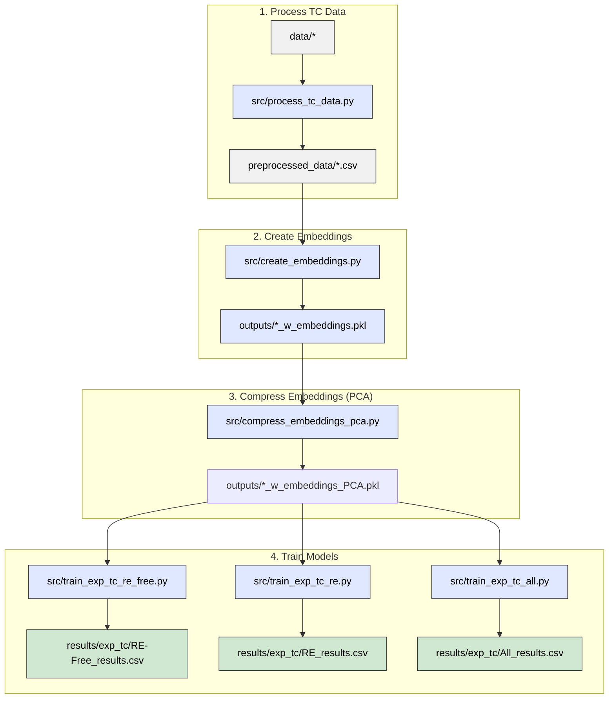

# Predicting simulated Curie temperatures from compound embeddings

This pipeline trains machine learning models that predict simulated Curie temperatures
(Tc_sim, in Kelvin) directly from stoichiometric compound embeddings — without any
experimental Tc values or data augmentation.

## Pipeline overview



Three datasets are trained independently (steps 3a–3c can run in any order or in parallel):
- **RE-Free** — rare-earth-free compounds (~6 200 rows)
- **RE** — rare-earth-containing compounds (~9 800 rows)
- **All** — combined dataset (~16 000 rows)

> **Note:** `src/train_exp_tc.py` is still available as a convenience script that runs all
> three datasets in sequence and is the shared library used by the individual scripts.

## 0. Installation

Install Python dependencies:

```bash
pip install -r requirements.txt
```

PyTorch must be installed separately to match your hardware:

```bash
# CPU-only example — see https://pytorch.org/get-started/locally/ for GPU variants
pip install torch --index-url https://download.pytorch.org/whl/cpu
```

## 1. Pre-Process Data

1. **Aggregate** data from multiple sources.  
2. **Clean** Tc values: remove units, symbols, and uncertainties; convert to float.  
3. **Drop** invalid (non-numeric) Tc entries.  
4. **Deduplicate** by taking the median Tc per composition.  
5. **Flag** compositions containing rare-earth elements.  
6. **Split** data into RE-containing and RE-free subsets.  
7. **Save** clean, structured datasets for analysis.


Run:

```bash
python src/process_tc_data.py
```

**Needs:**
```
data/m-tcsum_nur_new.csv
data/literature_values_prepared.csv
data/DS1+DS2.csv
data/combinded_tables.xlsx"
data/MagneticMaterials_All.csv
```
**Outputs:**
```
preprocessed_data/Experimental_Tc.csv          
preprocessed_data/Experimental_Tc_RE.csv   
preprocessed_data/Simulated_Tc.csv           
preprocessed_data/Simulation_Tc_RE.csv
preprocessed_data/Experimental_Tc_RE-Free.csv  
preprocessed_data/Experimental_Tc_all.csv  
preprocessed_data/Simulation_Tc_RE-Free.csv  
preprocessed_data/Simulation_Tc_all.csv
```


## 2. Create compound embeddings

Generates element-abundance-weighted compound embeddings from the Matscholar200
element vectors (200-dimensional). For example:

```
Fe2O3 embedding = (2/5) × [Fe vec] + (3/5) × [O vec]
```

Run:

```bash
python src/create_embeddings.py
```

**Needs:**
```
preprocessed_data/Simulation_Tc_RE-Free.csv
preprocessed_data/Simulation_Tc_RE.csv
preprocessed_data/Simulation_Tc_all.csv
data/embeddings/element/matscholar200.json
```

**Outputs:**
```
outputs/Simulation_Tc_RE-Free_w_embeddings.pkl
outputs/Simulation_Tc_RE_w_embeddings.pkl
outputs/Simulation_Tc_all_w_embeddings.pkl
logs/create_embeddings.txt
```

Each pickle contains the original `composition` and `Tc_sim` columns plus a
`compound_embedding` column holding a 200-D numpy array per row. Rows whose
compositions cannot be parsed or contain elements absent from the Matscholar200
vocabulary are dropped.

## 2. Compress embeddings with PCA

Fits PCA on each dataset independently and adds compressed embedding columns for
component sizes 8, 16, 32, and 64.

Run:

```bash
python src/compress_embeddings_pca.py
```

**Needs:**
```
outputs/Simulation_Tc_RE-Free_w_embeddings.pkl
outputs/Simulation_Tc_RE_w_embeddings.pkl
outputs/Simulation_Tc_all_w_embeddings.pkl
```

**Outputs:**
```
outputs/Simulation_Tc_RE-Free_w_embeddings_PCA.pkl
outputs/Simulation_Tc_RE_w_embeddings_PCA.pkl
outputs/Simulation_Tc_all_w_embeddings_PCA.pkl
logs/compress_embeddings_pca.txt
```

Each output pickle extends the input with columns `comp_emb_pca_8`, `comp_emb_pca_16`,
`comp_emb_pca_32`, and `comp_emb_pca_64`.

## 3. Train models

Trains three model families on five embedding variants for each of the three datasets
(15 training runs per dataset, 45 total):

| Model family | Variants |
|---|---|
| Linear (Lasso / Ridge best of two) | all 5 embedding variants |
| Random Forest (randomised CV) | all 5 embedding variants |
| MLP with early stopping (PyTorch) | all 5 embedding variants |

Embedding variants: `raw_200D`, `pca_8`, `pca_16`, `pca_32`, `pca_64`.

Hyperparameters are scaled to the training-set size:
- **RF `n_iter`** scales inversely with n_train (≈40 / 25 / 15 for RE-Free / RE / All).
- **MLP architecture**: `(128, 64, 32)` for n_train < 6 000; `(256, 128, 64)` otherwise.

Each dataset is trained by a dedicated script. Run them individually:

```bash
## Results

All metrics are on a held-out 20 % test split. Metrics are R² (higher is better),
MAE and RMSE in Kelvin (lower is better).

### RE (rare-earth-containing compounds)

| Model  | Best Embedding | R²    | MAE (K) | RMSE (K) |
|--------|---------------|-------|---------|---------|
| RF     | raw_200D      | 0.846 | 49.4    | 78.2    |
| MLP    | pca_32        | 0.751 | 73.1    | 105.1   |
| Linear | raw_200D      | 0.485 | 93.6    | 128.1   |

### RE-Free (rare-earth-free compounds)

| Model  | Best Embedding | R²    | MAE (K) | RMSE (K) |
|--------|---------------|-------|---------|---------|
| RF     | pca_32        | 0.618 | 126.9   | 179.5   |
| MLP    | pca_64        | 0.336 | 188.8   | 250.3   |
| Linear | pca_16        | 0.270 | 206.7   | 256.6   |
