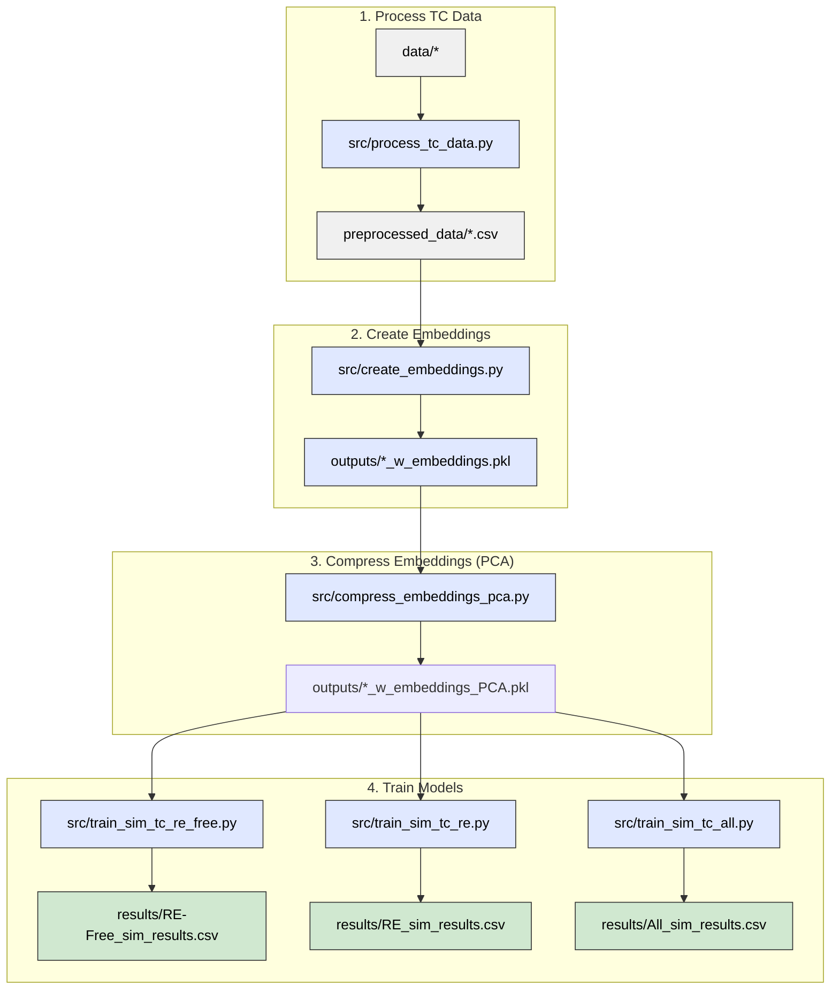

# Predicting simulated Curie temperatures from compound embeddings

This pipeline trains machine learning models that predict simulated Curie temperatures
(Tc_sim, in Kelvin) directly from stoichiometric compound embeddings — without any
experimental Tc values or data augmentation.

## Pipeline overview



Three datasets are trained independently (steps 3a–3c can run in any order or in parallel):
- **RE-Free** — rare-earth-free compounds (~6 200 rows)
- **RE** — rare-earth-containing compounds (~9 800 rows)
- **All** — combined dataset (~16 000 rows)

> **Note:** `src/train_sim_tc.py` is still available as a convenience script that runs all
> three datasets in sequence and is the shared library used by the individual scripts.

## 0. Installation

Install Python dependencies:

```bash
pip install -r requirements.txt
```

PyTorch must be installed separately to match your hardware:

```bash
# CPU-only example — see https://pytorch.org/get-started/locally/ for GPU variants
pip install torch --index-url https://download.pytorch.org/whl/cpu
```

## 1. Pre-Process Data

1. **Aggregate** data from multiple sources.  
2. **Clean** Tc values: remove units, symbols, and uncertainties; convert to float.  
3. **Drop** invalid (non-numeric) Tc entries.  
4. **Canonicalise & deduplicate**: reduce each formula to its pymatgen *reduced formula* (so H₂O/H₄O₂, CoFe₂O₄/Fe₂CoO₄ and other spelling / element-ordering / stoichiometric-multiple variants pool together; unparsable strings are dropped), then take the **median Tc** per reduced composition.  
5. **Flag** compositions containing rare-earth elements.  
6. **Split** data into RE-containing and RE-free subsets.  
7. **Save** clean, structured datasets for analysis.


Run:

```bash
python src/process_tc_data.py
```

**Needs:**
```
data/m-tcsum_nur_new.csv
data/literature_values_prepared.csv
data/DS1+DS2.csv
data/combinded_tables.xlsx"
data/MagneticMaterials_All.csv
```
**Outputs:**
```
preprocessed_data/Experimental_Tc.csv          
preprocessed_data/Experimental_Tc_RE.csv   
preprocessed_data/Simulated_Tc.csv           
preprocessed_data/Simulation_Tc_RE.csv
preprocessed_data/Experimental_Tc_RE-Free.csv  
preprocessed_data/Experimental_Tc_all.csv  
preprocessed_data/Simulation_Tc_RE-Free.csv  
preprocessed_data/Simulation_Tc_all.csv
```


## 2. Create compound embeddings

Generates element-abundance-weighted compound embeddings from the Matscholar200
element vectors (200-dimensional). For example:

```
Fe2O3 embedding = (2/5) × [Fe vec] + (3/5) × [O vec]
```

Run:

```bash
python src/create_embeddings.py
```

**Needs:**
```
preprocessed_data/Simulation_Tc_RE-Free.csv
preprocessed_data/Simulation_Tc_RE.csv
preprocessed_data/Simulation_Tc_all.csv
data/embeddings/element/matscholar200.json
```

**Outputs:**
```
outputs/Simulation_Tc_RE-Free_w_embeddings.pkl
outputs/Simulation_Tc_RE_w_embeddings.pkl
outputs/Simulation_Tc_all_w_embeddings.pkl
logs/create_embeddings.txt
```

Each pickle contains the original `composition` and `Tc_sim` columns plus a
`compound_embedding` column holding a 200-D numpy array per row. Rows whose
compositions cannot be parsed or contain elements absent from the Matscholar200
vocabulary are dropped.

## 3. Compress embeddings with PCA

Fits PCA on each dataset independently and adds compressed embedding columns for
component sizes 8, 16, 32, and 64.

Run:

```bash
python src/compress_embeddings_pca.py
```

**Needs:**
```
outputs/Simulation_Tc_RE-Free_w_embeddings.pkl
outputs/Simulation_Tc_RE_w_embeddings.pkl
outputs/Simulation_Tc_all_w_embeddings.pkl
```

**Outputs:**
```
outputs/Simulation_Tc_RE-Free_w_embeddings_PCA.pkl
outputs/Simulation_Tc_RE_w_embeddings_PCA.pkl
outputs/Simulation_Tc_all_w_embeddings_PCA.pkl
logs/compress_embeddings_pca.txt
```

Each output pickle extends the input with columns `comp_emb_pca_8`, `comp_emb_pca_16`,
`comp_emb_pca_32`, and `comp_emb_pca_64`.

## 4. Train models

The framework supports **four model families**, but the shipped `training_config.yaml`
enables only the top-two — **LightGBM and Random Forest** (Linear and MLP are available but
disabled, since they trail badly on Tc). Each (family × embedding) is trained as an
**ensemble** of N members on different random train/test splits (N per family, default 10),
so the shipped default is 2 × 5 × 10 = **100 fits per dataset**.

| Model family | Notes |
|---|---|
| Linear (Lasso / Ridge, best of two) | all 5 embedding variants |
| Random Forest (randomised CV, tuned once per embedding) | all 5 embedding variants |
| MLP with early stopping (PyTorch) | all 5 embedding variants |
| LightGBM (gradient-boosted trees, randomised CV, tuned once per embedding) | all 5 embedding variants |

**Enabled in the shipped config:** LightGBM + Random Forest only (the top-two on Tc). Linear
and MLP remain in the table because they are implemented and can be re-enabled in
`training_config.yaml`.

Embedding variants: `raw_200D`, `pca_8`, `pca_16`, `pca_32`, `pca_64`.

Hyperparameters are scaled to the training-set size:
- **RF / LightGBM `n_iter`** scales inversely with n_train (the search is run **once**
  per (dataset, embedding) and the best params are reused across all ensemble members).
- **MLP architecture**: `(128, 64, 32)` for n_train < 6 000; `(256, 128, 64)` otherwise.

> **ONNX note:** every model — Linear, RF, MLP **and LightGBM** — is exported to ONNX
> (`results/onnx_models/`) for use by `predict_tc.py`. LightGBM export requires the
> `onnxmltools` package (in `requirements.txt`); if it is missing, only LightGBM is
> skipped and training still completes. With `re_features` enabled the ONNX input
> changes from a 200-D embedding to `[embedding | 7 RE feats]` (207-D), and `predict_tc`
> supplies the extra features automatically (see the `re_features` row below).

### Configuration (`training_config.yaml`)

Which families to train, the ensemble size, and the rare-earth feature toggle are all
controlled by `training_config.yaml`:

```yaml
  re_features: true         # shipped default: rare-earth physics features ON (see below)
  models:                   # shipped default enables only the top-two families (LGBM + RF)
    linear:
      enabled: false        # trails badly on Tc -> disabled
      ensemble: 10
    rf:
      enabled: true
      ensemble: 10          # train 10 members on different splits; headline = mean ± std
    mlp:
      enabled: false        # trails badly on Tc -> disabled
      ensemble: 10
    lgbm:                   # LightGBM (gradient-boosted trees)
      enabled: true
      ensemble: 10
```

**Options:**

| Key | Values | Meaning |
|---|---|---|
| `models.<family>.enabled` | `true` / `false` | Train this family or skip it entirely. Families: `linear`, `rf`, `mlp`, `lgbm`. |
| `models.<family>.ensemble` | integer ≥ 1 | Number of ensemble members (different random splits). Reported metrics are the **mean ± std** across members. `ensemble: 1` reproduces a single split (std = 0). |
| `re_features` | `true` / `false` | When `true`, append 7 rare-earth physics features (de Gennes factor, S-state fraction, free-ion moment, …) to the embedding. Zero for RE-free compounds, so safe on every dataset. The exported ONNX then takes a **207-D** input `[embedding \| 7 feats]` (**raw_200D only** — PCA variants are skipped, as they'd need an in-graph ColumnTransformer), written with a **`_refeats`** suffix so it doesn't collide with the embedding-only models; `predict_tc` detects the 207-D input and computes & appends the features from the formula automatically. Code default `false`, but the **shipped config sets it `true`**. |

Shorthands: a family may be given as a bare bool (`rf: true` ⇒ enabled, ensemble 1); an
omitted family defaults to enabled with ensemble 1; if the file is missing, all four
families train with ensemble 1 and `re_features` off. `lgbm` requires the optional
`lightgbm` package (otherwise it is skipped with a note).

Each dataset is trained by a dedicated script. Run them individually:

```bash
python src/train_sim_tc_re_free.py   # RE-Free dataset
python src/train_sim_tc_re.py        # RE dataset
python src/train_sim_tc_all.py       # All (combined) dataset
```

Or run all three in one go (backward-compatible):

```bash
python src/train_sim_tc.py
```

**Outputs (per script):**
```
results/<Dataset>_sim_results.csv         (one row per ensemble member)
results/<Dataset>_sim_results_agg.csv     (ensemble mean ± std per model/embedding)
results/sim_tc_comparison.csv             (aggregated, updated from all datasets run so far)
results/sim_tc_best_by_dataset.csv        (best by mean R², updated from all datasets run so far)
results/figures/<dataset>_<embedding>_<model>.png
results/onnx_models/<dataset>_<embedding>_<model>.onnx   (LightGBM needs onnxmltools;
                                                          re_features adds a _refeats, raw_200D-only, 207-D variant)
logs/train_sim_tc_re_free.txt  |  train_sim_tc_re.txt  |  train_sim_tc_all.txt
```

## 5. Predict Tc for new compounds

`src/predict_tc.py` predicts (simulated) Tc for any chemical formula using the exported
ONNX models — you give it a formula and it does all preprocessing (embedding, PCA,
scaling, and the RE features if needed) internally.

```bash
# best model for the compound's type (RE vs RE-free is auto-detected)
python src/predict_tc.py --compound Nd2Fe14B --best

# every applicable model, as a comparison table (ensemble mean ± std)
python src/predict_tc.py --compound Fe --all

# a specific model file
python src/predict_tc.py --compound SmCo5 --model results/onnx_models/RE_raw_200D_lgbm_e0.onnx

# many compounds from a file (one formula per line)
python src/predict_tc.py --compounds-file new_materials.txt --best

# list available models
python src/predict_tc.py --list
```

**Choosing a model:** `--best`/`--all` auto-detect rare-earth content and pick the right
dataset's model(s) — `--best` uses the best **RE** model for a rare-earth compound and the
best **RE-Free** model for a rare-earth-free one. If you pass `--model` yourself, match it
to the chemistry — **RE-Free** or **All** for rare-earth-free compounds (Fe, Co, Ni…),
**RE** or **All** for rare-earth compounds (Nd₂Fe₁₄B, SmCo₅…). The RE and RE-Free models
extrapolate poorly across the RE boundary, so `predict_tc` **refuses** a mismatched
`--model` (a RE model on a RE-free compound, or vice-versa) with an error telling you to
use an `All_*` model; the `All` model is always valid.

**RE-features models:** models trained with `re_features: true` are saved with a
`_refeats` suffix and take a 207-D input. `predict_tc` detects this from the ONNX graph
and computes & appends the 7 features automatically — no extra arguments. `--best`/`--all`
resolve to these `_refeats` files when they are the ones on disk (exact embedding-only
name first, `_refeats` as fallback).

A SLURM helper is provided: `run_1node-predict.sh` (runs `--compounds-file … --best`).

### Validate against a reference set (`src/validate_reference_data.py`)

`src/validate_reference_data.py` scores the models against an external reference list of
compounds with known Curie/Néel temperatures (`data/validation_reference.csv`). For each
compound it predicts Tc with **only the best model for that chemistry** — the best **RE**
model for rare-earth compounds, the best **RE-Free** model otherwise (from
`results/sim_tc_best_by_dataset.csv`) — as the **ensemble mean ± std** over the model's ONNX
members (never a best-of-N pick). It reuses the exact prediction path from `predict_tc.py`,
so it can't drift from the deployed predictor.

```bash
python src/validate_reference_data.py
# or point at a different reference / output file
python src/validate_reference_data.py --ref data/validation_reference.csv --out table.csv
```

It prints a table (`compound | RE? | reference | prediction | std | error | best model`),
writes the same to `results/validation_reference_predictions.csv`, and reports a summary MAE
over the true ferro/ferrimagnetic Curie temperatures — antiferromagnets (Néel T) and
non-magnetic entries are shown for sanity but excluded from the error stat.

> **Note (simulated model):** the reference values are *experimental* Curie/Néel temperatures,
> whereas this model predicts a *simulated* (DFT / spin-dynamics) Tc; read the error column as
> bundling that simulation-vs-experiment offset with model error, not pure accuracy. See
> `validation_idea.txt`.

---

## Results

Metrics are on held-out 20 % test splits, reported as the **ensemble mean ± std** over
the N members (default N = 10) — not the single luckiest split. R² higher is better;
MAE and RMSE in Kelvin lower is better.

> **Current run:** **RE** and **RE-Free** below are from the latest run with **LightGBM**
> and `re_features: true` (rare-earth physics features on). The **All** (combined) dataset
> has not been run yet — run `python src/train_sim_tc_all.py` to produce it. The
> simulated-Tc datasets are small (RE ≈ 1 200 rows, RE-Free ≈ 1 000), so per-split
> variance is sizeable (note the ± std).

### Best model per dataset (ensemble mean ± std)

| Dataset | Model | Embedding | R² | MAE (K) | RMSE (K) |
| ------- | ----- | --------- | -- | ------- | -------- |
| RE      | **Random Forest** | raw_200D | **0.768 ± 0.058** | 55.1 | 93.0 |
| RE-Free | **Random Forest** | raw_200D | 0.517 ± 0.066 | 143.5 | 209.3 |

Random Forest is the best model on both datasets; LightGBM is a close second (tied within
noise) and both clearly beat MLP and Linear. The simulated-Tc task is harder than the
experimental one, and RE-Free is the hardest case (R² ≈ 0.52).

### RE — All models × embeddings (ensemble mean ± std, with RE features)

Latest run: 4 families, `re_features: true`, N = 10. Sorted by R².

| Embedding | Model    | R² (mean ± std) | MAE (K) | RMSE (K) |
| --------- | -------- | --------------- | ------- | -------- |
| raw_200D  | RF       | **0.768 ± 0.058** | 55.1 | 93.0 |
| raw_200D  | LightGBM | 0.761 ± 0.062   | 52.2  | 94.3  |
| pca_32    | LightGBM | 0.757 ± 0.050   | 57.7  | 95.3  |
| pca_16    | LightGBM | 0.752 ± 0.058   | 58.1  | 96.2  |
| pca_16    | RF       | 0.747 ± 0.061   | 59.5  | 97.3  |
| pca_32    | RF       | 0.744 ± 0.059   | 60.5  | 97.8  |
| pca_64    | LightGBM | 0.744 ± 0.051   | 58.2  | 98.1  |
| pca_64    | RF       | 0.731 ± 0.057   | 62.5  | 100.4 |
| pca_8     | RF       | 0.728 ± 0.066   | 60.3  | 101.0 |
| pca_8     | LightGBM | 0.706 ± 0.073   | 60.2  | 104.9 |
| pca_32    | MLP      | 0.646 ± 0.075   | 75.5  | 115.1 |
| pca_16    | MLP      | 0.625 ± 0.061   | 78.3  | 118.9 |
| raw_200D  | MLP      | 0.624 ± 0.067   | 77.5  | 118.9 |
| pca_8     | MLP      | 0.556 ± 0.064   | 83.0  | 129.4 |
| pca_64    | MLP      | 0.540 ± 0.125   | 84.8  | 130.6 |
| pca_16    | Linear   | 0.434 ± 0.037   | 102.7 | 146.5 |
| pca_64    | Linear   | 0.432 ± 0.044   | 102.1 | 146.7 |
| raw_200D  | Linear   | 0.431 ± 0.044   | 102.8 | 146.8 |
| pca_32    | Linear   | 0.430 ± 0.040   | 103.3 | 146.9 |
| pca_8     | Linear   | 0.415 ± 0.035   | 104.0 | 148.9 |

### RE-Free — All models × embeddings (ensemble mean ± std, with RE features)

Latest run: 4 families, `re_features: true`, N = 10. Sorted by R². (RE features are
all-zero for RE-free compounds, so they leave LightGBM/Linear unchanged and only perturb
RF/MLP within noise.)

| Embedding | Model    | R² (mean ± std) | MAE (K) | RMSE (K) |
| --------- | -------- | --------------- | ------- | -------- |
| raw_200D  | RF       | **0.517 ± 0.066** | 143.5 | 209.3 |
| pca_32    | RF       | 0.508 ± 0.074   | 145.8 | 211.1 |
| pca_64    | LightGBM | 0.505 ± 0.080   | 143.8 | 211.6 |
| pca_64    | RF       | 0.498 ± 0.070   | 150.4 | 213.5 |
| raw_200D  | LightGBM | 0.492 ± 0.083   | 145.8 | 214.6 |
| pca_32    | LightGBM | 0.486 ± 0.087   | 146.5 | 215.6 |
| pca_16    | RF       | 0.473 ± 0.064   | 152.0 | 218.7 |
| pca_8     | RF       | 0.447 ± 0.070   | 154.4 | 224.1 |
| pca_16    | LightGBM | 0.441 ± 0.079   | 151.7 | 224.9 |
| pca_8     | LightGBM | 0.410 ± 0.072   | 163.2 | 231.5 |
| pca_32    | MLP      | 0.280 ± 0.045   | 192.9 | 256.1 |
| raw_200D  | MLP      | 0.274 ± 0.030   | 194.8 | 257.1 |
| pca_16    | MLP      | 0.253 ± 0.051   | 198.6 | 260.6 |
| raw_200D  | Linear   | 0.226 ± 0.031   | 203.4 | 265.5 |
| pca_64    | Linear   | 0.224 ± 0.032   | 205.0 | 265.9 |
| pca_32    | Linear   | 0.212 ± 0.026   | 206.4 | 267.9 |
| pca_16    | Linear   | 0.205 ± 0.038   | 209.9 | 269.0 |
| pca_64    | MLP      | 0.191 ± 0.078   | 198.9 | 270.9 |
| pca_8     | Linear   | 0.189 ± 0.039   | 214.2 | 271.7 |
| pca_8     | MLP      | 0.185 ± 0.060   | 210.9 | 272.4 |
