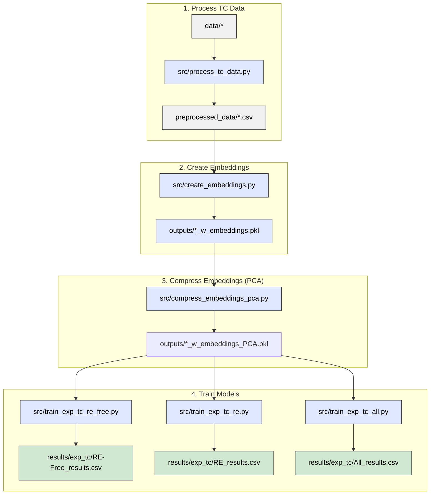

# Predicting simulated Curie temperatures from compound embeddings

This pipeline trains machine learning models that predict simulated Curie temperatures
(Tc_sim, in Kelvin) directly from stoichiometric compound embeddings — without any
experimental Tc values or data augmentation.

## Pipeline overview




Three datasets are trained independently (steps 3a–3c can run in any order or in parallel):
- **RE-Free** — rare-earth-free compounds (~6 200 rows)
- **RE** — rare-earth-containing compounds (~9 800 rows)
- **All** — combined dataset (~16 000 rows)

> **Note:** `src/train_exp_tc.py` is still available as a convenience script that runs all
> three datasets in sequence and is the shared library used by the individual scripts.

## 0. Installation

Install Python dependencies:

```bash
pip install -r requirements.txt
```

PyTorch must be installed separately to match your hardware:

```bash
# CPU-only example — see https://pytorch.org/get-started/locally/ for GPU variants
pip install torch --index-url https://download.pytorch.org/whl/cpu
```

## 1. Pre-Process Data

1. **Aggregate** data from multiple sources.  
2. **Clean** Tc values: remove units, symbols, and uncertainties; convert to float.  
3. **Drop** invalid (non-numeric) Tc entries.  
4. **Deduplicate** by taking the median Tc per composition.  
5. **Flag** compositions containing rare-earth elements.  
6. **Split** data into RE-containing and RE-free subsets.  
7. **Save** clean, structured datasets for analysis.


Run:

```bash
python src/process_tc_data.py
```

**Needs:**
```
data/m-tcsum_nur_new.csv
data/literature_values_prepared.csv
data/DS1+DS2.csv
data/combinded_tables.xlsx"
data/MagneticMaterials_All.csv
```
**Outputs:**
```
preprocessed_data/Experimental_Tc.csv          
preprocessed_data/Experimental_Tc_RE.csv   
preprocessed_data/Simulated_Tc.csv           
preprocessed_data/Simulation_Tc_RE.csv
preprocessed_data/Experimental_Tc_RE-Free.csv  
preprocessed_data/Experimental_Tc_all.csv  
preprocessed_data/Simulation_Tc_RE-Free.csv  
preprocessed_data/Simulation_Tc_all.csv
```


## 2. Create compound embeddings

Generates element-abundance-weighted compound embeddings from the Matscholar200
element vectors (200-dimensional). For example:

```
Fe2O3 embedding = (2/5) × [Fe vec] + (3/5) × [O vec]
```

Run:

```bash
python src/create_embeddings.py
```

**Needs:**
```
preprocessed_data/Experimental_Tc_RE-Free.csv
preprocessed_data/Experimental_Tc_RE.csv
preprocessed_data/Experimental_Tc_all.csv
data/embeddings/element/matscholar200.json
```

**Outputs:**
```
outputs/Experimental_Tc_RE-Free_w_embeddings.pkl
outputs/Experimental_Tc_RE_w_embeddings.pkl
outputs/Experimental_Tc_all_w_embeddings.pkl
logs/create_embeddings.txt
```

Each pickle contains the original `composition` and `Tc_exp` columns plus a
`compound_embedding` column holding a 200-D numpy array per row. Rows whose
compositions cannot be parsed or contain elements absent from the Matscholar200
vocabulary are dropped.

## 3. Compress embeddings with PCA

Fits PCA on each dataset independently and adds compressed embedding columns for
component sizes 8, 16, 32, and 64.

Run:

```bash
python src/compress_embeddings_pca.py
```

**Needs:**
```
outputs/Experimental_Tc_RE-Free_w_embeddings.pkl
outputs/Experimental_Tc_RE_w_embeddings.pkl
outputs/Experimental_Tc_all_w_embeddings.pkl
```

**Outputs:**
```
outputs/Experimental_Tc_RE-Free_w_embeddings_PCA.pkl
outputs/Experimental_Tc_RE_w_embeddings_PCA.pkl
outputs/Experimental_Tc_all_w_embeddings_PCA.pkl
logs/compress_embeddings_pca.txt
```

Each output pickle extends the input with columns `comp_emb_pca_8`, `comp_emb_pca_16`,
`comp_emb_pca_32`, and `comp_emb_pca_64`.

## 4. Train models

Trains three model families on five embedding variants for each of the three datasets
(15 training runs per dataset, 45 total):

| Model family | Variants |
|---|---|
| Linear (Lasso / Ridge best of two) | all 5 embedding variants |
| Random Forest (randomised CV) | all 5 embedding variants |
| MLP with early stopping (PyTorch) | all 5 embedding variants |

Embedding variants: `raw_200D`, `pca_8`, `pca_16`, `pca_32`, `pca_64`.

Hyperparameters are scaled to the training-set size:
- **RF `n_iter`** scales inversely with n_train (≈40 / 25 / 15 for RE-Free / RE / All).
- **MLP architecture**: `(128, 64, 32)` for n_train < 6 000; `(256, 128, 64)` otherwise.

Each dataset is trained by a dedicated script. Run them individually:

```bash
python src/train_exp_tc_re_free.py   # RE-Free dataset
python src/train_exp_tc_re.py        # RE dataset
python src/train_exp_tc_all.py       # All (combined) dataset
```

Or run all three in one go (backward-compatible):

```bash
python src/train_exp_tc.py
```

**Needs (per script):**
```
outputs/Experimental_Tc_RE-Free_w_embeddings_PCA.pkl   ← train_exp_tc_re_free.py
outputs/Experimental_Tc_RE_w_embeddings_PCA.pkl         ← train_exp_tc_re.py
outputs/Experimental_Tc_all_w_embeddings_PCA.pkl        ← train_exp_tc_all.py
```

**Outputs (per script):**
```
results/exp_tc/<Dataset>_results.csv
results/exp_tc/exp_tc_comparison.csv      (updated from all datasets run so far)
results/exp_tc/exp_tc_best_by_dataset.csv (updated from all datasets run so far)
results/exp_tc/figures/<dataset>_<embedding>_<model>.png
logs/train_exp_tc_re_free.txt  |  train_exp_tc_re.txt  |  train_exp_tc_all.txt
```

---

## 5. Results

All metrics are on a held-out 20 % test split. Metrics are R² (higher is better),
MAE and RMSE in Kelvin (lower is better).

### Best model per dataset

Below we report the performance of the best-performing ensemble member on the test set.


| Dataset | Model | Embedding | R²        | MAE (K)   | RMSE (K)  |
| ------- | ----- | --------- | --------- | --------- | --------- |
| All     | RF    | raw_200D  | 0.682     | 99.39     | 152.94    |
| RE      | RF    | raw_200D  | **0.841** | **45.20** | **67.25** |
| RE-Free | RF    | pca_32    | 0.623     | 125.10    | 178.42    |

Random Forest provides the strongest performance on the RE materials subset, achieving an R² of 0.841 with substantially lower prediction errors (MAE = 45.20 K, RMSE = 67.25 K) than the other datasets. In contrast, performance is lower on the mixed All dataset (R² = 0.682) and drops further on the RE-Free dataset (R² = 0.623), suggesting that compounds containing rare-earth elements exhibit more predictable structure–property relationships than the broader or RE-free chemical spaces.

---

### All — Best result per embedding and model 

Below we report the performance of the best-performing ensemble member on the All test set.

| Embedding | Model          |         R² |  MAE (K) |  RMSE (K) |
| --------- | -------------- | ---------: | -------: | --------: |
| raw_200D  | RF             | **0.6819** | **99.4** | **152.9** |
| pca_16    | RF             |     0.6596 |    101.7 |     158.2 |
| pca_32    | RF             |     0.6565 |    103.7 |     158.9 |
| pca_64    | RF             |     0.6469 |    106.8 |     161.1 |
| pca_8     | RF             |     0.6126 |    112.9 |     168.8 |
| pca_32    | MLP(128,64,32) |     0.6152 |    116.3 |     167.9 |
| pca_64    | MLP(128,64,32) |     0.6029 |    108.9 |     176.8 |
| pca_16    | MLP(128,64,32) |     0.5643 |    127.9 |     178.6 |
| raw_200D  | MLP(128,64,32) |     0.5570 |    125.8 |     180.1 |
| pca_8     | MLP(128,64,32) |     0.4576 |    146.3 |     199.7 |
| raw_200D  | Linear(Lasso)  |     0.3981 |    147.5 |     205.1 |
| pca_64    | Linear(Lasso)  |     0.3914 |    148.3 |     206.2 |
| pca_32    | Linear(Lasso)  |     0.3830 |    147.6 |     207.7 |
| pca_16    | Linear(Lasso)  |     0.3595 |    162.9 |     218.4 |
| pca_8     | Linear(Lasso)  |     0.3221 |    165.7 |     223.2 |


### All - Random Forest — Mean ± Std (per embedding)

| Embedding |                R² |         MAE (K) |         RMSE (K) |
| --------- | ----------------: | --------------: | ---------------: |
| raw_200D  | **0.636 ± 0.045** | **102.7 ± 7.2** | **163.1 ± 17.7** |
| pca_16    |     0.590 ± 0.046 |     108.4 ± 5.6 |     176.2 ± 13.8 |
| pca_32    |     0.597 ± 0.041 |     108.5 ± 6.3 |     168.7 ± 14.8 |
| pca_64    |     0.618 ± 0.039 |     111.4 ± 6.0 |     167.2 ± 13.7 |
| pca_8     |     0.551 ± 0.042 |     119.1 ± 5.3 |     180.6 ± 13.6 |

---

### RE — Best result per embedding and model 

Below we report the performance of the best-performing ensemble member on the RE test set.

| Embedding | Model          |         R² |  MAE (K) | RMSE (K) |
| --------- | -------------- | ---------: | -------: | -------: |
| raw_200D  | RF             | **0.8413** | **45.2** | **67.2** |
| pca_16    | RF             |     0.8042 |     49.7 |     74.7 |
| pca_32    | RF             |     0.7865 |     57.8 |     93.1 |
| pca_64    | RF             |     0.7830 |     51.3 |     78.6 |
| pca_8     | RF             |     0.7611 |     50.6 |     82.5 |
| pca_32    | MLP(128,64,32) |     0.7031 |     68.5 |    114.3 |
| raw_200D  | MLP(128,64,32) |     0.6762 |     74.4 |    119.4 |
| pca_16    | MLP(128,64,32) |     0.6672 |     77.3 |    121.0 |
| pca_64    | MLP(128,64,32) |     0.6234 |     77.0 |    131.8 |
| pca_8     | MLP(128,64,32) |     0.5945 |     80.9 |    133.6 |
| pca_64    | Linear(Lasso)  |     0.4704 |     96.5 |    138.0 |
| raw_200D  | Linear(Lasso)  |     0.4583 |     98.6 |    139.5 |
| pca_32    | Linear(Lasso)  |     0.4468 |     99.7 |    141.0 |
| pca_16    | Linear(Lasso)  |     0.4335 |    112.2 |    171.3 |
| pca_8     | Linear(Lasso)  |     0.4032 |    116.2 |    175.8 |


### RE - Random Forest — Mean ± Std (per embedding)

| Embedding |                R² |        MAE (K) |        RMSE (K) |
| --------- | ----------------: | -------------: | --------------: |
| raw_200D  | **0.753 ± 0.051** | **57.0 ± 5.3** | **99.3 ± 16.2** |
| pca_16    |     0.743 ± 0.041 |     61.8 ± 5.2 |    101.5 ± 13.1 |
| pca_32    |     0.743 ± 0.036 |     63.1 ± 4.8 |    101.7 ± 11.4 |
| pca_64    |     0.729 ± 0.045 |     62.5 ± 5.7 |    103.8 ± 12.9 |
| pca_8     |     0.707 ± 0.031 |     64.4 ± 7.0 |    108.0 ± 13.9 |


The model performance exhibits substantial variability across ensemble realizations, 
with R² ranging from 0.669 to 0.841 for the RE dataset using raw 200-dimensional embeddings. 
This indicates that the reported performance is sensitive to the specific ensemble realization.

---

### RE-Free — Best result per embedding and model 

Below we report the performance of the best-performing ensemble member on the RE-Free test set.

| Embedding | Model          |         R² (↑) |   MAE (K) |  RMSE (K) |
| --------- | -------------- | ---------: | --------: | --------: |
| pca_32    | RF             | **0.6226** | **125.1** | **178.4** |
| raw_200D  | RF             |     0.6170 |     122.9 |     179.7 |
| pca_64    | RF             |     0.5883 |     132.8 |     186.3 |
| pca_8     | RF             |     0.5615 |     135.5 |     192.3 |
| pca_16    | RF             |     0.5527 |     152.6 |     218.0 |
| pca_64    | MLP(128,64,32) |     0.3358 |     188.8 |     250.3 |
| pca_32    | MLP(128,64,32) |     0.3260 |     178.5 |     238.4 |
| raw_200D  | MLP(128,64,32) |     0.3157 |     183.4 |     240.3 |
| pca_16    | MLP(128,64,32) |     0.3084 |     180.4 |     241.5 |
| pca_8     | MLP(128,64,32) |     0.2770 |     196.5 |     247.0 |
| pca_16    | Linear(Lasso)  |     0.2704 |     206.7 |     256.6 |
| pca_64    | Linear(Lasso)  |     0.2635 |     193.9 |     249.2 |
| raw_200D  | Linear(Lasso)  |     0.2598 |     193.1 |     249.9 |
| pca_32    | Linear(Lasso)  |     0.2533 |     204.5 |     259.6 |
| pca_8     | Linear(Lasso)  |     0.2449 |     203.4 |     252.4 |


### RE-Free - Random Forest — Mean ± Std (per embedding)

| Embedding | R²             | MAE (K)          | RMSE (K)         |
| --------- | ----------------- | ---------------- | ---------------- |
| raw_200D  | **0.512 ± 0.073** | **142.9 ± 10.5** | **210.4 ± 20.5** |
| pca_8     | 0.442 ± 0.072     | 154.5 ± 10.2     | 225.8 ± 18.6     |
| pca_16    | 0.472 ± 0.069     | 150.0 ± 10.0     | 222.8 ± 18.4     |
| pca_32    | **0.511 ± 0.075** | **144.6 ± 11.0** | **210.5 ± 21.1** |
| pca_64    | 0.498 ± 0.071     | 149.3 ± 8.5      | 213.8 ± 20.9     |

---