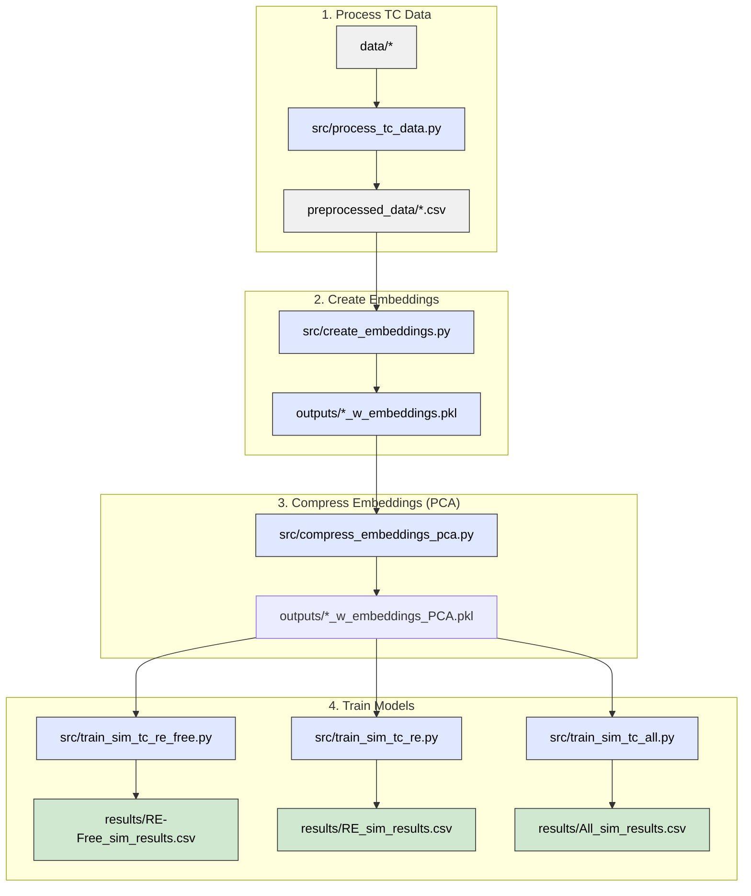

# Predicting simulated Curie temperatures from compound embeddings

This pipeline trains machine learning models that predict simulated Curie temperatures
(Tc_sim, in Kelvin) directly from stoichiometric compound embeddings — without any
experimental Tc values or data augmentation.

## Pipeline overview


```mermaid
graph TD

    %% === Cluster 1: Process TC Data ===
    subgraph cluster_1["1. Process TC Data"]
        direction TB
        A0[data/*] --> B0[src/process_tc_data.py]
        B0 --> A[preprocessed_data/*.csv]
    end

    %% === Cluster 2: Create Embeddings ===
    subgraph cluster_2["2. Create Embeddings"]
        direction TB
        A --> B[src/create_embeddings.py]
        B --> C[outputs/*_w_embeddings.pkl]
    end

    %% === Cluster 3: Compress Embeddings (PCA) ===
    subgraph cluster_3["3. Compress Embeddings (PCA)"]
        direction TB
        C --> D[src/compress_embeddings_pca.py]
        D --> E[outputs/*_w_embeddings_PCA.pkl]
    end

    %% === Cluster 4: Train Models ===
    subgraph cluster_4["4. Train Models"]
        direction TB
        E --> F1[src/train_sim_tc_re_free.py]
        E --> F2[src/train_sim_tc_re.py]
        E --> F3[src/train_sim_tc_all.py]

        F1 --> G1[results/RE-Free_sim_results.csv]
        F2 --> G2[results/RE_sim_results.csv]
        F3 --> G3[results/All_sim_results.csv]
    end

    %% === Styling ===
    classDef input fill:#f0f0f0,stroke:#333,stroke-width:1px,color:#000;
    classDef process fill:#e0e8ff,stroke:#333,stroke-width:1px,color:#000;
    classDef output fill:#d0e8d0,stroke:#333,stroke-width:1px,color:#000;

    class A0,A input
    class B0,B,C,D,F1,F2,F3 process
    class G1,G2,G3 output

    class cluster_1,cluster_2,cluster_3,cluster_4 fill:#ffffff,stroke:#ccc,stroke-width:1px;
```

Three datasets are trained independently (steps 3a–3c can run in any order or in parallel):
- **RE-Free** — rare-earth-free compounds (~6 200 rows)
- **RE** — rare-earth-containing compounds (~9 800 rows)
- **All** — combined dataset (~16 000 rows)

> **Note:** `src/train_sim_tc.py` is still available as a convenience script that runs all
> three datasets in sequence and is the shared library used by the individual scripts.

## 0. Installation

Install Python dependencies:

```bash
pip install -r requirements.txt
```

PyTorch must be installed separately to match your hardware:

```bash
# CPU-only example — see https://pytorch.org/get-started/locally/ for GPU variants
pip install torch --index-url https://download.pytorch.org/whl/cpu
```

## 1. Pre-Process Data

1. **Aggregate** data from multiple sources.  
2. **Clean** Tc values: remove units, symbols, and uncertainties; convert to float.  
3. **Drop** invalid (non-numeric) Tc entries.  
4. **Canonicalise & deduplicate**: reduce each formula to its pymatgen *reduced formula* (so H₂O/H₄O₂, CoFe₂O₄/Fe₂CoO₄ and other spelling / element-ordering / stoichiometric-multiple variants pool together; unparsable strings are dropped), then take the **median Tc** per reduced composition.  
5. **Flag** compositions containing rare-earth elements.  
6. **Split** data into RE-containing and RE-free subsets.  
7. **Save** clean, structured datasets for analysis.


Run:

```bash
python src/process_tc_data.py
```

**Needs:**
```
data/m-tcsum_nur_new.csv
data/literature_values_prepared.csv
data/DS1+DS2.csv
data/combinded_tables.xlsx"
data/MagneticMaterials_All.csv
```
**Outputs:**
```
preprocessed_data/Experimental_Tc.csv          
preprocessed_data/Experimental_Tc_RE.csv   
preprocessed_data/Simulated_Tc.csv           
preprocessed_data/Simulation_Tc_RE.csv
preprocessed_data/Experimental_Tc_RE-Free.csv  
preprocessed_data/Experimental_Tc_all.csv  
preprocessed_data/Simulation_Tc_RE-Free.csv  
preprocessed_data/Simulation_Tc_all.csv
```


## 2. Create compound embeddings

Generates element-abundance-weighted compound embeddings from the Matscholar200
element vectors (200-dimensional). For example:

```
Fe2O3 embedding = (2/5) × [Fe vec] + (3/5) × [O vec]
```

Run:

```bash
python src/create_embeddings.py
```

**Needs:**
```
preprocessed_data/Simulation_Tc_RE-Free.csv
preprocessed_data/Simulation_Tc_RE.csv
preprocessed_data/Simulation_Tc_all.csv
data/embeddings/element/matscholar200.json
```

**Outputs:**
```
outputs/Simulation_Tc_RE-Free_w_embeddings.pkl
outputs/Simulation_Tc_RE_w_embeddings.pkl
outputs/Simulation_Tc_all_w_embeddings.pkl
logs/create_embeddings.txt
```

Each pickle contains the original `composition` and `Tc_sim` columns plus a
`compound_embedding` column holding a 200-D numpy array per row. Rows whose
compositions cannot be parsed or contain elements absent from the Matscholar200
vocabulary are dropped.

## 3. Compress embeddings with PCA

Fits PCA on each dataset independently and adds compressed embedding columns for
component sizes 8, 16, 32, and 64.

Run:

```bash
python src/compress_embeddings_pca.py
```

**Needs:**
```
outputs/Simulation_Tc_RE-Free_w_embeddings.pkl
outputs/Simulation_Tc_RE_w_embeddings.pkl
outputs/Simulation_Tc_all_w_embeddings.pkl
```

**Outputs:**
```
outputs/Simulation_Tc_RE-Free_w_embeddings_PCA.pkl
outputs/Simulation_Tc_RE_w_embeddings_PCA.pkl
outputs/Simulation_Tc_all_w_embeddings_PCA.pkl
logs/compress_embeddings_pca.txt
```

Each output pickle extends the input with columns `comp_emb_pca_8`, `comp_emb_pca_16`,
`comp_emb_pca_32`, and `comp_emb_pca_64`.

## 4. Train models

The framework supports **four model families**, but the shipped `training_config.yaml`
enables only the top-two — **LightGBM and Random Forest** (Linear and MLP are available but
disabled, since they trail badly on Tc). Each (family × embedding) is trained as an
**ensemble** of N members on different random train/test splits (N per family, default 10),
so the shipped default is 2 × 5 × 10 = **100 fits per dataset**.

| Model family | Notes |
|---|---|
| Linear (Lasso / Ridge, best of two) | all 5 embedding variants |
| Random Forest (randomised CV, tuned once per embedding) | all 5 embedding variants |
| MLP with early stopping (PyTorch) | all 5 embedding variants |
| LightGBM (gradient-boosted trees, randomised CV, tuned once per embedding) | all 5 embedding variants |

**Enabled in the shipped config:** LightGBM + Random Forest only (the top-two on Tc). Linear
and MLP remain in the table because they are implemented and can be re-enabled in
`training_config.yaml`.

Embedding variants: `raw_200D`, `pca_8`, `pca_16`, `pca_32`, `pca_64`.

Hyperparameters are scaled to the training-set size:
- **RF / LightGBM `n_iter`** scales inversely with n_train (the search is run **once**
  per (dataset, embedding) and the best params are reused across all ensemble members).
- **MLP architecture**: `(128, 64, 32)` for n_train < 6 000; `(256, 128, 64)` otherwise.

> **ONNX note:** every model — Linear, RF, MLP **and LightGBM** — is exported to ONNX
> (`results/onnx_models/`) for use by `predict_tc.py`. LightGBM export requires the
> `onnxmltools` package (in `requirements.txt`); if it is missing, only LightGBM is
> skipped and training still completes. With `re_features` enabled the ONNX input
> changes from a 200-D embedding to `[embedding | 7 RE feats]` (207-D), and `predict_tc`
> supplies the extra features automatically (see the `re_features` row below).

### Configuration (`training_config.yaml`)

Which families to train, the ensemble size, and the rare-earth feature toggle are all
controlled by `training_config.yaml`:

```yaml
  re_features: true         # shipped default: rare-earth physics features ON (see below)
  models:                   # shipped default enables only the top-two families (LGBM + RF)
    linear:
      enabled: false        # trails badly on Tc -> disabled
      ensemble: 10
    rf:
      enabled: true
      ensemble: 10          # train 10 members on different splits; headline = mean ± std
    mlp:
      enabled: false        # trails badly on Tc -> disabled
      ensemble: 10
    lgbm:                   # LightGBM (gradient-boosted trees)
      enabled: true
      ensemble: 10
```

**Options:**

| Key | Values | Meaning |
|---|---|---|
| `models.<family>.enabled` | `true` / `false` | Train this family or skip it entirely. Families: `linear`, `rf`, `mlp`, `lgbm`. |
| `models.<family>.ensemble` | integer ≥ 1 | Number of ensemble members (different random splits). Reported metrics are the **mean ± std** across members. `ensemble: 1` reproduces a single split (std = 0). |
| `re_features` | `true` / `false` | When `true`, append 7 rare-earth physics features (de Gennes factor, S-state fraction, free-ion moment, …) to the embedding. Zero for RE-free compounds, so safe on every dataset. The exported ONNX then takes a **207-D** input `[embedding \| 7 feats]` (**raw_200D only** — PCA variants are skipped, as they'd need an in-graph ColumnTransformer), written with a **`_refeats`** suffix so it doesn't collide with the embedding-only models; `predict_tc` detects the 207-D input and computes & appends the features from the formula automatically. Code default `false`, but the **shipped config sets it `true`**. |

Shorthands: a family may be given as a bare bool (`rf: true` ⇒ enabled, ensemble 1); an
omitted family defaults to enabled with ensemble 1; if the file is missing, all four
families train with ensemble 1 and `re_features` off. `lgbm` requires the optional
`lightgbm` package (otherwise it is skipped with a note).

Each dataset is trained by a dedicated script. Run them individually:

```bash
python src/train_sim_tc_re_free.py   # RE-Free dataset
python src/train_sim_tc_re.py        # RE dataset
python src/train_sim_tc_all.py       # All (combined) dataset
```

Or run all three in one go (backward-compatible):

```bash
python src/train_sim_tc.py
```

 
**Outputs (per script):**
```
results/<Dataset>_sim_results.csv         (one row per ensemble member)
results/<Dataset>_sim_results_agg.csv     (ensemble mean ± std per model/embedding)
results/sim_tc_comparison.csv             (aggregated, updated from all datasets run so far)
results/sim_tc_best_by_dataset.csv        (best by mean R², updated from all datasets run so far)
results/figures/<dataset>_<embedding>_<model>.png
results/onnx_models/<dataset>_<embedding>_<model>.onnx   (LightGBM needs onnxmltools;
                                                          re_features adds a _refeats, raw_200D-only, 207-D variant)
logs/train_sim_tc_re_free.txt  |  train_sim_tc_re.txt  |  train_sim_tc_all.txt
```

## 5. Predict Tc for new compounds

`src/predict_tc.py` predicts (simulated) Tc for any chemical formula using the exported
ONNX models — you give it a formula and it does all preprocessing (embedding, PCA,
scaling, and the RE features if needed) internally.

```bash
# best model for the compound's type (RE vs RE-free is auto-detected)
python src/predict_tc.py --compound Nd2Fe14B --best

# every applicable model, as a comparison table (ensemble mean ± std)
python src/predict_tc.py --compound Fe --all

# a specific model file
python src/predict_tc.py --compound SmCo5 --model results/onnx_models/RE_raw_200D_lgbm_e0.onnx

# many compounds from a file (one formula per line)
python src/predict_tc.py --compounds-file new_materials.txt --best

# list available models
python src/predict_tc.py --list
```

**Choosing a model:** `--best`/`--all` auto-detect rare-earth content and pick the right
dataset's model(s) — `--best` uses the best **RE** model for a rare-earth compound and the
best **RE-Free** model for a rare-earth-free one. If you pass `--model` yourself, match it
to the chemistry — **RE-Free** or **All** for rare-earth-free compounds (Fe, Co, Ni…),
**RE** or **All** for rare-earth compounds (Nd₂Fe₁₄B, SmCo₅…). The RE and RE-Free models
extrapolate poorly across the RE boundary, so `predict_tc` **refuses** a mismatched
`--model` (a RE model on a RE-free compound, or vice-versa) with an error telling you to
use an `All_*` model; the `All` model is always valid.

**RE-features models:** models trained with `re_features: true` are saved with a
`_refeats` suffix and take a 207-D input. `predict_tc` detects this from the ONNX graph
and computes & appends the 7 features automatically — no extra arguments. `--best`/`--all`
resolve to these `_refeats` files when they are the ones on disk (exact embedding-only
name first, `_refeats` as fallback).

### Validate against a reference set (`src/validate_reference_data.py`)

`src/validate_reference_data.py` scores the models against an external reference list of
compounds with known Curie/Néel temperatures (`data/validation_reference.csv`). For each
compound it predicts Tc with **only the best model for that chemistry** — the best **RE**
model for rare-earth compounds, the best **RE-Free** model otherwise (from
`results/sim_tc_best_by_dataset.csv`) — as the **ensemble mean ± std** over the model's ONNX
members (never a best-of-N pick). It reuses the exact prediction path from `predict_tc.py`,
so it can't drift from the deployed predictor.

```bash
python src/validate_reference_data.py
# or point at a different reference / output file
python src/validate_reference_data.py --ref data/validation_reference.csv --out table.csv
```

It prints a table (`compound | RE? | reference | prediction | std | error | best model`),
writes the same to `results/validation_reference_predictions.csv`, and reports a summary MAE
over the true ferro/ferrimagnetic Curie temperatures — antiferromagnets (Néel T) and
non-magnetic entries are shown for sanity but excluded from the error stat.

> **Note (simulated model):** the reference values are *experimental* Curie/Néel temperatures,
> whereas this model predicts a *simulated* (DFT / spin-dynamics) Tc; read the error column as
> bundling that simulation-vs-experiment offset with model error, not pure accuracy. See
> `validation_idea.txt`.

---

## Results

Metrics are on held-out 20 % test splits, reported as the **ensemble mean ± std** over
the N members (default N = 10) — not the single luckiest split. R² higher is better;
MAE and RMSE in Kelvin lower is better.

> **Current run:** **RE** and **RE-Free** below are from the latest run with **LightGBM**
> and `re_features: true` (rare-earth physics features on). The **All** (combined) dataset
> has not been run yet — run `python src/train_sim_tc_all.py` to produce it. The
> simulated-Tc datasets are small (RE ≈ 1 200 rows, RE-Free ≈ 1 000), so per-split
> variance is sizeable (note the ± std).

### Best model per dataset (ensemble mean ± std)

| **Dataset** | **Model**    | **Embedding** |            **R²** | **MAE (K)** | **RMSE (K)** |
| ----------- | ------------ | ------------- | ----------------: | ----------: | -----------: |
| RE          | **RF**       | raw_200D      | **0.760 ± 0.068** |  **55.856** |   **94.302** |
| All         | **LightGBM** | raw_200D      | **0.643 ± 0.037** | **101.448** |  **171.584** |
| RE-Free     | **RF**       | raw_200D      | **0.478 ± 0.068** | **153.088** |  **223.385** |

### All Materials — all models × embeddings (ensemble mean ± std, with RE features)

Latest run: 4 families, re_features: true, N = 10 members.

| Dataset | Embedding | Model    |  N |                R² |                 MAE |                 RMSE |
| ------- | --------- | -------- | -: | ----------------: | ------------------: | -------------------: |
| All     | raw_200D  | **LGBM** | 10 | **0.643 ± 0.037** | **101.448 ± 4.282** | **171.584 ± 11.784** |
| All     | raw_200D  | RF       | 10 |     0.642 ± 0.036 |     103.940 ± 4.368 |     171.794 ± 11.873 |
| All     | pca_64    | LGBM     | 10 |     0.634 ± 0.040 |     105.200 ± 4.462 |     173.750 ± 11.382 |
| All     | pca_32    | LGBM     | 10 |     0.632 ± 0.041 |     105.651 ± 4.512 |     174.165 ± 12.609 |
| All     | pca_32    | RF       | 10 |     0.630 ± 0.038 |     106.163 ± 4.694 |     174.706 ± 12.166 |
| All     | pca_64    | RF       | 10 |     0.625 ± 0.041 |     108.842 ± 5.346 |     175.912 ± 12.294 |
| All     | pca_16    | RF       | 10 |     0.610 ± 0.041 |     107.570 ± 4.972 |     179.311 ± 12.970 |
| All     | pca_16    | LGBM     | 10 |     0.610 ± 0.045 |     106.402 ± 5.380 |     179.317 ± 13.481 |
| All     | pca_8     | RF       | 10 |     0.593 ± 0.043 |     111.096 ± 6.232 |     183.310 ± 13.539 |
| All     | pca_8     | LGBM     | 10 |     0.582 ± 0.047 |     111.455 ± 6.949 |     185.686 ± 14.054 |
| All     | pca_64    | MLP      | 10 |     0.516 ± 0.046 |     126.242 ± 7.258 |     199.843 ± 13.297 |
| All     | raw_200D  | MLP      | 10 |     0.492 ± 0.053 |     132.834 ± 7.866 |     204.783 ± 14.948 |
| All     | pca_32    | MLP      | 10 |     0.487 ± 0.057 |     132.811 ± 7.596 |     205.786 ± 16.156 |
| All     | pca_16    | MLP      | 10 |     0.461 ± 0.048 |     136.967 ± 7.327 |     211.008 ± 13.520 |
| All     | pca_8     | MLP      | 10 |     0.422 ± 0.027 |     145.514 ± 4.474 |      218.615 ± 9.967 |
| All     | raw_200D  | Linear   | 10 |     0.331 ± 0.031 |     163.452 ± 4.339 |     235.142 ± 10.605 |
| All     | pca_64    | Linear   | 10 |     0.328 ± 0.028 |     164.507 ± 4.583 |     235.709 ± 10.144 |
| All     | pca_32    | Linear   | 10 |     0.309 ± 0.035 |     165.935 ± 4.621 |     238.994 ± 11.315 |
| All     | pca_16    | Linear   | 10 |     0.305 ± 0.025 |     168.422 ± 4.046 |      239.610 ± 9.914 |
| All     | pca_8     | Linear   | 10 |     0.301 ± 0.021 |     169.258 ± 3.663 |      240.361 ± 9.051 |


### RE Materials — all models × embeddings (ensemble mean ± std, with RE features)

Latest run: 4 families, re_features: true, N = 10 members. 

| Dataset | Embedding | Model  |  N |                R² |                MAE |                RMSE |
| ------- | --------- | ------ | -: | ----------------: | -----------------: | ------------------: |
| RE      | raw_200D  | **RF** | 10 | **0.760 ± 0.068** |     55.856 ± 5.427 | **94.302 ± 15.091** |
| RE      | raw_200D  | LGBM   | 10 |     0.741 ± 0.077 | **53.687 ± 5.423** |     98.053 ± 15.854 |
| RE      | pca_64    | LGBM   | 10 |     0.729 ± 0.070 |     58.714 ± 5.498 |    100.318 ± 12.929 |
| RE      | pca_32    | LGBM   | 10 |     0.728 ± 0.073 |     59.402 ± 5.656 |    100.527 ± 13.058 |
| RE      | pca_32    | RF     | 10 |     0.720 ± 0.063 |     62.613 ± 5.145 |    102.351 ± 12.644 |
| RE      | pca_16    | LGBM   | 10 |     0.717 ± 0.091 |     59.925 ± 5.939 |    102.139 ± 15.447 |
| RE      | pca_8     | RF     | 10 |     0.702 ± 0.074 |     62.915 ± 5.916 |    105.351 ± 14.133 |
| RE      | pca_64    | RF     | 10 |     0.700 ± 0.085 |     64.204 ± 5.562 |    105.568 ± 13.180 |
| RE      | pca_16    | RF     | 10 |     0.697 ± 0.087 |     64.278 ± 6.099 |    106.005 ± 13.868 |
| RE      | pca_8     | LGBM   | 10 |     0.682 ± 0.066 |     62.830 ± 5.365 |    109.243 ± 12.498 |
| RE      | pca_32    | MLP    | 10 |     0.747 ± 0.000 |     68.937 ± 0.000 |     104.729 ± 0.000 |
| RE      | raw_200D  | MLP    | 10 |     0.745 ± 0.000 |     68.112 ± 0.000 |     105.110 ± 0.000 |
| RE      | pca_16    | MLP    | 10 |     0.726 ± 0.000 |     72.688 ± 0.000 |     109.073 ± 0.000 |
| RE      | pca_64    | MLP    | 10 |     0.609 ± 0.000 |     82.370 ± 0.000 |     130.221 ± 0.000 |
| RE      | pca_8     | MLP    | 10 |     0.658 ± 0.000 |     75.936 ± 0.000 |     121.751 ± 0.000 |
| RE      | pca_64    | Linear | 10 |     0.510 ± 0.000 |     95.375 ± 0.000 |     145.708 ± 0.000 |
| RE      | pca_16    | Linear | 10 |     0.505 ± 0.000 |     96.536 ± 0.000 |     146.450 ± 0.000 |
| RE      | raw_200D  | Linear | 10 |     0.505 ± 0.000 |     96.364 ± 0.000 |     146.545 ± 0.000 |
| RE      | pca_32    | Linear | 10 |     0.495 ± 0.000 |     97.828 ± 0.000 |     148.016 ± 0.000 |
| RE      | pca_8     | Linear | 10 |     0.477 ± 0.000 |     97.165 ± 0.000 |     150.599 ± 0.000 |

### RE-Free Materials — all models × embeddings (ensemble mean ± std, with RE features) 

Latest run: 4 families, re_features: true, N = 10 members. (RE features are all-zero for RE-free compounds, so they leave LightGBM/Linear unchanged and only perturb RF/MLP within noise.)

| Dataset | Embedding | Model  |  N |                R² |                  MAE |                 RMSE |
| ------- | --------- | ------ | -: | ----------------: | -------------------: | -------------------: |
| RE-Free | raw_200D  | **RF** | 10 | **0.478 ± 0.068** | **153.088 ± 10.659** | **223.385 ± 25.639** |
| RE-Free | pca_64    | LGBM   | 10 |     0.465 ± 0.058 |      156.233 ± 8.710 |     226.305 ± 22.628 |
| RE-Free | raw_200D  | LGBM   | 10 |     0.465 ± 0.072 |     153.402 ± 10.916 |     226.239 ± 25.252 |
| RE-Free | pca_32    | RF     | 10 |     0.452 ± 0.073 |     158.070 ± 11.769 |     228.813 ± 25.441 |
| RE-Free | pca_64    | RF     | 10 |     0.451 ± 0.070 |     160.208 ± 10.479 |     229.194 ± 26.192 |
| RE-Free | pca_16    | RF     | 10 |     0.437 ± 0.086 |     159.755 ± 11.947 |     231.737 ± 24.954 |
| RE-Free | pca_16    | LGBM   | 10 |     0.431 ± 0.058 |      162.529 ± 7.899 |     233.163 ± 21.112 |
| RE-Free | pca_32    | LGBM   | 10 |     0.416 ± 0.068 |     163.707 ± 10.981 |     236.304 ± 24.657 |
| RE-Free | pca_8     | RF     | 10 |     0.403 ± 0.066 |      165.927 ± 8.925 |     238.842 ± 23.966 |
| RE-Free | pca_8     | LGBM   | 10 |     0.367 ± 0.075 |      173.490 ± 7.136 |     246.022 ± 24.954 |
| RE-Free | raw_200D  | MLP    | 10 |     0.282 ± 0.052 |      190.902 ± 8.413 |     261.844 ± 19.396 |
| RE-Free | pca_32    | MLP    | 10 |     0.278 ± 0.065 |      190.232 ± 9.194 |     262.669 ± 21.327 |
| RE-Free | pca_16    | MLP    | 10 |     0.265 ± 0.062 |      194.291 ± 8.404 |     265.043 ± 22.040 |
| RE-Free | raw_200D  | Linear | 10 |     0.210 ± 0.039 |      203.902 ± 7.661 |     274.837 ± 19.294 |
| RE-Free | pca_32    | Linear | 10 |     0.210 ± 0.041 |      205.085 ± 8.768 |     274.939 ± 19.685 |
| RE-Free | pca_64    | Linear | 10 |     0.209 ± 0.033 |      206.072 ± 7.943 |     275.100 ± 19.413 |
| RE-Free | pca_16    | Linear | 10 |     0.193 ± 0.047 |      209.682 ± 7.965 |     277.750 ± 19.789 |
| RE-Free | pca_8     | MLP    | 10 |     0.189 ± 0.062 |      208.095 ± 9.757 |     278.500 ± 23.956 |
| RE-Free | pca_8     | Linear | 10 |     0.180 ± 0.050 |      214.119 ± 9.137 |     280.176 ± 22.816 |
| RE-Free | pca_64    | MLP    | 10 |     0.173 ± 0.109 |     200.721 ± 14.133 |     280.715 ± 24.973 |
