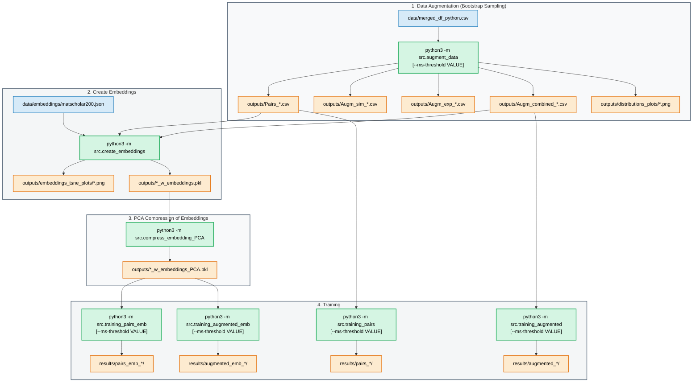

# ML model for systematic errors between simulations and experimental measurements of the spontaneous magnetization

This codebase implements various machine learning models to predict experimental spontaneous magnetization values from simulated values. Additionally, chemical property information is incorporated via an embedding representation.

Machine-learning pipeline for correcting DFT-simulated saturation magnetisation (Ms)
values against experimental measurements. Models learn the systematic error between
simulated Ms (A/m) and experimental Ms (A/m) and predict a corrected value.

## Current version of model
v0.2

## Overview

The pipeline runs in five stages:



| Stage | Script | Description |
|---|---|---|
| 1 | `src/augment_data.py` | Bootstrap augmentation to generate mock Ms_exp / Ms_sim for unpaired rows |
| 2 | `src/create_embeddings.py` | Create 200-D Matscholar compound embeddings |
| 3 | `src/compress_embedding_PCA.py` | Compress embeddings to 8/16/32/64 PCA components |
| 4a | `src/training_pairs.py` | Train on real pairs only, no embeddings |
| 4b | `src/training_augmented.py` | Train on augmented data, no embeddings |
| 4c | `src/training_pairs_emb.py` | Train on real pairs with compound embeddings |
| 4d | `src/training_augmented_emb.py` | Train on augmented data with compound embeddings |

Models trained: Symbolic Regression (PySR), Linear (LASSO / Ridge / OLS), Random Forest, FCNN/MLP.

Datasets: All pairs, RE-only (rare-earth compounds), RE-free.

All models operate in log1p-space; metrics are reported in original A/m space.

## Data

Place the merged dataset at:

```
data/merged_df_python.csv
```

Expected columns include `Ms (ampere/meter)_s` (simulated), `Ms (ampere/meter)_e`
(experimental), and `has_rare_earth`.

## Usage

### Individual stages

```bash
python3 -m src.augment_data
python3 -m src.create_embeddings
python3 -m src.compress_embedding_PCA
python3 -m src.training_pairs
python3 -m src.training_pairs_emb
python3 -m src.training_augmented
python3 -m src.training_augmented_emb
```

## Options

### `--ms-threshold VALUE`

Accepted by: `augment_data`, `training_pairs`, `training_augmented`,
`training_pairs_emb`, `training_augmented_emb`.

Drops all rows where `Ms_sim` or `Ms_exp` is at or below `VALUE` (A/m) **before**
any log-space transformation or model training. This removes the low-Ms poor-DFT
regime where simulations are unreliable and which degrades model performance.

| Value | Effect |
|---|---|
| `50000` | Default — matches the filter used in the reference implementation |
| Any positive float | Custom threshold in A/m |
| `0` | Disable filtering entirely (use all data) |

Examples:

```bash
# Default (50,000 A/m threshold)
python3 -m src.training_pairs

# Custom threshold
python3 -m src.training_pairs --ms-threshold 100000

# Disable threshold
python3 -m src.training_pairs --ms-threshold 0
```

The threshold is applied consistently across:
- `DataLoader.load_pairs_data()` and `load_augmented_data()` in `base_trainer.py`
- Pairs, sim-only, and exp-only rows in `augment_data.py`
- PKL-loaded DataFrames in the embedding training scripts

### `--delta-learning`

Accepted by: `training_pairs`, `training_augmented`, `training_pairs_emb`,
`training_augmented_emb`. It is an on/off flag (no value).

When set, models train on the **correction** to the simulation rather than the
experimental value directly:

```
target = log1p(Ms_exp) - log1p(Ms_sim)      # instead of log1p(Ms_exp)
```

The simulation is treated as the baseline and the model only predicts the systematic
deviation from it. Predictions are reconstructed as
`log1p(Ms_sim) + model_output`, and the `log1p(Ms_sim)` baseline is added back
**before** metrics are computed — so reported R²/RMSE/MAE stay in `log1p(Ms_exp)`
space and remain directly comparable to direct-target runs.

Why it helps: `log1p(Ms_exp)` is dominated by `log1p(Ms_sim)` (the simulation is a
good first approximation). Predicting the target directly spends most of the model's
capacity reproducing that trivial identity; subtracting it focuses all capacity on the
element-specific correction — the hard part. This benefits flexible models (MLP,
RandomForest, Symbolic Regression) most, especially on the small, noisy rare-earth
(RE) data. Linear models are mathematically near-invariant to it.

```bash
# Direct target (default)
python3 -m src.training_pairs

# Delta-learning
python3 -m src.training_pairs --delta-learning

# Combine with a threshold
python3 -m src.training_pairs --ms-threshold 50000 --delta-learning
```

Measured effect (test R²): MLP on RE + embeddings improved 0.74 → 0.82, MLP on All +
embeddings 0.83 → 0.89, and Symbolic Regression on RE 0.41 → 0.47. See
`report_improvement_steps_for_results.txt` for the full table. Note: Symbolic
Regression requires PySR installed in the run environment, otherwise its rows are
silently skipped.

## Outputs

| Path | Contents |
|---|---|
| `outputs/Pairs_*.csv` | Original paired rows (per dataset split) |
| `outputs/Augm_sim_*.csv` | Phase 1 augmented (sim-only → mock exp) |
| `outputs/Augm_exp_*.csv` | Phase 2 augmented (exp-only → mock sim) |
| `outputs/Augm_combined_*.csv` | Phase 3 combined augmented dataset |
| `outputs/*.pkl` | DataFrames with compound embeddings |
| `results/` | Model comparison CSVs and prediction plots |
| `logs/` | Per-stage stdout logs |

## Source layout

```
src/
├── augment_data.py            Bootstrap augmentation
├── create_embeddings.py       Matscholar200 compound embeddings
├── compress_embedding_PCA.py  PCA compression of embeddings
├── composition_data.py        Composition parsing utilities
├── log_to_file.py             Stdout-to-file logging decorator
├── training_pairs.py          Entry point: pairs, no embeddings
├── training_augmented.py      Entry point: augmented, no embeddings
├── training_pairs_emb.py      Entry point: pairs + embeddings
├── training_augmented_emb.py  Entry point: augmented + embeddings
└── training/
    ├── base_trainer.py        DataLoader, ModelEvaluator, split_data
    ├── fcnn_mlp.py            FCNN/MLP trainer
    ├── linear_models.py       LASSO / Ridge / OLS trainer
    ├── random_forest.py       Random Forest trainer
    └── symbolic_regression.py PySR trainer
```

### 📈 Model Performance Comparison

(best models and symbolic regression baseline shown)

| Dataset         | Model              | Embedding   | R²    | RMSE    |
|----------------|---------------------|-------------|-------|---------|
| All-Pairs      | **MLP (FCNN)**      | -           | 0.78  | 0.393   |
| All-Pairs      | Linear Regression   | raw_200D    | 0.835 | 0.342   |
| All-Pairs      | Symbolic Regression | -           | 0.782 | 0.393   |
| All-Augm       | MLP (FCNN)          | -           | 0.791 | 0.399   |
| All-Augm       | **MLP (FCNN)**      | PCA32       | 0.794 | 0.395   |
| All-Augm       | Symbolic Regression | -           | 0.791 | 0.399   |
| RE-Pairs       | Random Forest       |             | 0.467 | 0.621   |
| RE-Pairs       | Ridge Regression    | raw_200D    | 0.747 | 0.427   |
| RE-Pairs       | Symbolic Regression | -           | 0.411 | 0.653   |
| RE-Augm        | MLP (FCNN)          | -           | 0.612 | 0.624   |
| RE-Augm        | **MLP (FCNN)**      | PCA32       | 0.621 | 0.616   |
| RE-Augm        | Symbolic Regression | -           | 0.612 | 0.624   |
| RE-Free-Pairs  | Lasso               | -           | 0.873 | 0.293   |
| RE-Free-Pairs  | Random Forest       | raw_200D    | 0.897 | 0.264   |
| RE-Free-Pairs  | Symbolic Regression | -           | 0.872 | 0.295   |
| RE-Free-Augm   | MLP (FCNN)          | -           | 0.869 | 0.300   |
| RE-Free-Augm   | **MLP (FCNN)**      | PCA16       | 0.862 | 0.308   |
| RE-Free-Augm   | Symbolic Regression | -           | 0.869 | 0.301   |
