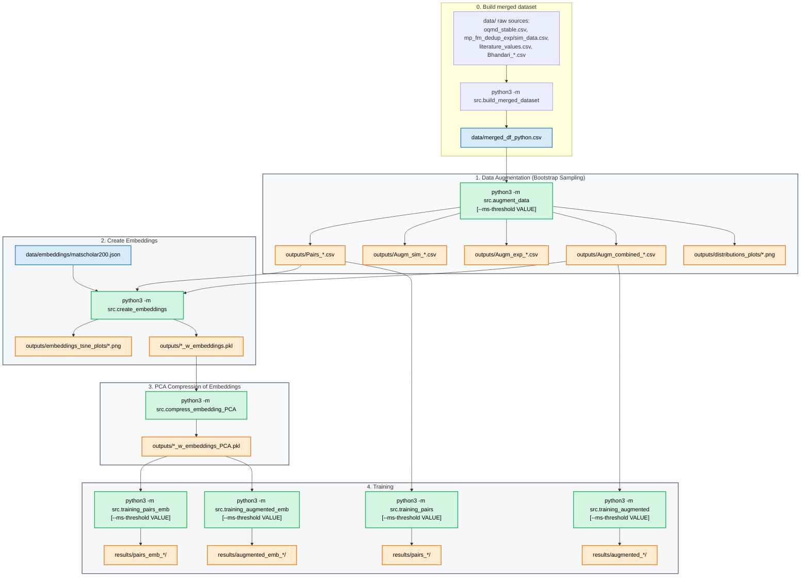

# my_ms

Machine-learning pipeline for correcting DFT-simulated saturation magnetisation (Ms)
values against experimental measurements. Models learn the systematic error between
simulated Ms (A/m) and experimental Ms (A/m) and predict a corrected value.

## Overview

The pipeline runs in the stages below. **Stage 0 must be run first if
`data/merged_df_python.csv` does not already exist** — it builds that merged table from
the raw data sources; every later stage depends on it.


```mermaid
flowchart TB

%% =========================
%% Styles
%% =========================
classDef input   fill:#D6EAF8,stroke:#2E86C1,stroke-width:2px,color:#000;
classDef process fill:#D5F5E3,stroke:#27AE60,stroke-width:2px,color:#000;
classDef output  fill:#FDEBD0,stroke:#E67E22,stroke-width:2px,color:#000;

%% =========================
%% 0. Build merged dataset (run first if the merged CSV is missing)
%% =========================
subgraph cluster_build["0. Build merged dataset"]
    direction TB
    R0["data/ raw sources:\noqmd_stable.csv, mp_fm_dedup_exp/sim_data.csv,\nliterature_values.csv, Bhandari_*.csv"]
    Bb["python3 -m src.build_merged_dataset"]
    R0 --> Bb
    Bb --> A0
end

%% =========================
%% 1. Data Augmentation
%% =========================
subgraph cluster_0["1. Data Augmentation (Bootstrap Sampling)"]
    direction TB
    A0["data/merged_df_python.csv"]
    B0["python3 -m src.augment_data\n[--ms-threshold VALUE]"]
    A0 --> B0
    B0 --> O1["outputs/Pairs_*.csv"]
    B0 --> O2["outputs/Augm_sim_*.csv"]
    B0 --> O3["outputs/Augm_exp_*.csv"]
    B0 --> O4["outputs/Augm_combined_*.csv"]
    B0 --> O5["outputs/distributions_plots/*.png"]
end

%% =========================
%% 2. Create Embeddings
%% =========================
subgraph cluster_1["2. Create Embeddings"]
    direction TB
    A1["data/embeddings/matscholar200.json"]
    B1["python3 -m src.create_embeddings"]
    A1 --> B1
    O1 --> B1
    O4 --> B1
    B1 --> O7["outputs/embeddings_tsne_plots/*.png"]
    B1 --> O8["outputs/*_w_embeddings.pkl"]
end

%% =========================
%% 3. PCA Compression
%% =========================
subgraph cluster_2["3. PCA Compression of Embeddings"]
    direction TB
    B2["python3 -m src.compress_embedding_PCA"]
    O8 --> B2
    B2 --> O10["outputs/*_w_embeddings_PCA.pkl"]
end

%% =========================
%% 4. Training
%% =========================
subgraph cluster_3["4. Training"]
    direction TB
    B3["python3 -m src.training_pairs\n[--ms-threshold VALUE]"]
    B4["python3 -m src.training_augmented\n[--ms-threshold VALUE]"]
    B5["python3 -m src.training_pairs_emb\n[--ms-threshold VALUE]"]
    B6["python3 -m src.training_augmented_emb\n[--ms-threshold VALUE]"]
    O1  --> B3
    O4  --> B4
    O10 --> B5
    O10 --> B6
    B3  --> O11["results/pairs_*/"]
    B4  --> O12["results/augmented_*/"]
    B5  --> O13["results/pairs_emb_*/"]
    B6  --> O14["results/augmented_emb_*/"]
end

%% =========================
%% Apply Classes
%% =========================
class A0,A1 input;
class B0,B1,B2,B3,B4,B5,B6 process;
class O1,O2,O3,O4,O5,O7,O8,O10,O11,O12,O13,O14 output;

style cluster_0 fill:#F8F9FA,stroke:#5D6D7E,stroke-width:2px
style cluster_1 fill:#F4F6F7,stroke:#5D6D7E,stroke-width:2px
style cluster_2 fill:#F8F9FA,stroke:#5D6D7E,stroke-width:2px
style cluster_3 fill:#F4F6F7,stroke:#5D6D7E,stroke-width:2px
```

| Stage | Script | Description |
|---|---|---|
| 0 | `src/build_merged_dataset.py` | Build `data/merged_df_python.csv` from the raw sources (**run first if it does not exist**) |
| 1 | `src/augment_data.py` | Bootstrap augmentation to generate mock Ms_exp / Ms_sim for unpaired rows |
| 2 | `src/create_embeddings.py` | Create 200-D Matscholar compound embeddings |
| 3 | `src/compress_embedding_PCA.py` | Compress embeddings to 8/16/32/64 PCA components |
| 4a | `src/training_pairs.py` | Train on real pairs only, no embeddings |
| 4b | `src/training_augmented.py` | Train on augmented data, no embeddings |
| 4c | `src/training_pairs_emb.py` | Train on real pairs with compound embeddings |
| 4d | `src/training_augmented_emb.py` | Train on augmented data with compound embeddings |

Models trained: Symbolic Regression (PySR), Linear (LASSO / Ridge / OLS), Random Forest, FCNN/MLP.

Datasets: All pairs, RE-only (rare-earth compounds), RE-free.

All models operate in log1p-space; metrics are reported in original A/m space.

## Data

The pipeline reads a single merged table:

```
data/merged_df_python.csv
```

Columns: `composition`, `Ms (ampere/meter)_e` (experimental), `Ms (ampere/meter)_s`
(simulated), `material_id`, `has_rare_earth`.

If this file does not exist yet, build it first from the raw sources in `data/`
(`oqmd_stable.csv`, `mp_fm_dedup_exp/sim_data.csv`, `literature_values.csv`,
`Bhandari_*.csv`):

```
python3 -m src.build_merged_dataset
```

This aggregates the experimental and simulated Ms values, converts every source to
A/m, and reduces duplicate compositions with a single median (see the module docstring
for the per-source unit conversions). It only needs to be re-run when the raw sources
change.

## Usage

### Full pipeline (SLURM)

```bash
sbatch run_1node-RE.sh          # direct target
sbatch run_1node-RE-delta.sh    # delta-learning enabled (see below)
```

To change the Ms threshold for the entire run, edit the `MS_THRESHOLD` variable at the
top of the script:

```bash
MS_THRESHOLD=50000   # default — change here to apply everywhere
```

`run_1node-RE-delta.sh` additionally sets a `DELTA` variable that is appended to every
training step:

```bash
DELTA="--delta-learning"   # set DELTA="" to disable without editing the srun lines
```

### Individual stages

```bash
python3 -m src.build_merged_dataset   # stage 0 — only if data/merged_df_python.csv is missing
python3 -m src.augment_data
python3 -m src.create_embeddings
python3 -m src.compress_embedding_PCA
python3 -m src.training_pairs
python3 -m src.training_pairs_emb
python3 -m src.training_augmented
python3 -m src.training_augmented_emb
```

## Options

### `--ms-threshold VALUE`

Accepted by: `augment_data`, `training_pairs`, `training_augmented`,
`training_pairs_emb`, `training_augmented_emb`.

Drops all rows where `Ms_sim` or `Ms_exp` is at or below `VALUE` (A/m) **before**
any log-space transformation or model training. This removes the low-Ms poor-DFT
regime where simulations are unreliable and which degrades model performance.

| Value | Effect |
|---|---|
| `50000` | Default — matches the filter used in the reference implementation |
| Any positive float | Custom threshold in A/m |
| `0` | Disable filtering entirely (use all data) |

Examples:

```bash
# Default (50,000 A/m threshold)
python3 -m src.training_pairs

# Custom threshold
python3 -m src.training_pairs --ms-threshold 100000

# Disable threshold
python3 -m src.training_pairs --ms-threshold 0
```

The threshold is applied consistently across:
- `DataLoader.load_pairs_data()` and `load_augmented_data()` in `base_trainer.py`
- Pairs, sim-only, and exp-only rows in `augment_data.py`
- PKL-loaded DataFrames in the embedding training scripts

### `--delta-learning`

Accepted by: `training_pairs`, `training_augmented`, `training_pairs_emb`,
`training_augmented_emb`. It is an on/off flag (no value).

When set, models train on the **correction** to the simulation rather than the
experimental value directly:

```
target = log1p(Ms_exp) - log1p(Ms_sim)      # instead of log1p(Ms_exp)
```

The simulation is treated as the baseline and the model only predicts the systematic
deviation from it. Predictions are reconstructed as
`log1p(Ms_sim) + model_output`, and the `log1p(Ms_sim)` baseline is added back
**before** metrics are computed — so reported R²/RMSE/MAE stay in `log1p(Ms_exp)`
space and remain directly comparable to direct-target runs.

Why it helps: `log1p(Ms_exp)` is dominated by `log1p(Ms_sim)` (the simulation is a
good first approximation). Predicting the target directly spends most of the model's
capacity reproducing that trivial identity; subtracting it focuses all capacity on the
element-specific correction — the hard part. This benefits flexible models (MLP,
RandomForest, Symbolic Regression) most, especially on the small, noisy rare-earth
(RE) data. Linear models are mathematically near-invariant to it.

```bash
# Direct target (default)
python3 -m src.training_pairs

# Delta-learning
python3 -m src.training_pairs --delta-learning

# Combine with a threshold
python3 -m src.training_pairs --ms-threshold 50000 --delta-learning
```

Measured effect (test R²): MLP on RE + embeddings improved 0.74 → 0.82, MLP on All +
embeddings 0.83 → 0.89, and Symbolic Regression on RE 0.41 → 0.47. See
`report_improvement_steps_for_results.txt` for the full table. Note: Symbolic
Regression requires PySR installed in the run environment, otherwise its rows are
silently skipped.

### `--re-features`

Accepted by: `training_pairs`, `training_augmented`, `training_pairs_emb`,
`training_augmented_emb`. On/off flag (no value).

Appends rare-earth 4f **physics features** to `X`, computed per composition from a
RE³⁺ Hund's-rules lookup table (`src/re_features.py`) and aggregated over the formula.
For rare-earth compounds the DFT simulation-vs-experiment gap is dominated by the
localized 4f moment, which standard collinear DFT mistreats; these features give the
models a near-first-principles estimate of that correction. RE-free rows get all-zero
features, so the flag is safe for every split.

The seven features:

| Feature | Physics |
|---|---|
| `re_fraction` | total atomic fraction of RE elements |
| `mu_free` | Σ xᵢ·(g_J·J)ᵢ — free-ion saturation moment (magnitude of the correction) |
| `spin_proj` | Σ xᵢ·(g_J−1)·Jᵢ — spin projection (RKKY coupling sign/strength to 3d) |
| `de_gennes` | Σ xᵢ·(g_J−1)²J(J+1)ᵢ — exchange strength |
| `nf_weighted` | Σ xᵢ·n_fᵢ — mean 4f filling |
| `heavy_fraction` | atomic fraction of heavy-RE (n_f ≥ 7) atoms |
| `s_state_fraction` | atomic fraction of **S-state** RE (Gd³⁺, Eu²⁺; half-filled 4f⁷, L=0) |

`s_state_fraction` isolates the two ions (Gd, Eu²⁺) whose large, isotropic,
crystal-field-unquenched **pure-spin** moment collinear DFT misses most — these need
by far the largest correction (mean Δ: Eu +1.4, Gd +0.8; all other REs ~+0.01–0.07).
Because `mu_sat` and `de_gennes` rank Tb/Dy *above or near* Gd/Eu, no single continuous
feature isolates them linearly; the explicit flag does, which helps the linear and
symbolic-regression models in particular.

**Valence note:** Eu is modelled as Eu²⁺ (4f⁷, ~7 μ_B) and Yb as Yb²⁺ (4f¹⁴,
nonmagnetic), not the default trivalent states. The Eu²⁺ choice is well justified
(Eu is commonly divalent and was the largest residual anomaly); the Yb²⁺ choice is
more uncertain (few samples, genuine mixed valence).

```bash
python3 -m src.training_pairs --re-features                  # add RE features
python3 -m src.training_pairs --re-features --delta-learning # recommended combo
```

Measured effect (test R², RE pairs, no embedding, delta target): RandomForest
0.47 → **0.85**, Ridge 0.47 → 0.74 — six-to-seven interpretable physics features match
or beat the 200-D embedding with no embedding at all. Gains are largest for the
non-embedding models; on top of embeddings the headroom is smaller (the embedding
already encodes element identity), though RF + embedding + RE still improved
0.67 → 0.75. The companion diagnostic is `python3 -m src.residual_diagnostic`.

To enable for a full run, the SLURM scripts expose an `RE_FEATURES` variable
(`run_1node-RE-delta.sh` sets it to `--re-features` by default; `run_1node-RE.sh`
leaves it empty). The `s_state_fraction` feature is part of `--re-features` — no
separate flag is needed.

### `--cv N`

Accepted by: `training_pairs`, `training_augmented`, `training_pairs_emb`,
`training_augmented_emb`. `N` = number of folds (≥ 2); `0`/absent = single 80/20 split.

Reports **N-fold cross-validated metrics (mean ± std)** as the headline numbers
instead of a single split. Strongly recommended for the small, noisy **RE** split,
whose single-split R² swings by ±0.02–0.09 between otherwise-identical runs — the
swings that previously masqueraded as improvements/regressions.

Applies to **all five model families**:
- **Linear, RandomForest, LightGBM** — a fresh clone of the tuned model is refit on
  each fold (`cross_val_report`).
- **MLP** — a fresh network is trained per fold; early stopping uses a validation
  split carved from the fold's *training* data, so the held-out fold stays unseen.
- **Symbolic Regression** — a fresh symbolic search runs per fold. **This is slow**
  (N × the full SR cost); the per-fold train is subsampled (`max_train_samples`) as
  in the single-split path.

Single-split is still computed (it drives the prediction plot and, for SR, the
reported equation); CV means become the headline R²/RMSE/MAE and an `*_std` is added.

```bash
python3 -m src.training_pairs --cv 5 --delta-learning --re-features   # recommended
python3 -m src.training_pairs                                          # single split (default)
```

The SLURM scripts expose a `CV` variable (`run_1node-RE-delta.sh` sets `--cv 5`).

## Outputs

| Path | Contents |
|---|---|
| `outputs/Pairs_*.csv` | Original paired rows (per dataset split) |
| `outputs/Augm_sim_*.csv` | Phase 1 augmented (sim-only → mock exp) |
| `outputs/Augm_exp_*.csv` | Phase 2 augmented (exp-only → mock sim) |
| `outputs/Augm_combined_*.csv` | Phase 3 combined augmented dataset |
| `outputs/*.pkl` | DataFrames with compound embeddings |
| `results/` | Model comparison CSVs and prediction plots |
| `logs/` | Per-stage stdout logs |

## Source layout

```
src/
├── build_merged_dataset.py    Stage 0: build data/merged_df_python.csv from raw sources
├── augment_data.py            Bootstrap augmentation
├── create_embeddings.py       Matscholar200 compound embeddings
├── compress_embedding_PCA.py  PCA compression of embeddings
├── composition_data.py        Composition parsing utilities
├── log_to_file.py             Stdout-to-file logging decorator
├── training_pairs.py          Entry point: pairs, no embeddings
├── training_augmented.py      Entry point: augmented, no embeddings
├── training_pairs_emb.py      Entry point: pairs + embeddings
├── training_augmented_emb.py  Entry point: augmented + embeddings
└── training/
    ├── base_trainer.py        DataLoader, ModelEvaluator, split_data
    ├── fcnn_mlp.py            FCNN/MLP trainer
    ├── linear_models.py       LASSO / Ridge / OLS trainer
    ├── random_forest.py       Random Forest trainer
    └── symbolic_regression.py PySR trainer
```
