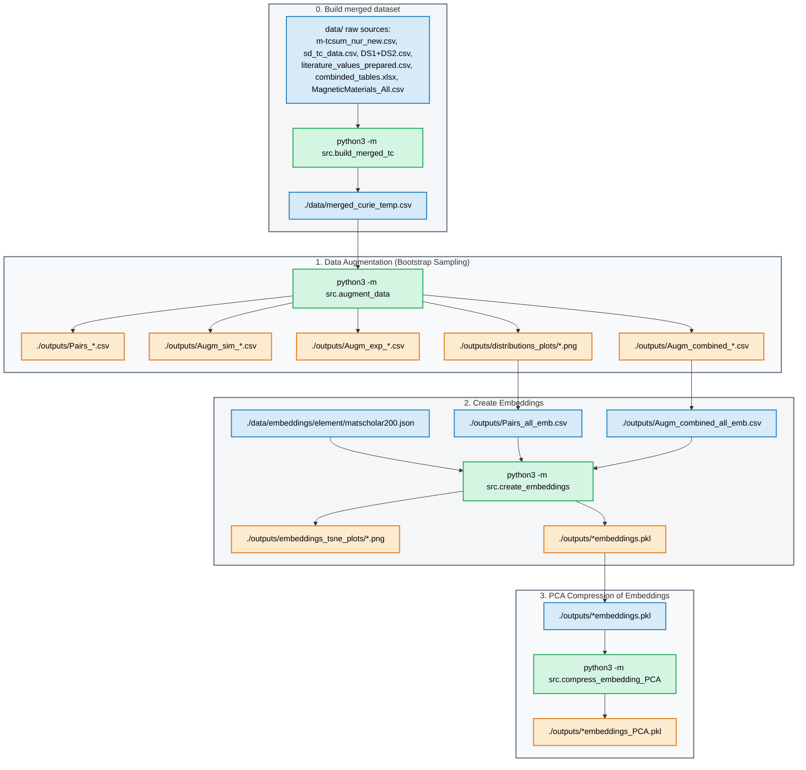

python3
# ML model for systematic errors between simulations and experimental measurements of the Curie temperature

This codebase implements various machine learning models to predict experimental Curie temperatures from simulated values. Additionally, chemical property information is incorporated via an embedding representation. 

## Current version of model
v0.2


## 0. Installation
Use requirements.txt. In addition pytorch, compatible with your system, must be installed
- PyTorch (version matching your hardware, see: https://pytorch.org/get-started/locally/)

### ONNX export/prediction (optional)
The ONNX export (during training) and `src/predict_tc.py` need three extra packages. They are
**included in `requirements.txt`** (pinned), so `pip install -r requirements.txt` covers them;
to add them to an existing environment:

```
pip install skl2onnx onnxmltools onnxruntime
```

- `skl2onnx` — export the Linear / Random Forest models (and, with `onnxmltools` registered,
  LightGBM) to ONNX.
- `onnxmltools` — provides the LightGBM→ONNX converter. If missing, **LightGBM** export is
  skipped (other families still export).
- `onnxruntime` — load and run the `.onnx` models in `src/predict_tc.py`.

If none of these are installed, training still completes — ONNX export is simply skipped with a
message (see §5). MLP export additionally uses `torch.onnx` (already covered by PyTorch above).
Verified with `skl2onnx` 1.20, `onnxmltools` 1.16, `onnxruntime` 1.26.

## Running the full pipeline

End-to-end, in order, from the project root (each stage is documented in its own section below):

```
# Stage 0–3 : data preparation
python3 -m src.build_merged_tc          # §0 -> data/merged_curie_temp.csv (reduced-formula dedup)
python3 -m src.augment_data             # §1 -> outputs/Pairs_*, Augm_*
python3 -m src.create_embeddings        # §2 -> outputs/*_w_embeddings.pkl
python3 -m src.compress_embedding_PCA   # §3 -> outputs/*_w_embeddings_PCA.pkl

# Stage 4 : training (config-driven, see §4.0; also exports ONNX, see §5.1)
python3 -m src.training_original
python3 -m src.training_original_emb
python3 -m src.training_augmented
python3 -m src.training_augmented_emb

# Stage 5 : prediction (see §5.2)
python3 -m src.predict_tc --compound Nd2Fe14B --tc-sim 550
```

On the cluster, the SLURM scripts run the whole chain (stages 0–4) in one job:
- **`run_1node-RE.sh`** — uses the default `training_config.yaml`.
- **`run_1node-RE-delta-learning.sh`** — the delta-learning experiment (`--config training_config.delta.yaml`).

Both start from `build_merged_tc` and use `set -e`, so a failing stage aborts the job instead of
silently training on stale intermediates. Model selection and the `delta_learning` / `re_features`
/ `cv` options are read from the config file (§4.0) — no CLI flags needed.

# Data Processing



```mermaid
flowchart TB

%% =========================
%% Styles
%% =========================
classDef input fill:#D6EAF8,stroke:#2E86C1,stroke-width:2px,color:#000;
classDef process fill:#D5F5E3,stroke:#27AE60,stroke-width:2px,color:#000;
classDef output fill:#FDEBD0,stroke:#E67E22,stroke-width:2px,color:#000;

%% =========================
%% 0. Build merged dataset (run first if the merged CSV is missing)
%% =========================
subgraph cluster_build["0. Build merged dataset"]
    direction TB

    R0["data/ raw sources:\nm-tcsum_nur_new.csv, sd_tc_data.csv, DS1+DS2.csv,\nliterature_values_prepared.csv, combinded_tables.xlsx, MagneticMaterials_All.csv"]
    Bb["python3 -m src.build_merged_tc"]

    R0 --> Bb
    Bb --> A0
end

%% =========================
%% 1. Data Augmentation
%% =========================
subgraph cluster_0["1. Data Augmentation (Bootstrap Sampling)"]
    direction TB

    A0["./data/merged_curie_temp.csv"]
    B0["python3 -m src.augment_data"]

    A0 --> B0

    B0 --> O1["./outputs/Pairs_*.csv"]
    B0 --> O2["./outputs/Augm_sim_*.csv"]
    B0 --> O3["./outputs/Augm_exp_*.csv"]
    B0 --> O4["./outputs/Augm_combined_*.csv"]
    B0 --> O5["./outputs/distributions_plots/*.png"]
end

%% =========================
%% 2. Create Embeddings
%% =========================
subgraph cluster_1["2. Create Embeddings"]
    direction TB

    A1["./data/embeddings/element/matscholar200.json"]
    A2["./outputs/Pairs_all_emb.csv"]
    A3["./outputs/Augm_combined_all_emb.csv"]

    B1["python3 -m src.create_embeddings"]

    A1 --> B1
    A2 --> B1
    A3 --> B1

    B1 --> O7["./outputs/embeddings_tsne_plots/*.png"]
    B1 --> O8["./outputs/*embeddings.pkl"]
end

%% =========================
%% 3. PCA Compression
%% =========================
subgraph cluster_2["3. PCA Compression of Embeddings"]
    direction TB

    A4["./outputs/*embeddings.pkl"]
    B2["python3 -m src.compress_embedding_PCA"]

    A4 --> B2

    B2 --> O10["./outputs/*embeddings_PCA.pkl"]
end

%% =========================
%% Pipeline Flow
%% =========================
O5 --> A2
O4 --> A3
O8 --> A4

%% =========================
%% Apply Classes
%% =========================
class A0,A1,A2,A3,A4,R0 input;
class B0,B1,B2,Bb process;
class O1,O2,O3,O4,O5,O7,O8,O10 output;

%% =========================
%% Subgraph Styling
%% =========================
style cluster_build fill:#F4F6F7,stroke:#5D6D7E,stroke-width:2px
style cluster_0 fill:#F8F9FA,stroke:#5D6D7E,stroke-width:2px
style cluster_1 fill:#F4F6F7,stroke:#5D6D7E,stroke-width:2px
style cluster_2 fill:#F8F9FA,stroke:#5D6D7E,stroke-width:2px
```

## 0. Build merged dataset

Aggregates the experimental and simulated Curie temperatures from the raw sources into a
single lean training table, `./data/merged_curie_temp.csv`. **Run this first if that file
does not exist** (or when the raw sources change); every later stage depends on it.

For each composition, all simulated (resp. experimental) Tc values from every source are
pooled and reduced with a **single median** (one median, every source included — not a
per-source pre-average and not a median-of-medians).

Run:

```
python3 -m src.build_merged_tc
```

NEEDS (in `./data/`):
- m-tcsum_nur_new.csv, sd_tc_data.csv, DS1+DS2.csv
- literature_values_prepared.csv, combinded_tables.xlsx, MagneticMaterials_All.csv

OUTPUT — `./data/merged_curie_temp.csv`, a plain CSV with columns:
```
composition, Tc_sim, Tc_exp, contains_rare_earth, use_for_emb
```
(`Tc_delta = Tc_exp − Tc_sim` and `pair_exists = both present` are derived downstream.)

## 1. Data augmentation

Executing the code below performs data augmentation on missing experimental values using bootstrap sampling.

Run:

```
python3 -m src.augment_data
```

NEEDS:

- ./data/merged_curie_temp.csv


OUTPUT:
```
- stdout
- ./outputs/Pairs_all.csv
- ./outputs/Pairs_RE.csv
- ./outputs/Pairs_RE_Free.csv
- ./outputs/Pairs_all_emb.csv
- ./outputs/Pairs_RE_emb.csv
- ./outputs/Pairs_RE_Free_emb.csv
- ./outputs/Augm_sim_all.csv          # Phase 1: paired + Tc_sim-only (mock Tc_exp)
- ./outputs/Augm_sim_RE.csv
- ./outputs/Augm_sim_RE_Free.csv
- ./outputs/Augm_sim_all_emb.csv
- ./outputs/Augm_sim_RE_emb.csv
- ./outputs/Augm_sim_RE_Free_emb.csv
- ./outputs/Augm_exp_all.csv          # Phase 2: paired + Tc_exp-only (mock Tc_sim)
- ./outputs/Augm_exp_RE.csv
- ./outputs/Augm_exp_RE_Free.csv
- ./outputs/Augm_exp_all_emb.csv
- ./outputs/Augm_exp_RE_emb.csv
- ./outputs/Augm_exp_RE_Free_emb.csv
- ./outputs/Augm_combined_all.csv     # Phase 3: Phase 1 + Phase 2 (used for training)
- ./outputs/Augm_combined_RE.csv
- ./outputs/Augm_combined_RE_Free.csv
- ./outputs/Augm_combined_all_emb.csv
- ./outputs/Augm_combined_RE_emb.csv
- ./outputs/Augm_combined_RE_Free_emb.csv
- ./outputs/distributions_plots/*.png
```

## 2. Creation of embeddings

Stoichiometric embeddings are created from the Matscholar200 embeddings
using an element-abundance weighted sum approach. For example:
    H2O embedding = 2 × [H embedding] + 1 × [O embedding]

Run:

```
python3 -m src.create_embeddings
```

NEEDS:
- ./data/embeddings/element/matscholar200.json
- ./outputs/Pairs_all_emb.csv
- ./outputs/Pairs_RE_emb.csv
- ./outputs/Pairs_RE_Free_emb.csv
- ./outputs/Augm_combined_all_emb.csv  (required)
- ./outputs/Augm_combined_RE_emb.csv   (required)
- ./outputs/Augm_combined_RE_Free_emb.csv  (required)
- ./outputs/Augm_exp_all_emb.csv       (optional, processed when present)
- ./outputs/Augm_exp_RE_emb.csv        (optional)
- ./outputs/Augm_exp_RE_Free_emb.csv   (optional)
- ./outputs/Augm_sim_all_emb.csv       (optional)
- ./outputs/Augm_sim_RE_emb.csv        (optional)
- ./outputs/Augm_sim_RE_Free_emb.csv   (optional)

OUTPUT:
```
- stdout
- ./outputs/embeddings_tsne_plots/*.png
- ./outputs/*embeddings.pkl
```

## 3. Compress embeddings with PCA
Create PCA-compressed embeddings for the paired Curie temperature dataset.
It computes PCA components of sizes 8, 16, 32, and 64 to ensure they are available
for the training scripts.

Run:

```
python3 -m src.compress_embedding_PCA
```

NEEDS:
- ./outputs/*embeddings.pkl

OUTPUT:
```
- stdout
- ./outputs/*embeddings_PCA.pkl
```
# Modeling

## 4. Model Training

Train baseline models on original (non-augmented, non-embedding) data. Namely, 

· Symbolic regression: stoichiometry was disregarded
· LASSO regression,
· RIDGE regression,
· Random Forest,
· LightGBM (gradient-boosted trees),
· FCNN.

The materials dataset is evaluated separately for RE and RE-free samples to account
for potential differences in data distribution and model behavior. Experiments on the
combined (“All”) dataset are included as a global baseline to assess generalization.

## 4.0 Training configuration (`training_config.yaml`)

All four training scripts (`training_original[_emb].py`, `training_augmented[_emb].py`)
read a single config file at the project root, so a run is fully reproducible from one
file and the SLURM scripts need no arguments. It controls the three options that used to
be CLI flags **and** which model families are trained:

```yaml
delta_learning: false   # train on the correction (Tc_exp - Tc_sim); was --delta-learning
re_features:    false   # append 7 rare-earth physics features;        was --re-features
cv:             0        # K-fold CV for headline metrics (0 = single split); was --cv N

models:                 # switch individual families on/off (faster turnaround)
  sr:     {enabled: false}   # Symbolic Regression (PySR) — slowest by far
  linear: {enabled: true}    # LASSO / Ridge / LinearRegression
  rf:     {enabled: true}    # Random Forest
  lgbm:   {enabled: true}    # LightGBM
  mlp:    {enabled: false}   # FCNN / PyTorch MLP — slow
```

**Shipped default** disables the two slow families (`sr`, `mlp`) and keeps the three fast
ones (`linear`, `rf`, `lgbm`). On the latest full run the ranking is **consistent across RE and
RE-free** — LightGBM > MLP ≈ RF > Linear > SR, all within ~0.01 R² — so the accuracy top-3 is
`{LightGBM, MLP, RandomForest}` for both (no RE vs RE-free conflict). Since MLP is slow and beats
Linear by only ~0.001 R², the shipped config swaps **MLP → Linear**: three fast families at a
negligible accuracy cost. Re-enable any family by flipping `enabled: true` (a missing key defaults
to enabled) — e.g. set `mlp`/`sr` true for a full five-family comparison run.

Overrides:
- A CLI flag still wins if explicitly passed, e.g. `python3 -m src.training_original --delta-learning`.
- `--config PATH` selects a different YAML. The delta-learning experiment lives in
  `training_config.delta.yaml` (`delta_learning: true`, `re_features: true`, `cv: 5`) and is
  launched by `run_1node-RE-delta-learning.sh` via `--config training_config.delta.yaml`.

## 4.1 Orginal dataset

Run:

```
python3 -m src.training_original
```

NEEDS:
- ./outputs/Pairs_all.csv
- ./outputs/Pairs_RE.csv
- ./outputs/Pairs_RE_Free.csv

OUTPUT:
```
- stdout
- ./results/figures/All-Pairs_*_no_emb.png
- ./results/figures/RE-Pairs_*_no_emb.png
- ./results/figures/RE-Free-Pairs_*_no_emb.png
- ./results/original_[model]
- ./results/original_comparison/*.csv
```

## 4.2 Orginal dataset with stoichiometric embedding
Train models on original data with stoichiometric embeddings as additional input to the simulate value.

Run:

```
python3 -m src.training_original_emb
```

NEEDS:
- ./outputs/Pairs_RE_Free_emb.csv
- ./outputs/Pairs_RE_emb.csv
- ./outputs/Pairs_all_emb.csv
- ./outputs/Pairs_RE_Free_emb_w_embeddings.pkl
- ./outputs/Pairs_RE_Free_emb_w_embeddings_PCA.pkl
- ./outputs/Pairs_RE_emb_w_embeddings.pkl
- ./outputs/Pairs_RE_emb_w_embeddings_PCA.pkl
- ./outputs/Pairs_all_emb_w_embeddings.pkl
- ./outputs/Pairs_all_emb_w_embeddings_PCA.pkl


OUTPUT:
```
- stdout
- ./results/original_emb_[model]
- ./results/original_emb_comparison/*.csv
- ./results/figures/All-Pairs_[model]_[None|pca_*].png
- ./results/figures/RE_Pairs_[model]_[None|pca_*].png
```

## 4.3 Augmented dataset

Train baseline models on augmented data (no embeddings).

Run:

```
python3 -m src.training_augmented
```

NEEDS:
- ./outputs/Augm_exp_all.csv
- ./outputs/Augm_exp_RE.csv
- ./outputs/Augm_exp_RE_Free.csv
- ./outputs/Augm_sim_all.csv
- ./outputs/Augm_sim_RE.csv
- ./outputs/Augm_sim_RE_Free.csv
- ./outputs/Augm_combined_all.csv
- ./outputs/Augm_combined_RE.csv
- ./outputs/Augm_combined_RE_Free.csv

OUTPUT:
```
- stdout
- ./results/augmented_[model]/{variant}/      (variant: exp_augmented, sim_augmented, combined_augmented)
- ./results/figures/{variant}/[All|RE|RE-Free]-Augm_*_no_emb.png
- ./results/figures/{variant}/[All|RE|RE-Free]-Augm_SR.png
- ./results/augmented_comparison/{variant}/augmented_models_comparison.csv
- ./results/augmented_comparison/{variant}/augmented_best_by_dataset.csv
- ./results/augmented_comparison/{variant}/augmented_comparison_pivot.csv
- ./results/augmented_comparison/augmented_all_variants_comparison.csv
- ./results/augmented_comparison/augmented_all_variants_best.csv
- ./results/augmented_comparison/augmented_cross_variant_pivot.csv
```


## 4.4 Augmented dataset with stoichiometry embedding
Train models on augmented data WITH EMBEDDINGS.

Run:

```
python3 -m src.training_augmented_emb
```

NEEDS:
- ./outputs/Augm_exp_all_emb_w_embeddings[_PCA].pkl
- ./outputs/Augm_exp_RE_emb_w_embeddings[_PCA].pkl
- ./outputs/Augm_exp_RE_Free_emb_w_embeddings[_PCA].pkl
- ./outputs/Augm_sim_all_emb_w_embeddings[_PCA].pkl
- ./outputs/Augm_sim_RE_emb_w_embeddings[_PCA].pkl
- ./outputs/Augm_sim_RE_Free_emb_w_embeddings[_PCA].pkl
- ./outputs/Augm_combined_all_emb_w_embeddings[_PCA].pkl
- ./outputs/Augm_combined_RE_emb_w_embeddings[_PCA].pkl
- ./outputs/Augm_combined_RE_Free_emb_w_embeddings[_PCA].pkl

(For each file the _PCA.pkl variant is preferred; plain .pkl is used as fallback.)

OUTPUT:
```
- stdout
- ./results/augmented_emb_[model]/{variant}/      (variant: exp_augmented, sim_augmented, combined_augmented)
- ./results/figures/{variant}/[All|RE|RE-Free]-Augm_[model]_[None|pca_*].png
- ./results/augmented_emb_comparison/{variant}/augmented_emb_models_comparison.csv
- ./results/augmented_emb_comparison/{variant}/augmented_emb_best_by_dataset.csv
- ./results/augmented_emb_comparison/{variant}/augmented_emb_comparison_pivot.csv
- ./results/augmented_emb_comparison/augmented_emb_all_variants_comparison.csv
- ./results/augmented_emb_comparison/augmented_emb_all_variants_best.csv
- ./results/augmented_emb_comparison/augmented_emb_cross_variant_pivot.csv
```
## 5. ONNX export & prediction

### 5.1 ONNX export (automatic during training)

While the embedding training scripts (`training_original_emb.py`, `training_augmented_emb.py`)
run, each trained **raw-200D** model is exported to ONNX under `results/onnx_models/`. This
happens automatically — no extra step — and never breaks training (export failures are caught
and reported).

- **Families exported:** Linear, Random Forest, LightGBM, MLP. **Symbolic Regression is not
  exported** (a symbolic expression is not a tensor graph).
- **Only the raw-200D variant is exported.** The PCA variants use an *offline* PCA
  (`compress_embedding_PCA.py`) whose fitted object is not persisted, and the no-embedding
  models ignore the composition — neither can be served from a formula. Raw-200D is the only
  servable variant.
- **Requires** `skl2onnx`, `onnxmltools` (for LightGBM) and `onnxruntime` in the environment;
  if absent, export is skipped with a message and training still completes.
- **Each ONNX encodes the full input** `X = [embedding(200) | RE-features(7)? | Tc_sim(1)]`,
  with any `StandardScaler` (Linear/MLP) bundled in. File names:

  ```
  <Dataset>[_<augvariant>]_<family>[_refeats][_delta].onnx
  e.g.  RE-Augm_combined_augmented_lgbm.onnx
        RE-Free-Pairs_rf_refeats_delta.onnx
  ```
  `_refeats` = trained with `re_features:true` (input is 207+1 D); `_delta` = trained with
  `delta_learning:true` (the model outputs the correction `Tc_exp - Tc_sim`, so the predictor
  adds `Tc_sim` back).

### 5.2 Prediction — `src/predict_tc.py`

Predicts the (corrected) **experimental** Curie temperature `Tc_exp` for a compound from the
ONNX models in `results/onnx_models/`. Because this is the sim→exp **correction** model — not a
direct compound→Tc predictor — you must supply **both** the chemical formula **and its simulated
Curie temperature** `Tc_sim` (the models take `Tc_sim` as their last input feature). There is no
way to correct a simulated value you don't provide.

**Run:**

```
# Run every model matching the compound's chemistry and tabulate the results:
python -m src.predict_tc --compound Nd2Fe14B --tc-sim 550

# Or run one specific model:
python -m src.predict_tc --compound Fe3Pt --tc-sim 420 \
    --model results/onnx_models/RE-Free-Augm_combined_augmented_lgbm.onnx
```

**Arguments:**

| Flag | Required | Description |
|------|----------|-------------|
| `--compound` | yes | Chemical formula, e.g. `Nd2Fe14B`. |
| `--tc-sim`   | yes | Simulated Curie temperature `Tc_sim` [K] for this compound (the model input). |
| `--model`    | no  | Path to a single `.onnx` model. Omit to run **all** chemistry-matching models. |

**How it works:** it computes the 200-D matscholar200 embedding, appends the 7 RE features **iff**
the model file is `_refeats`, appends `Tc_sim` **last**, runs the ONNX, and — for `_delta` models —
adds `Tc_sim` back to turn the predicted correction into `Tc_exp`. With no `--model`, it routes by
chemistry: **RE** compounds → `RE-*` models, **RE-free** → `RE-Free-*`; `All-*` models always apply.

**NEEDS:**
- `data/embeddings/element/matscholar200.json` (element embeddings)
- `src/re_features.py` (the same RE-feature module the trainer used)
- `results/onnx_models/*.onnx` (produced by the embedding training scripts, §5.1)
- `onnxruntime` + `pymatgen` installed (see §0)

**OUTPUT:** a table on stdout, one row per model, e.g.:

```
Compound : Nd2Fe14B   (RE)
Tc_sim   : 550.0 K   ->  predicted Tc_exp:
------------------------------------------------------------------------
model (onnx)                                              Tc_exp [K]
------------------------------------------------------------------------
RE-Augm_combined_augmented_lgbm.onnx                          585.3
RE-Augm_combined_augmented_rf.onnx                            578.1
All-Augm_combined_augmented_lgbm.onnx                         590.7
------------------------------------------------------------------------
```

## 📈 Model Performance Comparison

**Best model per dataset** from the latest full run — the delta-learning experiment
(`training_config.delta.yaml`: `delta_learning:true`, `re_features:true`, `cv:5`), fast-trio
families (LightGBM / Random Forest / Linear). R², RMSE and MAE are **5-fold cross-validated
means** (reduced-formula-deduplicated data). `Aug` = augmentation variant for the augmented sets.

| Dataset         | Best model    | Embedding | Aug     | R²     | RMSE [K] | MAE [K] |
|-----------------|---------------|-----------|---------|--------|----------|---------|
| All-Pairs       | LightGBM      | pca_16    | —       | 0.850  | 91.0     | 41.4    |
| All-Augm        | LightGBM      | raw_200D  | Tc_exp  | 0.940  | 65.9     | 32.3    |
| RE-Pairs        | Linear        | pca_8     | —       | 0.882  | 59.5     | 21.2    |
| RE-Augm         | LightGBM      | pca_8     | Tc_exp  | 0.977  | 41.2     | 15.9    |
| RE-Free-Pairs   | LightGBM      | pca_8     | —       | 0.777  | 126.3    | 73.3    |
| RE-Free-Augm    | LightGBM      | raw_200D  | Tc_exp  | 0.867  | 95.8     | 55.4    |

> The **RE** and **augmented** datasets are the strongest (RE-Augm R² ≈ 0.98); the small raw
> **RE-Free-Pairs** set is the hardest. Numbers are lower than pre-deduplication because the
> reduced-formula dedup removed duplicate-spelling train/test leakage — see `dedup_result.txt`.
> To reproduce the baseline (non-delta) numbers instead, run with the default `training_config.yaml`.

## Pairs Dataset

| Model Family           | Model    | Dataset           |        R² |        RMSE |        MAE |
| ---------------------- | -------- | ----------------- | --------: | ----------: | ---------: |
| **MLP**                | **FCNN** | **All-Pairs**     | **0.903** |  **80.329** | **39.713** |
| Linear                 | LINEAR   | All-Pairs         |     0.900 |      81.421 |     42.591 |
| SymbolicRegression     | PySR     | All-Pairs         |     0.899 |      82.129 |     40.881 |
| RandomForest           | RF       | All-Pairs         |     0.868 |      93.660 |     45.136 |
| LightGBM               | LGBM     | All-Pairs         |     0.868 |      93.678 |     43.685 |
| **SymbolicRegression** | **PySR** | **RE-Pairs**      | **0.942** |  **42.234** | **17.870** |
| Linear                 | LINEAR   | RE-Pairs          |     0.941 |      42.574 |     20.014 |
| LightGBM               | LGBM     | RE-Pairs          |     0.941 |      42.647 |     19.958 |
| RandomForest           | RF       | RE-Pairs          |     0.940 |      42.683 |     19.719 |
| MLP                    | FCNN     | RE-Pairs          |     0.940 |      42.719 |     22.435 |
| **MLP**                | **FCNN** | **RE-Free-Pairs** | **0.695** | **136.134** | **78.405** |
| Linear                 | LASSO    | RE-Free-Pairs     |     0.687 |     137.843 |     79.129 |
| LightGBM               | LGBM     | RE-Free-Pairs     |     0.684 |     138.545 |     84.291 |
| RandomForest           | RF       | RE-Free-Pairs     |     0.682 |     138.968 |     83.949 |
| SymbolicRegression     | PySR     | RE-Free-Pairs     |     0.682 |     139.021 |     78.484 |


## Pairs Dataset - with Embedding

| Model Family | Model     | Dataset           | Embedding |         R² |        RMSE |         MAE |
| ------------ | --------- | ----------------- | --------- | ---------: | ----------: | ----------: |
| **MLP**      | **FCNN**  | **All-Pairs**     | pca_8     |  **0.910** |  **75.820** |  **41.558** |
| Linear       | RIDGE     | All-Pairs         | pca_16    |      0.908 |      76.728 |      44.233 |
| Linear       | RIDGE     | All-Pairs         | pca_8     |      0.907 |      77.025 |      44.340 |
| Linear       | LASSO     | All-Pairs         | pca_16    |      0.907 |      77.034 |      45.078 |
| Linear       | LASSO     | All-Pairs         | pca_32    |      0.904 |      78.561 |      46.745 |
| Linear       | RIDGE     | All-Pairs         | raw_200D  |      0.900 |      79.902 |      48.794 |
| Linear       | RIDGE     | All-Pairs         | pca_64    |      0.899 |      80.486 |      49.818 |
| MLP          | FCNN      | All-Pairs         | raw_200D  |      0.898 |      80.882 |      51.269 |
| RandomForest | RF        | All-Pairs         | pca_32    |      0.897 |      81.436 |      38.378 |
| RandomForest | RF        | All-Pairs         | pca_8     |      0.896 |      81.498 |      39.872 |
| RandomForest | RF        | All-Pairs         | pca_64    |      0.897 |      81.136 |      38.663 |
| RandomForest | RF        | All-Pairs         | pca_16    |      0.893 |      82.648 |      39.377 |
| LightGBM     | LGBM      | All-Pairs         | pca_64    |      0.888 |      84.880 |      44.196 |
| LightGBM     | LGBM      | All-Pairs         | raw_200D  |      0.888 |      84.916 |      45.208 |
| LightGBM     | LGBM      | All-Pairs         | pca_8     |      0.887 |      85.217 |      45.883 |
| LightGBM     | LGBM      | All-Pairs         | pca_16    |      0.882 |      86.929 |      43.428 |
| LightGBM     | LGBM      | All-Pairs         | pca_32    |      0.878 |      88.486 |      43.720 |
| **Linear**   | **LASSO** | **RE-Pairs**      | pca_8     |  **0.930** |  **49.226** |      27.318 |
| RandomForest | RF        | RE-Pairs          | pca_8     |      0.929 |      49.334 |      23.823 |
| Linear       | RIDGE     | RE-Pairs          | pca_8     |      0.926 |      50.555 |  **22.848** |
| Linear       | LASSO     | RE-Pairs          | raw_200D  |      0.923 |      51.529 |      26.436 |
| Linear       | LASSO     | RE-Pairs          | pca_16    |      0.922 |      51.727 |      26.807 |
| Linear       | LASSO     | RE-Pairs          | pca_32    |      0.922 |      51.727 |      26.807 |
| Linear       | LASSO     | RE-Pairs          | pca_64    |      0.922 |      51.727 |      26.807 |
| RandomForest | RF        | RE-Pairs          | raw_200D  |      0.918 |      53.181 |  **21.413** |
| RandomForest | RF        | RE-Pairs          | pca_32    |      0.911 |      55.442 |      23.351 |
| LightGBM     | LGBM      | RE-Pairs          | raw_200D  |      0.910 |      55.702 |      26.361 |
| MLP          | FCNN      | RE-Pairs          | pca_16    |      0.908 |      56.201 |      31.016 |
| RandomForest | RF        | RE-Pairs          | pca_64    |      0.901 |      58.387 |      23.472 |
| RandomForest | RF        | RE-Pairs          | pca_16    |      0.898 |      59.252 |      23.029 |
| MLP          | FCNN      | RE-Pairs          | pca_32    |      0.888 |      62.174 |      35.820 |
| LightGBM     | LGBM      | RE-Pairs          | pca_8     |      0.881 |      64.056 |      26.465 |
| LightGBM     | LGBM      | RE-Pairs          | pca_16    |      0.880 |      64.301 |      26.109 |
| LightGBM     | LGBM      | RE-Pairs          | pca_32    |      0.879 |      64.648 |      25.940 |
| LightGBM     | LGBM      | RE-Pairs          | pca_64    |      0.877 |      65.037 |      26.518 |
| MLP          | FCNN      | RE-Pairs          | raw_200D  |      0.849 |      72.066 |      38.395 |
| MLP          | FCNN      | RE-Pairs          | pca_64    |      0.835 |      75.428 |      43.306 |
| **Linear**   | **RIDGE** | **RE-Free-Pairs** | pca_16    |  **0.877** | **107.372** |      76.074 |
| Linear       | RIDGE     | RE-Free-Pairs     | pca_8     |      0.871 |     110.085 |      78.414 |
| Linear       | LASSO     | RE-Free-Pairs     | raw_200D  |      0.862 |     113.562 |      81.659 |
| MLP          | FCNN      | RE-Free-Pairs     | pca_8     |      0.863 |     113.384 |      81.208 |
| Linear       | LASSO     | RE-Free-Pairs     | pca_32    |      0.859 |     115.096 |      80.480 |
| Linear       | LASSO     | RE-Free-Pairs     | pca_64    |      0.856 |     116.096 |      81.771 |
| MLP          | FCNN      | RE-Free-Pairs     | raw_200D  |      0.850 |     118.423 |      83.802 |
| MLP          | FCNN      | RE-Free-Pairs     | pca_16    |      0.851 |     118.037 |      87.514 |
| MLP          | FCNN      | RE-Free-Pairs     | pca_32    |      0.841 |     122.186 |      86.673 |
| LightGBM     | LGBM      | RE-Free-Pairs     | pca_16    |      0.825 |     127.940 |      83.234 |
| LightGBM     | LGBM      | RE-Free-Pairs     | pca_32    |      0.813 |     132.475 |      82.410 |
| RandomForest | RF        | RE-Free-Pairs     | pca_32    |      0.825 |     128.173 |      70.328 |
| RandomForest | RF        | RE-Free-Pairs     | pca_8     |      0.828 |     127.073 |      72.827 |
| RandomForest | RF        | RE-Free-Pairs     | raw_200D  |      0.823 |     128.770 |      73.269 |
| RandomForest | RF        | RE-Free-Pairs     | pca_64    |      0.819 |     130.105 |      73.963 |
| RandomForest | RF        | RE-Free-Pairs     | pca_16    |      0.814 |     132.190 |      74.495 |
| LightGBM     | LGBM      | RE-Free-Pairs     | raw_200D  |      0.825 |     128.238 |      80.400 |
| LightGBM     | LGBM      | RE-Free-Pairs     | pca_8     |      0.820 |     129.994 |      82.594 |
| LightGBM     | LGBM      | RE-Free-Pairs     | pca_64    |      0.806 |     134.787 |      84.331 |
| MLP          | FCNN      | RE-Free-Pairs     | pca_64    |     -0.11  |     322.646 |     148.864 |


# Augmented Dataset

| Augmentation                         | Dataset      | Model    | R2        |        RMSE |        MAE |
| ------------------------------------ | ------------ | -------- | --------- | ----------: | ---------: |
| Combined (Tc_exp + Tc_sim) augmented | All-Augm     | **FCNN** | **0.896** |  **89.022** | **40.373** |
| Combined (Tc_exp + Tc_sim) augmented | All-Augm     | RIDGE    | 0.893     |      90.197 |     43.376 |
| Combined (Tc_exp + Tc_sim) augmented | All-Augm     | PySR     | 0.892     |      90.969 |     43.692 |
| Combined (Tc_exp + Tc_sim) augmented | All-Augm     | LGBM     | 0.890     |      91.709 |     41.443 |
| Combined (Tc_exp + Tc_sim) augmented | All-Augm     | RF       | 0.885     |      93.684 |     44.388 |
| Combined (Tc_exp + Tc_sim) augmented | RE-Augm      | **FCNN** | **0.964** |  **52.442** | **16.742** |
| Combined (Tc_exp + Tc_sim) augmented | RE-Augm      | LGBM     | 0.962     |      54.001 |     17.458 |
| Combined (Tc_exp + Tc_sim) augmented | RE-Augm      | RF       | 0.958     |      56.833 |     18.999 |
| Combined (Tc_exp + Tc_sim) augmented | RE-Augm      | PySR     | 0.955     |      58.709 |     17.950 |
| Combined (Tc_exp + Tc_sim) augmented | RE-Augm      | LASSO    | 0.953     |      60.478 |     18.224 |
| Combined (Tc_exp + Tc_sim) augmented | RE-Free-Augm | **FCNN** | **0.821** | **117.924** |     72.514 |
| Combined (Tc_exp + Tc_sim) augmented | RE-Free-Augm | LASSO    | 0.819     |     118.521 |     73.650 |
| Combined (Tc_exp + Tc_sim) augmented | RE-Free-Augm | LGBM     | 0.818     |     118.859 |     73.277 |
| Combined (Tc_exp + Tc_sim) augmented | RE-Free-Augm | PySR     | 0.814     |     120.135 | **72.431** |
| Combined (Tc_exp + Tc_sim) augmented | RE-Free-Augm | RF       | 0.805     |     123.122 |     75.104 |


# Augmented Dataset with Embedding

| Augmentation     | Dataset                        | Embedding  | Model    |        R² |       RMSE |        MAE |
| ---------------- | ------------------------------ | ---------- | -------- | --------: | ---------: | ---------: |
| **RE-Augm**      | **Combined (Tc_exp + Tc_sim)** | **pca_64** | **LGBM** | **0.979** | **39.718** | **17.572** |
| RE-Augm          | Combined (Tc_exp + Tc_sim)     | pca_32     | LGBM     |     0.979 |     39.759 |     18.636 |
| RE-Augm          | Combined (Tc_exp + Tc_sim)     | pca_8      | LGBM     |     0.979 |     39.921 |     17.234 |
| RE-Augm          | Combined (Tc_exp + Tc_sim)     | pca_16     | LGBM     |     0.978 |     40.376 |     19.051 |
| RE-Augm          | Combined (Tc_exp + Tc_sim)     | pca_8      | RF       |     0.977 |     41.056 |     16.043 |
| RE-Augm          | Combined (Tc_exp + Tc_sim)     | raw_200D   | LGBM     |     0.977 |     41.398 |     18.329 |
| RE-Augm          | Combined (Tc_exp + Tc_sim)     | pca_64     | RF       |     0.975 |     42.900 |     16.179 |
| RE-Augm          | Combined (Tc_exp + Tc_sim)     | pca_32     | RF       |     0.975 |     42.928 |     16.107 |
| RE-Augm          | Combined (Tc_exp + Tc_sim)     | pca_16     | RF       |     0.975 |     42.939 |     16.311 |
| RE-Augm          | Combined (Tc_exp + Tc_sim)     | pca_64     | FCNN     |     0.972 |     46.083 |     20.879 |
| RE-Augm          | Combined (Tc_exp + Tc_sim)     | pca_16     | FCNN     |     0.972 |     46.041 |     20.025 |
| RE-Augm          | Combined (Tc_exp + Tc_sim)     | pca_8      | FCNN     |     0.972 |     45.664 |     19.577 |
| RE-Augm          | Combined (Tc_exp + Tc_sim)     | raw_200D   | RF       |     0.971 |     46.327 |     16.575 |
| RE-Augm          | Combined (Tc_exp + Tc_sim)     | raw_200D   | FCNN     |     0.971 |     46.467 |     21.755 |
| RE-Augm          | Combined (Tc_exp + Tc_sim)     | pca_32     | FCNN     |     0.969 |     47.854 |     20.833 |
| RE-Augm          | Combined (Tc_exp + Tc_sim)     | raw_200D   | RIDGE    |     0.964 |     52.255 |     20.996 |
| RE-Augm          | Combined (Tc_exp + Tc_sim)     | pca_64     | LASSO    |     0.963 |     52.354 |     19.490 |
| RE-Augm          | Combined (Tc_exp + Tc_sim)     | pca_16     | LASSO    |     0.963 |     52.393 |     20.165 |
| RE-Augm          | Combined (Tc_exp + Tc_sim)     | pca_8      | LASSO    |     0.963 |     52.417 |     20.059 |
| RE-Augm          | Combined (Tc_exp + Tc_sim)     | pca_32     | LASSO    |     0.963 |     52.425 |     20.250 |
| **All-Augm**     | **Combined (Tc_exp + Tc_sim)** | **pca_32** | **LGBM** | **0.938** | **67.641** | **35.920** |
| All-Augm         | Combined (Tc_exp + Tc_sim)     | pca_16     | LGBM     |     0.938 |     67.760 |     35.660 |
| All-Augm         | Combined (Tc_exp + Tc_sim)     | pca_64     | LGBM     |     0.936 |     69.051 |     35.903 |
| All-Augm         | Combined (Tc_exp + Tc_sim)     | pca_8      | LGBM     |     0.934 |     69.662 |     37.385 |
| All-Augm         | Combined (Tc_exp + Tc_sim)     | raw_200D   | LGBM     |     0.932 |     70.779 |     35.607 |
| All-Augm         | Combined (Tc_exp + Tc_sim)     | pca_32     | FCNN     |     0.929 |     72.672 |     37.351 |
| All-Augm         | Combined (Tc_exp + Tc_sim)     | pca_16     | FCNN     |     0.928 |     72.861 |     37.207 |
| All-Augm         | Combined (Tc_exp + Tc_sim)     | raw_200D   | FCNN     |     0.928 |     73.003 |     38.633 |
| All-Augm         | Combined (Tc_exp + Tc_sim)     | raw_200D   | RF       |     0.927 |     73.644 |     34.844 |
| All-Augm         | Combined (Tc_exp + Tc_sim)     | pca_16     | RF       |     0.926 |     73.836 |     34.575 |
| All-Augm         | Combined (Tc_exp + Tc_sim)     | pca_32     | RF       |     0.926 |     74.110 |     34.759 |
| All-Augm         | Combined (Tc_exp + Tc_sim)     | pca_8      | FCNN     |     0.926 |     73.790 |     36.412 |
| All-Augm         | Combined (Tc_exp + Tc_sim)     | pca_8      | RF       |     0.925 |     74.288 |     34.949 |
| All-Augm         | Combined (Tc_exp + Tc_sim)     | pca_64     | RF       |     0.923 |     75.231 |     35.193 |
| All-Augm         | Combined (Tc_exp + Tc_sim)     | pca_64     | FCNN     |     0.922 |     75.780 |     40.701 |
| All-Augm         | Combined (Tc_exp + Tc_sim)     | pca_16     | RIDGE    |     0.911 |     80.971 |     43.161 |
| All-Augm         | Combined (Tc_exp + Tc_sim)     | pca_64     | LASSO    |     0.911 |     80.944 |     43.745 |
| All-Augm         | Combined (Tc_exp + Tc_sim)     | pca_32     | LASSO    |     0.911 |     81.098 |     43.457 |
| All-Augm         | Combined (Tc_exp + Tc_sim)     | raw_200D   | LASSO    |     0.911 |     81.019 |     43.262 |
| All-Augm         | Combined (Tc_exp + Tc_sim)     | pca_8      | LASSO    |     0.911 |     81.105 |     43.265 |
| **RE-Free-Augm** | **Combined (Tc_exp + Tc_sim)** | **pca_16** | **FCNN** | **0.884** | **93.006** | **58.874** |
| RE-Free-Augm     | Combined (Tc_exp + Tc_sim)     | pca_32     | FCNN     |     0.878 |     95.061 |     58.006 |
| RE-Free-Augm     | Combined (Tc_exp + Tc_sim)     | pca_8      | FCNN     |     0.867 |     99.472 |     60.303 |
| RE-Free-Augm     | Combined (Tc_exp + Tc_sim)     | pca_32     | LGBM     |     0.866 |     99.641 |     56.028 |
| RE-Free-Augm     | Combined (Tc_exp + Tc_sim)     | pca_64     | LGBM     |     0.863 |    100.765 |     56.503 |
| RE-Free-Augm     | Combined (Tc_exp + Tc_sim)     | raw_200D   | LGBM     |     0.862 |    101.356 |     54.680 |
| RE-Free-Augm     | Combined (Tc_exp + Tc_sim)     | pca_8      | RF       |     0.861 |    101.598 |     55.137 |
| RE-Free-Augm     | Combined (Tc_exp + Tc_sim)     | raw_200D   | FCNN     |     0.860 |    102.014 |     66.543 |
| RE-Free-Augm     | Combined (Tc_exp + Tc_sim)     | pca_16     | RF       |     0.859 |    102.178 |     55.830 |
| RE-Free-Augm     | Combined (Tc_exp + Tc_sim)     | raw_200D   | RF       |     0.858 |    102.565 |     53.729 |
| RE-Free-Augm     | Combined (Tc_exp + Tc_sim)     | pca_32     | RF       |     0.858 |    102.738 |     54.853 |
| RE-Free-Augm     | Combined (Tc_exp + Tc_sim)     | pca_8      | LGBM     |     0.857 |    103.177 |     57.977 |
| RE-Free-Augm     | Combined (Tc_exp + Tc_sim)     | pca_64     | RF       |     0.856 |    103.423 |     55.177 |
| RE-Free-Augm     | Combined (Tc_exp + Tc_sim)     | raw_200D   | LASSO    |     0.855 |    103.773 |     67.320 |
| RE-Free-Augm     | Combined (Tc_exp + Tc_sim)     | pca_32     | LASSO    |     0.855 |    103.785 |     66.931 |
| RE-Free-Augm     | Combined (Tc_exp + Tc_sim)     | pca_16     | LASSO    |     0.854 |    104.186 |     67.140 |
| RE-Free-Augm     | Combined (Tc_exp + Tc_sim)     | pca_64     | FCNN     |     0.854 |    104.324 |     63.973 |
| RE-Free-Augm     | Combined (Tc_exp + Tc_sim)     | pca_8      | LASSO    |     0.852 |    104.759 |     67.359 |
| RE-Free-Augm     | Combined (Tc_exp + Tc_sim)     | pca_64     | LASSO    |     0.852 |    104.960 |     67.934 |


> 🔍 **Note**: The augmented datasets (`All-Augm`, `RE-Augm`, `RE-Free-Augm`) were created by combining **simulated (Tc_sim)** and **experimental (Tc_exp)** data to improve model generalization and performance.

### 📊 Summary of Results

**Data augmentation substantially improves predictive performance across all datasets.** For the combined (T_c^{exp}+T_c^{sim}) data, augmentation raises the best R² from **0.910** for the embedded All-Pairs setting to **0.979** with RE-Augm, while RE-Free-Augm reaches **0.884**. A similar pattern is observed for the individual pair datasets: RE-Pairs achieves R² ≈ **0.94** without augmentation and up to **0.93** with the tested embeddings, whereas RE-Free-Pairs is considerably more challenging, improving from R² ≈ **0.70** to **0.88** with embedding. The **best-performing model family depends on the dataset**: FCNN performs best on All-Pairs (R² = 0.910) and RE-Free-Pairs (R² = 0.877), Symbolic Regression gives the best result on the unembedded RE-Pairs dataset (R² = 0.942), and LightGBM achieves the strongest performance on the augmented combined RE dataset (R² = 0.979). Embedding generally provides a substantial improvement for the pair datasets, particularly RE-Free-Pairs, where PCA-16 with Ridge increases R² from **0.695 to 0.877**. For the combined augmented data, PCA embeddings are also highly effective: **PCA-64 + LightGBM** gives the best RE-Augm result (R² = 0.979), **PCA-32 + LightGBM** the best All-Augm result (R² = 0.938), and **PCA-16 + FCNN** the best RE-Free-Augm result (R² = 0.884). Overall, the results show that **RE-containing datasets are substantially easier to predict than their RE-free counterparts**, while augmentation and dimensionality reduction can both provide major gains. The small **RE-Free-Pairs** set is the hardest, which supports evaluating RE and RE-free separately. Symbolic Regression and MLP are competitive but disabled in the shipped fast-trio config (§4.0); enable them for a full five-family comparison. All numbers above are 5-fold CV means on reduced-formula-deduplicated data under the delta-learning config — see `dedup_result.txt` for why they are lower, but more honest, than the pre-deduplication values.
