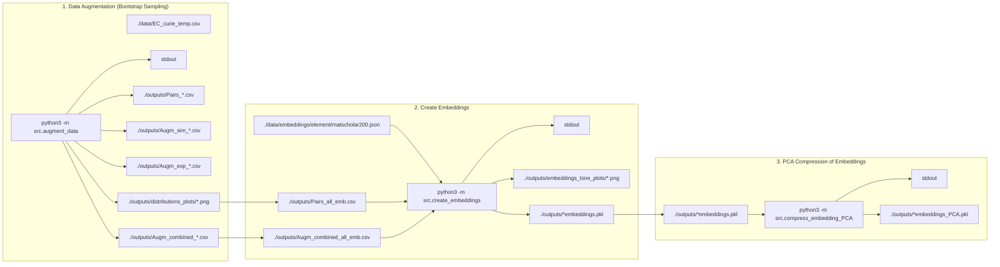

# ML model for systematic errors between simulations and experimental measurements of the Curie temperature

This codebase implements various machine learning models to predict experimental Curie temperatures from simulated values. Additionally, chemical property information is incorporated via an embedding representation. 

## Current version of model
v0.1


## 0. Installation
Use requirements.txt. In addition pytorch, compatible with your system, must be installed
- PyTorch (version matching your hardware, see: https://pytorch.org/get-started/locally/)




## 1. Data augmentation

Executing the code below performs data augmentation on missing experimental values using bootstrap sampling.

Run:

```
python3 -m src.augment_data
```

NEEDS:

- ./data/EC_curie_temp.csv


OUTPUT:
```
- stdout
- ./outputs/Pairs_all.csv
- ./outputs/Pairs_RE.csv
- ./outputs/Pairs_RE_Free.csv
- ./outputs/Pairs_all_emb.csv
- ./outputs/Pairs_RE_emb.csv
- ./outputs/Pairs_RE_Free_emb.csv
- ./outputs/Augm_sim_all.csv          # Phase 1: paired + Tc_sim-only (mock Tc_exp)
- ./outputs/Augm_sim_RE.csv
- ./outputs/Augm_sim_RE_Free.csv
- ./outputs/Augm_sim_all_emb.csv
- ./outputs/Augm_sim_RE_emb.csv
- ./outputs/Augm_sim_RE_Free_emb.csv
- ./outputs/Augm_exp_all.csv          # Phase 2: paired + Tc_exp-only (mock Tc_sim)
- ./outputs/Augm_exp_RE.csv
- ./outputs/Augm_exp_RE_Free.csv
- ./outputs/Augm_exp_all_emb.csv
- ./outputs/Augm_exp_RE_emb.csv
- ./outputs/Augm_exp_RE_Free_emb.csv
- ./outputs/Augm_combined_all.csv     # Phase 3: Phase 1 + Phase 2 (used for training)
- ./outputs/Augm_combined_RE.csv
- ./outputs/Augm_combined_RE_Free.csv
- ./outputs/Augm_combined_all_emb.csv
- ./outputs/Augm_combined_RE_emb.csv
- ./outputs/Augm_combined_RE_Free_emb.csv
- ./outputs/distributions_plots/*.png
```

## 2. Creation of embeddings

Stoichiometric embeddings are created from the Matscholar200 embeddings
using an element-abundance weighted sum approach. For example:
    H2O embedding = 2 × [H embedding] + 1 × [O embedding]

Run:

```
python3 -m src.create_embeddings
```

NEEDS:
- ./data/embeddings/element/matscholar200.json
- ./outputs/Pairs_all_emb.csv
- ./outputs/Pairs_RE_emb.csv
- ./outputs/Pairs_RE_Free_emb.csv
- ./outputs/Augm_combined_all_emb.csv  (required)
- ./outputs/Augm_combined_RE_emb.csv   (required)
- ./outputs/Augm_combined_RE_Free_emb.csv  (required)
- ./outputs/Augm_exp_all_emb.csv       (optional, processed when present)
- ./outputs/Augm_exp_RE_emb.csv        (optional)
- ./outputs/Augm_exp_RE_Free_emb.csv   (optional)
- ./outputs/Augm_sim_all_emb.csv       (optional)
- ./outputs/Augm_sim_RE_emb.csv        (optional)
- ./outputs/Augm_sim_RE_Free_emb.csv   (optional)

OUTPUT:
```
- stdout
- ./outputs/embeddings_tsne_plots/*.png
- ./outputs/*embeddings.pkl
```

## 3. Compress embeddings with PCA
Create PCA-compressed embeddings for the paired Curie temperature dataset.
It computes PCA components of sizes 8, 16, 32, and 64 to ensure they are available
for the training scripts.

Run:

```
python3 -m src.compress_embedding_PCA
```

NEEDS:
- ./outputs/*embeddings.pkl

OUTPUT:
```
- stdout
- ./outputs/*embeddings_PCA.pkl
```

## 4. Model Training

Train baseline models on original (non-augmented, non-embedding) data. Namely, 

· Symbolic regression: stoichiometry was disregarded
· LASSO regression,
· RIDGE regression,
· Random Forest,
· FCNN.

The materials dataset is evaluated separately for RE and RE-free samples to account
for potential differences in data distribution and model behavior. Experiments on the
combined (“All”) dataset are included as a global baseline to assess generalization.

## 4.1 Orginal dataset

Run:

```
python3 -m src.training_original
```

NEEDS:
- ./outputs/Pairs_all.csv
- ./outputs/Pairs_RE.csv
- ./outputs/Pairs_RE_Free.csv

OUTPUT:
```
- stdout
- ./results/figures/All-Pairs_*_no_emb.png
- ./results/figures/RE-Pairs_*_no_emb.png
- ./results/figures/RE-Free-Pairs_*_no_emb.png
- ./results/original_[model]
- ./results/original_comparision/*.csv
```

## 4.2 Orginal dataset with stoichiometric embedding
Train models on original data with stoichiometric embeddings as additional input to the simulate value.

Run:

```
python3 -m src.training_original_emb
```

NEEDS:
- ./outputs/Pairs_RE_Free_emb.csv
- ./outputs/Pairs_RE_emb.csv
- ./outputs/Pairs_all_emb.csv
- ./outputs/Pairs_RE_Free_emb_w_embeddings.pkl
- ./outputs/Pairs_RE_Free_emb_w_embeddings_PCA.pkl
- ./outputs/Pairs_RE_emb_w_embeddings.pkl
- ./outputs/Pairs_RE_emb_w_embeddings_PCA.pkl
- ./outputs/Pairs_all_emb_w_embeddings.pkl
- ./outputs/Pairs_all_emb_w_embeddings_PCA.pkl


OUTPUT:
```
- stdout
- ./results/original_emb_[model]
- ./results/original_emb_comparison/*.csv
- ./results/figures/All-Pairs_[model]_[None|pca_*].png
- ./results/figures/RE_Pairs_[model]_[None|pca_*].png
```

## 4.3 Augmented dataset

Train baseline models on augmented data (no embeddings).

Run:

```
python3 -m src.training_augmented
```

NEEDS:
- ./outputs/Augm_exp_all.csv
- ./outputs/Augm_exp_RE.csv
- ./outputs/Augm_exp_RE_Free.csv
- ./outputs/Augm_sim_all.csv
- ./outputs/Augm_sim_RE.csv
- ./outputs/Augm_sim_RE_Free.csv
- ./outputs/Augm_combined_all.csv
- ./outputs/Augm_combined_RE.csv
- ./outputs/Augm_combined_RE_Free.csv

OUTPUT:
```
- stdout
- ./results/augmented_[model]/{variant}/      (variant: exp_augmented, sim_augmented, combined_augmented)
- ./results/figures/{variant}/[All|RE|RE-Free]-Augm_*_no_emb.png
- ./results/figures/{variant}/[All|RE|RE-Free]-Augm_SR.png
- ./results/augmented_comparison/{variant}/augmented_models_comparison.csv
- ./results/augmented_comparison/{variant}/augmented_best_by_dataset.csv
- ./results/augmented_comparison/{variant}/augmented_comparison_pivot.csv
- ./results/augmented_comparison/augmented_all_variants_comparison.csv
- ./results/augmented_comparison/augmented_all_variants_best.csv
- ./results/augmented_comparison/augmented_cross_variant_pivot.csv
```


## 4.4 Augmented dataset with stoichiometry embedding
Train models on augmented data WITH EMBEDDINGS.

Run:

```
python3 -m src.training_augmented_emb
```

NEEDS:
- ./outputs/Augm_exp_all_emb_w_embeddings[_PCA].pkl
- ./outputs/Augm_exp_RE_emb_w_embeddings[_PCA].pkl
- ./outputs/Augm_exp_RE_Free_emb_w_embeddings[_PCA].pkl
- ./outputs/Augm_sim_all_emb_w_embeddings[_PCA].pkl
- ./outputs/Augm_sim_RE_emb_w_embeddings[_PCA].pkl
- ./outputs/Augm_sim_RE_Free_emb_w_embeddings[_PCA].pkl
- ./outputs/Augm_combined_all_emb_w_embeddings[_PCA].pkl
- ./outputs/Augm_combined_RE_emb_w_embeddings[_PCA].pkl
- ./outputs/Augm_combined_RE_Free_emb_w_embeddings[_PCA].pkl

(For each file the _PCA.pkl variant is preferred; plain .pkl is used as fallback.)

OUTPUT:
```
- stdout
- ./results/augmented_emb_[model]/{variant}/      (variant: exp_augmented, sim_augmented, combined_augmented)
- ./results/figures/{variant}/[All|RE|RE-Free]-Augm_[model]_[None|pca_*].png
- ./results/augmented_emb_comparison/{variant}/augmented_emb_models_comparison.csv
- ./results/augmented_emb_comparison/{variant}/augmented_emb_best_by_dataset.csv
- ./results/augmented_emb_comparison/{variant}/augmented_emb_comparison_pivot.csv
- ./results/augmented_emb_comparison/augmented_emb_all_variants_comparison.csv
- ./results/augmented_emb_comparison/augmented_emb_all_variants_best.csv
- ./results/augmented_emb_comparison/augmented_emb_cross_variant_pivot.csv
```
## 📈 Model Performance Comparison 
(best models and symbolic regression baseline shown)

| Dataset         | Model               | Embedding   | R²    | RMSE    |
|----------------|---------------------|-------------|-------|---------|
| All-Pairs      | **MLP (FCNN)**      | -           | 0.849 | 94.323  |
| All-Pairs      | MLP (FCNN)          | raw_200D    | 0.801 | 107.945 |
| All-Pairs      | Symbolic Regression | -           | 0.841 | 96.758  |
| All-Augm       | **MLP (FCNN)**      | -           | 0.935 | 69.875  |
| All-Augm       | MLP (FCNN)          | raw_200D    | 0.935 | 69.875  |
| All-Augm       | Symbolic Regression | -           | 0.935 | 70.342  |
| RE-Pairs       | **MLP (FCNN)**      | -           | 0.915 | 51.738  |
| RE-Pairs       | **RandomForest (RF)** | raw_200D  | 0.934 | 41.390  |
| RE-Pairs       | Symbolic Regression | -           | 0.913 | 52.234  |
| RE-Augm        | **Linear (LINEAR)** | -           | 0.980 | 38.240  |
| RE-Augm        | Linear (LINEAR)     | raw_200D    | 0.980 | 38.240  |
| RE-Augm        | Symbolic Regression | -           | 0.980 | 38.282  |
| RE-Free-Pairs  | **Linear (LINEAR)** | -           | 0.789 | 130.646 |
| RE-Free-Pairs  | Linear (LASSO)      | raw_200D    | 0.781 | 128.279 |
| RE-Free-Pairs  | Symbolic Regression | -           | 0.789 | 130.646 |
| RE-Free-Augm   | **Linear (LASSO)**  | -           | 0.829 | 119.500 |
| RE-Free-Augm   | Linear (LASSO)      | raw_200D    | 0.829 | 119.500 |
| RE-Free-Augm   | Symbolic Regression | -           | 0.827 | 120.166 |


> 🔍 **Note**: The augmented datasets (`All-Augm`, `RE-Augm`, `RE-Free-Augm`) were created by combining **simulated (Tc_sim)** and **experimental (Tc_exp)** data to improve model generalization and performance.

### 📊 Summary of Results

MLP without embeddings performs best overall, achieving the highest R² and lowest RMSE on most datasets, especially RE-Pairs and RE-Augm.

Data augmentation consistently improves performance, with RE-Augm reaching the strongest results (R² ≈ 0.967, RMSE ≈ 33.5).

Embeddings are not universally beneficial: PCA32 often underperforms compared to raw features, except for RE-free Augm, where a low-dimensional embedding (PCA8) yields the best results.

Performance differs between RE and RE-free subsets, supporting the decision to evaluate them separately.